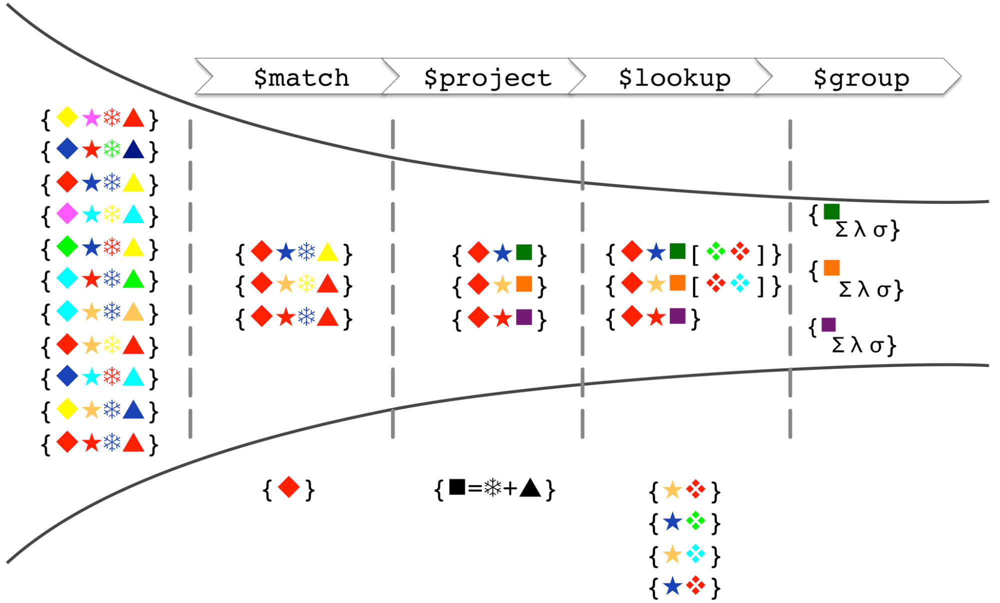

---

## 집계 파이프라인(Aggregation Pipeline) 소개

몽고DB의 집계(aggregation) 연산에 대해서 알아보자.

몽고DB의 집계 연산은은 컬렉션(다수의 도큐먼트)에 대해서 데이터 처리 및 변환 작업을 할 수 있도록 해준다. 조금 풀어서 설명하자면, 컬렉션에 대해서 필터링, 그룹, 조인, 정렬, 분석 등의 복합적인 데이터 작업을 가능하도록 해준다. 이런 집계 연산은 `aggregation pipeline`을 통해서 수행할 수 있다.

공식 문서 참고 : [https://www.mongodb.com/docs/manual/aggregation/#std-label-aggregation-pipeline-intro](https://www.mongodb.com/docs/manual/aggregation/#std-label-aggregation-pipeline-intro)

<br>

`Aggregation pipeline`은 도큐먼트를 처리하기 위한 하나 이상의 스테이지로 구성되어있다.

* 각 스테이지는 인풋 도큐먼트에 대해서 연산을 수행한다
  * 예) 필터링, 그룹핑, 계산, 등
* 이전 스테이지의 결과 도큐먼트들은 다음 스테이지로 넘겨진다
* 이런 스테이지들로 이루어진 집계 파이프라인의 결과로 계산된 값이 나올수도 있고, 도큐먼트가 나올수도 있다
* 뒤에서도 다루겠지만 `aggregate()`를 이용한 집계 파이프라인은 `$merge` 또는 `$out` 스테이지를 포함하지 않는 이상, 원본 도큐먼트를 수정하지 않는다(보통 집계 연산 과정 중에 메모리 위에 복사본을 생성해서 연산을 진행한다)

<br>

사용법에 대해서 알아보자.

> `syntax`
>
> ```js
> db.collection.aggregate( <pipeline>, <options> )
> ```
>
> * `<pipeline>` : 파이프라인을 구성하는 스테이지의 연산들을 배열 형태로 전달한다
>   * 예) `[{stage1}, {stage2}, ... ]`
>
> * `<options>` : 제공하는 옵션을 설정할 수 있다
{: .prompt-info }


<br>



<p align="center">https://www.mongodb.com/blog/post/joins-and-other-aggregation-enhancements-coming-in-mongodb-3-2-part-1-of-3-introduction</p>

<br>

---

## 사용 예시

실제 예시를 통해서 사용해보자.

<br>

`예시`

```js
db.books.aggregate([
  // Stage 1: status 'PUBLISH'인 도큐먼트를 매칭한다
  { $match: { status: 'PUBLISH' } },

  // Stage 2: 필요한 필드만 프로젝션
  { $project: { title: 1, authors: 1, categories: 1 } },

  // Stage 3: 'categories' 필드를 배열의 요소별로 분리한다
  { $unwind: '$categories' },

  // Stage 4: 'categories' 필드로 Grouping하고 각 카테고리별로 요소를 카운트
  {
    $group: {
      _id: '$categories', // Group by category
      count: { $sum: 1 }  // Count documents in each category
    }
  },

  // Stage 5: 'count'를 기준으로 내림차순 정렬 
  { $sort: { count: -1 } }
])
```

```
[
  { _id: 'Java', count: 95 },
  { _id: 'Internet', count: 41 },
  { _id: 'Microsoft .NET', count: 33 },
  { _id: 'Web Development', count: 16 },
  { _id: 'Software Engineering', count: 15 },
  { _id: 'Programming', count: 12 },
  { _id: 'Business', count: 12 },
  { _id: 'Client-Server', count: 11 },
  { _id: 'Microsoft', count: 8 },
  { _id: 'Networking', count: 7 },
  { _id: 'PowerBuilder', count: 7 },
  { _id: 'Theory', count: 7 },
  { _id: 'Perl', count: 6 },
  { _id: 'Computer Graphics', count: 6 },
  { _id: 'Python', count: 6 },
  { _id: 'Mobile Technology', count: 5 },
  { _id: 'XML', count: 4 },
  { _id: 'Object-Oriented Programming', count: 4 },
  { _id: 'Miscellaneous', count: 2 },
  { _id: 'Open Source', count: 2 }
]
```

<br>

집계 파이프라인에 사용할 수 있는 연산은 굉장히 많다. 공식 문서를 참고하면서 적용하자.

공식 문서 : [https://www.mongodb.com/docs/manual/core/aggregation-pipeline/](https://www.mongodb.com/docs/manual/core/aggregation-pipeline/)

<br>

---

## Reference

1. [https://www.mongodb.com/docs/manual/aggregation/#std-label-aggregation-pipeline-intro](https://www.mongodb.com/docs/manual/aggregation/#std-label-aggregation-pipeline-intro)
2. [https://www.mongodb.com/docs/manual/core/aggregation-pipeline/](https://www.mongodb.com/docs/manual/core/aggregation-pipeline/)
3. [https://www.mongodb.com/blog/post/joins-and-other-aggregation-enhancements-coming-in-mongodb-3-2-part-1-of-3-introduction](https://www.mongodb.com/blog/post/joins-and-other-aggregation-enhancements-coming-in-mongodb-3-2-part-1-of-3-introduction)