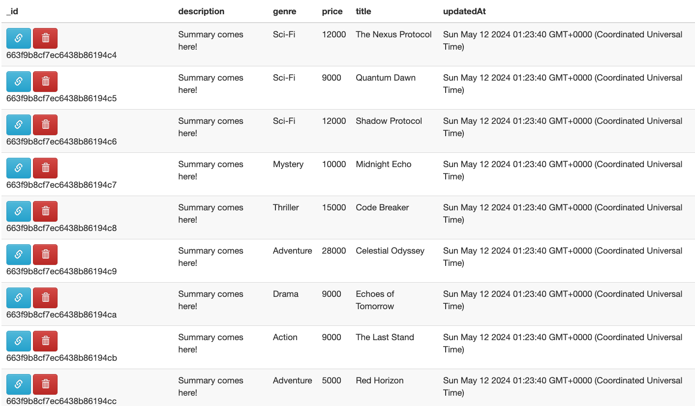

---

## 1.  자바 MongoDB 드라이버로 연결

자바의 몽고DB 드라이버를 통해 몽고DB 데이터베이스에 연결하고 사용해보자.

몽고DB와 통신하면서 쿼리하는 문법은 언어별로 서로 다르다. 그러나 이전 몽고쉘에서 다룬 컨셉들과 동작원리는 동일하다.

공식 문서 참고 : [https://www.mongodb.com/docs/drivers/java/sync/current/quick-start/](https://www.mongodb.com/docs/drivers/java/sync/current/quick-start/)

<br>

`build.gradle`의 `dependencies`에 `lombok`, `mongodb-driver`, `slf4j`를 사용할 수 있도록 추가.

```groovy
dependencies {
    testImplementation platform('org.junit:junit-bom:5.9.1')
    testImplementation 'org.junit.jupiter:junit-jupiter'

    compileOnly 'org.projectlombok:lombok:1.18.32'
    annotationProcessor 'org.projectlombok:lombok:1.18.32'

    testCompileOnly 'org.projectlombok:lombok:1.18.32'
    testAnnotationProcessor 'org.projectlombok:lombok:1.18.32'


    implementation 'org.slf4j:slf4j-api:1.7.32'
    implementation 'ch.qos.logback:logback-classic:1.4.12'

    implementation 'org.mongodb:mongodb-driver-sync:5.1.0'
}
```

<br>

몽고DB와 연결하고 쿼리까지 해보는 코드를 구현해보자.

<br>

`database.properties`

```properties
mongodb.username=root
mongodb.password=admin
mongodb.host=localhost
mongodb.port=27017
mongodb.database=shop
```

<br>

`database.properties`에서 설정을 읽어오는 유틸 코드를 작성해보자. (현재 스프링 없이 순수 자바를 사용중이다.)

`dbutil/MongoDBPropertiesLoader`

```java
@Slf4j
public class MongoDBPropertiesLoader {
    private static final String PROPERTIES_FILE = "database.properties";
    private static Properties properties;

    static {
        properties = new Properties();
        try (InputStream input = MongoDBPropertiesLoader.class.getClassLoader().getResourceAsStream(PROPERTIES_FILE)) {
            if (input == null) {
                System.out.println("file not found");
            }

            properties.load(input);
        } catch (IOException e) {
            log.error("MongoDBPropertiesLoader error", e);
        }
    }

    public static String getHost() {
        return properties.getProperty("mongodb.host");
    }

    public static  String getPort() {
        return properties.getProperty("mongodb.port");
    }

    public static String getDatabase() {
        return properties.getProperty("mongodb.database");
    }

    public static String getUsername() {
        return properties.getProperty("mongodb.username");
    }

    public static String getPassword() {
        return properties.getProperty("mongodb.password");
    }

}
```

<br>

이제 실제로 몽고DB에 연결하고 간단한 쿼리를 통해 조회해보자.

<br>

`ConnectMain`

```java
@Slf4j
public class ConnectMain {
    public static void main(String[] args) {

        String HOST = MongoDBPropertiesLoader.getHost();
        String PORT = MongoDBPropertiesLoader.getPort();
        String DATABASE = MongoDBPropertiesLoader.getDatabase();
        String USERNAME = MongoDBPropertiesLoader.getUsername();
        String PASSWORD = MongoDBPropertiesLoader.getPassword();
        String URI = "mongodb://"+USERNAME+":"+PASSWORD+"@" +HOST+":"+PORT;

        try (MongoClient mongoClient = MongoClients.create(URI)) {
            MongoDatabase database = mongoClient.getDatabase(DATABASE);
            MongoCollection<Document> collection = database.getCollection("books");

            Document projection = new Document("_id", 1) // 프로젝션을 위한 도큐먼트
                    .append("title", 1)
                    .append("pageCount", 1);

            Document query = new Document("pageCount", new Document("$gt", 300)); // 쿼리를 위한 도큐먼트
					  
            MongoCursor<Document> cursor = collection.find(query)
                            .projection(projection)
                            .sort(Sorts.descending("pageCount"))
                            .iterator();

            while (cursor.hasNext()) {
                System.out.println(cursor.next().toJson());
            }
            
        } catch (Exception e) {
            // log.error("Exception", e);
        }
    }
}
```

```
{"_id": 30, "title": "jQuery in Action, Second Edition", "pageCount": 488}
{"_id": 279, "title": "SCBCD Exam Study Kit", "pageCount": 488}
{"_id": 39, "title": "Graphics File Formats", "pageCount": 484}
{"_id": 25, "title": "JSTL in Action", "pageCount": 480}
...생략
{"_id": 64, "title": "Data Munging with Perl", "pageCount": 304}
{"_id": 198, "title": "SharePoint 2007 Developer's Guide to Business Data Catalog", "pageCount": 304}
{"_id": 243, "title": "Explorer's Guide to the Semantic Web", "pageCount": 304}
{"_id": {"$oid": "53c2ae8528d75d572c06adb3"}, "title": "J2EE and XML Development", "pageCount": 304}
```

* `find()`는 `FindIterable` 객체를 반환한다
  * `FindIterable`은 `MongoIterable`의 자손이다
* `iterator()`는 `MongoCursor` 객체를 반환한다

<br>

---

## 2. MongoDB에서 POJO 클래스 

POJO 클래스를 사용하면, 프로그래밍적 스키마를 도큐먼트에 그대로 사용할 수 있다. 쉽게 이야기 해서 POJO 클래스를 컬렉션의 도큐먼트에 바로 매핑해서 사용할 수 있다.

공식 문서 : [https://www.mongodb.com/docs/drivers/java/sync/current/fundamentals/data-formats/document-data-format-pojo/](https://www.mongodb.com/docs/drivers/java/sync/current/fundamentals/data-formats/document-data-format-pojo/)

<br>

**POJO를 사용하기 위해서는 이를 해석할 수 있는 코덱을 설정해줘야한다.**

<br>

`예시`

```java
CodecProvider pojoCodecProvider = PojoCodecProvider.builder().automatic(true).build();
CodecRegistry pojoCodecRegistry = fromRegistries(getDefaultCodecRegistry(),fromProviders(pojoCodecProvider));

MongoClient mongoClient = MongoClients.create(uri);
MongoDatabase database = mongoClient.getDatabase("sample_pojos").withCodecRegistry(pojoCodecRegistry);
```

* `sample_pojos`라는 데이터베이스에 `pojoCodecRegistry`를 설정

<br>

이후에는 사용할 POJO 클래스를 `MongoCollection` 객체의 타입으로 지정하고, `getCollection()`의 도큐먼트 클래스 인자로 전달해서 사용한다.

<br>

`예시`

```java
MongoCollection<MyPOJO> collection = database.getCollection("mypojos", MyPOJO.class);
```

<br>

---

## 3. POJO 클래스 사용하기

### 3.1 POJO 클래스 만들기

그러면 이제 POJO 클래스를 만들어보고, POJO 클래스를 사용해서 다양한 CRUD 작업을 해보자.

<br>

`domain/Movies`

```java
@Data
@AllArgsConstructor
@NoArgsConstructor
public class Movies {
    @BsonId
    ObjectId _id;
    String title;
    String genre;
    Integer price;
    // @BsonProperty("contents") : 데이터베이스상의 이름과 달라도 매핑 가능
    String description;
    LocalDateTime updatedAt;

    @Override
    public String toString() {
        return "Movies{" +
                "_id=" + _id +
                ", title='" + title + '\'' +
                ", genre='" + genre + '\'' +
                ", price=" + price +
                ", description='" + description + '\'' +
                ", updatedAt=" + updatedAt +
                '}';
    }
}
```

* `_id`를 위한 필드는 `@BsonId` 사용

<br>

몽고DB에 연결하기 위한 코드를 추출해서 유틸로 구현하자.

`dbutil/MongoConnectionUtil`

```java
@Slf4j
public class MongoConnectionUtil {
    private static final String HOST = MongoDBPropertiesLoader.getHost();
    private static final String PORT = MongoDBPropertiesLoader.getPort();
    private static final String USERNAME = MongoDBPropertiesLoader.getUsername();
    private static final String PASSWORD = MongoDBPropertiesLoader.getPassword();

    public static MongoClient getConnection() {
        String URI = "mongodb://"+USERNAME+":"+PASSWORD+"@" +HOST+":"+PORT;

        try {
            return MongoClients.create(URI);
        } catch (Exception e) {
            log.error("Failed to connect to MongoDB", e);
            throw new RuntimeException("Failed to connect to MongoDB", e);
        }
    }
}
```

<br>

---

### 3.2 도큐먼트 생성

POJO 클래스 `Movies`를 이용해서 `movies`라는 컬렉션에 도큐먼트들을 생성해보자.

<br>

`CreateDocuments`

```java
public class CreateDocuments {
    public static void main(String[] args) {

        CodecProvider pojoCodecProvider = PojoCodecProvider.builder().automatic(true).build();
        CodecRegistry pojoCodecRegistry = fromRegistries(getDefaultCodecRegistry(),fromProviders(pojoCodecProvider));

        try(MongoClient mongoClient = MongoConnectionUtil.getConnection()) {
            MongoDatabase database = mongoClient.getDatabase("shop").withCodecRegistry(pojoCodecRegistry);

            MongoCollection<Movies> moviesCollection = database.getCollection("movies", Movies.class);
            // DateTimeFormatter formatter = DateTimeFormatter.ofPattern("yyyy-MM-dd HH:mm:ss");

            List<Movies> movies = new ArrayList<>();
            movies.add(new Movies(null, "The Nexus Protocol", "Sci-Fi", 12000,
                    "Summary comes here!", LocalDateTime.now()));
            movies.add(new Movies(null, "Quantum Dawn", "Sci-Fi", 9000,
                    "Summary comes here!", LocalDateTime.now()));
            movies.add(new Movies(null, "Shadow Protocol", "Sci-Fi", 12000,
                    "Summary comes here!", LocalDateTime.now()));
            movies.add(new Movies(null, "Midnight Echo", "Mystery", 10000,
                    "Summary comes here!", LocalDateTime.now()));
            movies.add(new Movies(null, "Code Breaker", "Thriller", 15000,
                    "Summary comes here!", LocalDateTime.now()));
            movies.add(new Movies(null, "Celestial Odyssey", "Adventure", 28000,
                    "Summary comes here!", LocalDateTime.now()));
            movies.add(new Movies(null, "Echoes of Tomorrow", "Drama", 9000,
                    "Summary comes here!", LocalDateTime.now()));
            movies.add(new Movies(null, "The Last Stand", "Action", 9000,
                    "Summary comes here!", LocalDateTime.now()));
            movies.add(new Movies(null, "Red Horizon", "Adventure", 5000,
                    "Summary comes here!", LocalDateTime.now()));

            moviesCollection.insertMany(movies);

        }
    }
}
```

* 이전에도 설명했듯이, POJO를 사용하기 위한 코덱이 필요하다
* `insertMany()`를 이용해서 다수의 도큐먼트를 생성한다

<br>

데이터베이스를 확인해보면 도큐먼트들이 정상적으로 생성이 된것을 확인할 수 있다.(`MongoExpress`를 한번 사용해봤다)

<br>



<br>

---

### 3.3 도큐먼트 조회

도큐먼트를 조회해보자.

`ReadMain`

```java
public class ReadMain {
    public static void main(String[] args) {
        CodecProvider pojoCodecProvider = PojoCodecProvider.builder().automatic(true).build();
        CodecRegistry pojoCodecRegistry = fromRegistries(getDefaultCodecRegistry(),fromProviders(pojoCodecProvider));

        try(MongoClient mongoClient = MongoConnectionUtil.getConnection()) {
            MongoDatabase database = mongoClient.getDatabase("shop").withCodecRegistry(pojoCodecRegistry);

            MongoCollection<Movies> moviesCollection = database.getCollection("movies", Movies.class);

            // 1. 커서를 이용해서 조회
            MongoCursor<Movies> cursor = moviesCollection.find().cursor();
            while (cursor.hasNext()) {
                System.out.println(cursor.next());
            }

            // 2. 필터를 통한 조회 조건 설정
            cursor = moviesCollection.find(eq("price", 9000)).cursor(); // price가 9000인 경우만 필터링
            while (cursor.hasNext()) {
                System.out.println(cursor.next());
            }

            // 3. projection으로 원하는 필드만 가져오기

            // projection이라는 도큐먼트를 생성해서 사용하지 않고 Projections.fields(include()) 사용
            Document projection = new Document("title", 1)
                    .append("genre", 1)
                    .append("price", 1);

            cursor = moviesCollection.find()
                    .projection(Projections.fields(Projections.include("title", "genre", "price")))
                    .sort(Sorts.descending("price")) // price를 기준으로 내림차순 정렬
                    .limit(5) // 첫 5개의 결과만 가져온다
                    .cursor();
						
            while (cursor.hasNext()) {
                Movies doc = cursor.next();

                System.out.println("Title: " + doc.getTitle());
                System.out.println("Genre: " + doc.getGenre());
                System.out.println("Price: " + doc.getPrice());
                System.out.println("-------------------------");

            }
        }
    }
}
```

<br>

몽공DB 매뉴얼을 참고해서 자바에서 업데이트와 삭제하는 방법과 집계 연산을 사용하는 방법도 알아보자. 

<br>

---

## Reference

1. [MongoDB - Using MongoDB with Java](https://learn.mongodb.com/learn/learning-path/using-mongodb-with-java?sessionFields=[["certifiction"%2C"Course"]%2C["programming-language"%2C"Java"]])
2. [https://www.mongodb.com/docs/drivers/java/sync/current/quick-start/](https://www.mongodb.com/docs/drivers/java/sync/current/quick-start/)
3.  [https://www.mongodb.com/docs/drivers/java/sync/current/fundamentals/data-formats/document-data-format-pojo/](https://www.mongodb.com/docs/drivers/java/sync/current/fundamentals/data-formats/document-data-format-pojo/)

