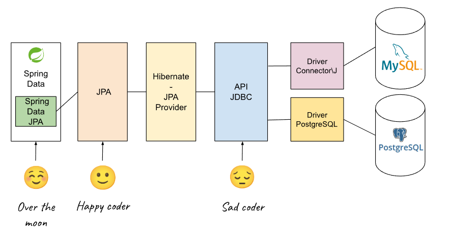

## 1. Spring Data JPA 소개

기존 JPA만으로도 편하게 개발할 수 있었다. 그러나 Spring Data JPA를 사용하면 마법처럼 **구현체 없이 레포지토리 인터페이스만으로 데이터 접근 계층을 개발**할 수 있다. 이는 개발자가 기존에 구현해야 보일러 플레이트 코드를 상당수 제거해줘서 생산성을 늘려준다.

<br>

> Spring Data JPA aims to significantly improve the implementation of data access layers by reducing the effort to the amount that’s actually needed. As a developer you write your repository interfaces using any number of techniques, and Spring will wire it up for you automatically. You can even use custom finders or query by example and Spring will write the query for you!
>
> 출처 : [https://spring.io/projects/spring-data-jpa](https://spring.io/projects/spring-data-jpa)
{: .prompt-info }

<br>

_https://danielme.com/2024/03/23/course-spring-data-jpa-1-introduction/_

<br>

Spring Data JPA는 다음과 같은 기능들을 제공한다.

* 레포지토리 인터페이스
  * 미리 정의되어 있는 레포지토리 인터페이스를 `extend`하는것 만으로도 기본적인 CRUD 작업을 수행할 수 있다
* 쿼리 메서드
  * 레포지토리 인터페이스에 특정 명명 규칙(naming convention)을 사용해서 쿼리 메서드를 정의하면 자동으로 이름에 맞는 쿼리를 생성해준다
  * 예) `findByLastName`라는 이름의 메서드를 만들면 `lastName`으로 찾는 쿼리를 자동 생성해준다
* JPQL이나 Native SQL을 사용한 쿼리를 사용자가 직접 만들어서 사용할 수 있다
* 페이지네이션(pagination), 정렬(sorting) 관련 기능들을 제공한다
* Auditing
  * 시간에 대해 자동으로 값을 입력해주는 기능을 제공한다
  * `@CreatedBy`, `@LastModifiedBy`와 같은 애노테이션 기능을 사용할 수 있다

<br>

이외에도 다양한 기능들을 제공해준다.

<br>

---

## 2. 도메인 모델

Spring Data JPA의 기능을 설명하기 위한 예제에 사용할 도메인 모델은 다음과 같다.

<br>

`Member`

```java
@Entity
@Getter @Setter
@NoArgsConstructor(access = AccessLevel.PROTECTED)
public class Member {

    @Id
    @GeneratedValue
    @Column(name = "member_id")
    private Long id;
    private String username;
    private int age;

    @ManyToOne(fetch = FetchType.LAZY)
    @JoinColumn(name = "team_id")
    private Team team;

    @Builder
    public Member(String username, int age) {
        this.username = username;
        this.age = age;
    }

    public Member(String username, int age, Team team) {
        this.username = username;
        this.age = age;
        if (team != null) {
            changeTeam(team);
        }
    }

    public void changeTeam(Team team) {
        this.team = team;
        team.getMembers().add(this);
    }

    @Override
    public String toString() {
        return "Member{" +
                "id=" + id +
                ", username='" + username + '\'' +
                ", age=" + age +
                '}';
    }
}
```

* `toString()`에 연관 관계 필드는 웬만하면 포함하지 말자!

<br>

`Team`

```java
@Entity
@Getter @Setter
@NoArgsConstructor(access = AccessLevel.PROTECTED)
public class Team {

    @Id
    @GeneratedValue
    @Column(name = "team_id")
    private Long id;
    private String name;

    @OneToMany(mappedBy = "team")
    List<Member> members = new ArrayList<>();

    public Team(String name) {
        this.name = name;
    }

    @Override
    public String toString() {
        return "Team{" +
                "id=" + id +
                ", name='" + name + '\'' +
                '}';
    }
}
```

<br>

---

## 3. 레포지토리 인터페이스(Repository Interface) 기능 

### 순수 JPA 기반 레포지토리

Spring Data JPA의 기능을 살펴보기 전에, 순수 JPA로 레포지토리를 구현해보자. 이후에 새로운 기능을 사용하고 비교하자.

<br>

`MemberJpaRepository`

```java
@Repository
@RequiredArgsConstructor
public class MemberJpaRepository {

    final private EntityManager em;

    public Member save(Member member) {
        em.persist(member);
        return member;
    }

    public void delete(Member member) {
        em.remove(member);
    }

    public List<Member> findAll() {
        return em.createQuery("select m from Member m", Member.class)
                .getResultList();
    }

    public Optional<Member> findById(Long id) {
        Member member = em.find(Member.class, id);
        return Optional.ofNullable(member);
    }

    public long count() {
        return em.createQuery("select count(m) from Member m", Long.class)
                .getSingleResult();
    }

    public Member find(Long id) {
        return em.find(Member.class, id);
    }

}
```

<br>

`TeamJpaRepository`

```java
@Repository
@RequiredArgsConstructor
public class TeamJpaRepository {

    private EntityManager em;

    public Team save(Team team) {
        em.persist(team);
        return team;
    }
    public void delete(Team team) {
        em.remove(team);
    }

    public List<Team> findAll() {
        return em.createQuery("select t from Team t", Team.class)
                .getResultList();
    }
    public Optional<Team> findById(Long id) {
        Team team = em.find(Team.class, id);
        return Optional.ofNullable(team);
    }
    public long count() {
        return em.createQuery("select count(t) from Team t", Long.class)
                .getSingleResult();
    }

}
```

<br>

순수 JPA로 작성한 레포지토리를 테스트해보자.

`JpaRepositoryTest`

```java
@SpringBootTest
@Transactional
public class JpaRepositoryTest {

    @Autowired
    MemberJpaRepository memberRepository;

    @Test
    public void 멤버_저장() {

        Member member1 = Member.builder().username("멤버1").build();
        Member member2 = Member.builder().username("멤버2").build();
        memberRepository.save(member1);
        memberRepository.save(member2);

        Member findMember1 = getMember(member1);
        Member findMember2 = getMember(member2);

        // save 검증
        assertThat(findMember1.getId()).isEqualTo(member1.getId());
        assertThat(findMember2.getId()).isEqualTo(member2.getId());

    }

    @Test
    public void 멤버_리스트_조회() {

        Member member1 = Member.builder().username("멤버1").build();
        Member member2 = Member.builder().username("멤버2").build();
        memberRepository.save(member1);
        memberRepository.save(member2);

        assertThat(memberRepository.findAll().size()).isEqualTo(2);
    }

    @Test
    public void 멤버_카운트() {
        Member member1 = Member.builder().username("멤버1").build();
        Member member2 = Member.builder().username("멤버2").build();
        memberRepository.save(member1);
        memberRepository.save(member2);

        long memberCount = memberRepository.count();

        assertThat(memberCount).isEqualTo(2);
    }

    @Test
    public void 멤버_삭제() {
        Member member1 = Member.builder().username("멤버1").build();
        Member member2 = Member.builder().username("멤버2").build();
        memberRepository.save(member1);
        memberRepository.save(member2);

        memberRepository.delete(member1);
        memberRepository.delete(member2);

        assertThat(memberRepository.findAll().size()).isEqualTo(0);
    }

    private Member getMember(Member member) {
        Optional<Member> optFindMember = memberRepository.findById(member.getId());
        assertThat(optFindMember).isPresent();
        return optFindMember.get();
    }

}
```

<br>

_순수 JPA 레포지토리 테스트_

<br>

모든 기능이 정상적으로 동작하는 것을 확인할 수 있다.

<br>

---

### 레포지토리 인터페이스 사용법

우리가 사용하는 CRUD 기능은 사실 도메인별로, 프로젝트별로 크게 달라질 이유가 없다. 이런 기본적인 데이터 접근 기능들을 공통화 시켜서 제공할 수 없는지 개발자들은 고민하기 시작했다. 그 결과로 나온것이 Spring Data JPA의 공통 인터페이스 기능이다.

레포지토리 인터페이스 기능의 사용법을 알아보고 바로 사용해보자.

<br>

베이스 패키지 설정하기.

```java
@SpringBootApplication
@EnableJpaRepositories(basePackages = "de.datajpa.repository") // 생략 가능
public class DatajpaApplication {

	public static void main(String[] args) {
		SpringApplication.run(DatajpaApplication.class, args);
	}

}
```

* `@EnableJpaRepositories(basePackages = "de.datajpa.repository")`
  * `@SpringBootApplication`의 패키지와 하위 패키지를 인식한다
  * 원래는 `@Configuration`이 붙은 설정 클래스에 추가하지만, 스프링 부트를 사용하는 경우 생략해도 된다
  * 보통은 `Application`의 하위 패키지에 위치하기 때문에 굳이 사용할 필요가 없다
  * 만약 위치가 완전히 다르면 `@EnableJpaRepositories` 사용

<br>

레포지토리 인터페이스 적용하기. `MemberRepository`라는 인터페이스를 만들자.

```java
public interface MemberRepository extends JpaRepository<Member, Long> {
}
```

* `JpaRepository`라는 인터페이스를 상속한다
* 제네릭 : `<엔티티 타입, 식별자 타입(PK)>`
  * `Member` 타입
  * `Member`의 `id`는 `Long` 타입

<br>

이렇게만 적용하면 기존 순수 JPA로 구현한 레포지토리 대신 사용할 수 있다. (당연히 모든 기능도 동일하게 제공한다)

테스트 코드로 살펴보자. 기존 테스트 코드에서 `MemberJpaRepository`를 `MemberRepository`로 수정해도 테스트가 동일하게 통과하는 것을 확인할 수 있다.

<br>

_순수 JPA 대신 레포지토리 인터페이스 사용_

<br>

---

### 레포지토리 인터페이스 동작 원리

그러면 구현체도 없이 인터페이스만으로 어떻게 기존 레포지토리의 기능을 그대로 사용할 수 있는 것일까?

대략적으로 설명하자면 애플리케이션 로딩 시점에 스프링은 인터페이스를 스캔해서 Spring Data JPA의 레포지토리 인터페이스를 상속하는 경우, 해당 인터페이스에 대한 구현체를 프록시 기법을 사용해서 생성해준다.

다음 그림으로 살펴보자.(깊게 들어가면 과정이 더 복잡하다. 대략적으로 이렇게 동작한다는 것을 알아두자.)

<br>

_Spring Data JPA에서 레포지토리 인터페이스의 구현_

<br>

---

### 인터페이스의 구성

<br>

_https://www.javaguides.net/2018/11/spring-data-jpa-tutorial-getting-started.html_

* `T` : 엔티티의 타입
* `ID` : 엔티티의 식별자 타입
* `S` : 엔티티와 그 자식의 타입

<br>

`JpaRepository`는 개발자가 생각해낼 수 있는 대부분의 공통 메서드를 제공한다.

그런데 만약 도메인에 특화된 복잡한 쿼리가 필요하면 어떻게 해야할까? 예를 들어, `Member`의 특정 `age`와 `username`으로 조회하고 싶을 수 있다. 스프링 데이터 JPA에서 이런 세세한 케이스까지 공통 메서드로 제공하지는 않는다. 

그러나 공통 메서드로 제공해주지는 않아도, 메서드의 이름만으로 특정 쿼리를 생성해주는 **쿼리 메서드**라는 기능을 제공해준다. 

다음 포스트는 스프링 데이터 JPA의 쿼리 메서드에 대해서 알아본다.

<br>

---

## Reference

1. [김영한 : 실전 스프링 데이터 JPA!](https://www.inflearn.com/course/%EC%8A%A4%ED%94%84%EB%A7%81-%EB%8D%B0%EC%9D%B4%ED%84%B0-JPA-%EC%8B%A4%EC%A0%84/dashboard)
2. [https://spring.io/projects/spring-data-jpa](https://spring.io/projects/spring-data-jpa)
3. [https://www.javaguides.net/2018/11/spring-data-jpa-tutorial-getting-started.html](https://www.javaguides.net/2018/11/spring-data-jpa-tutorial-getting-started.html)
