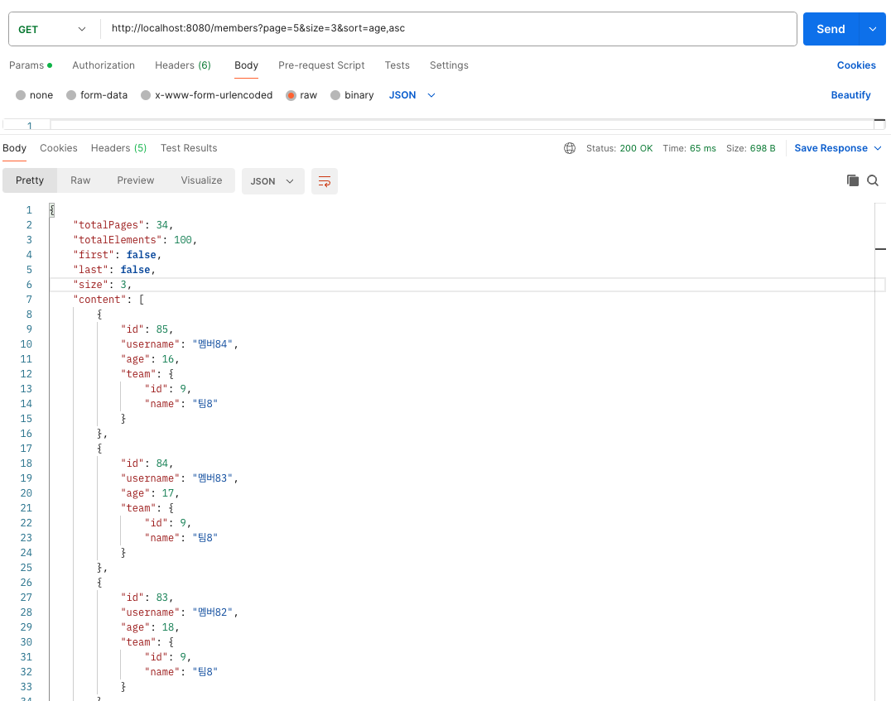
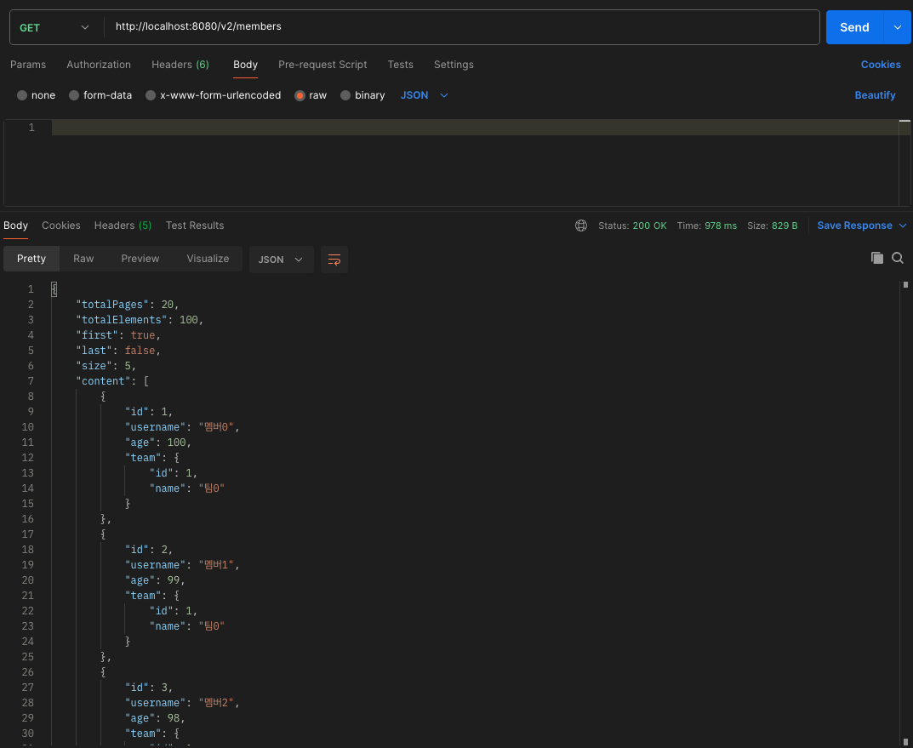

---

## 1. 조회 결과의 반환 타입

스프링 데이터 JPA에서 조회 결과의 반환 타입은 다양한 옵션을 제공한다. 각 반환 타입은 특정 요구사항에 맞게 사용할 수 있으며, 쿼리 메소드(또는 쿼리)에서 정의된 조건에 따라 다양한 형태로 결과를 받을 수 있다.

주요 반환 타입들을 살펴보자.

<br>

* **단일 엔티티 반환 : 단건 조회하는 경우**

  * ```java
    User findByUsername(String username);
    ```

  * 결과가 없다면 `null` 반환(원래는 `NoResultException`이 발생하지만, 스프링 데이터 JPA는 이 예외 대신 `null`을 반환한다)

  * 결과가 2건 이상인 경우 `NonUniqueResultException` 예외 발생


* **`Collection` 반환 : 쿼리 결과가 여러 개의 엔티티인 경우**

  * ```java
    List<User> findByStatus(String status);
    ```

  * 결과가 없으면 빈 컬렉션을 반환한다


* **`Optional` : 결과가 무조건 있어야하는 경우 `null` 대신 `Optional`을 반환해서 NPE를 방지할 수 있다**

  * ```java
    Optional<User> findById(Long id);
    ```


* **`Page` : 페이지네이션을 사용하여 대량의 데이터셋을 페이지 단위로 처리하여 성능을 최적화한다**

  * ```java
    Page<User> findByStatus(String status, Pageable pageable);
    ```


* **`Slice` : 페이지네이션과 유사하지만, 전체 페이지 개수를 계산하지 않는다**

  * ```java
    Slice<User> findByStatus(String status, Pageable pageable);
    ```


* **DTO : 사용자 정의 객체를 반환하는 것도 가능하다. 위의 [DTO 조회](https://seungki1011.github.io/posts/spring-data-jpa-2-query-method/#dto%EB%A1%9C-%EC%A1%B0%ED%9A%8C%ED%95%98%EA%B8%B0) 참고.**

  * ```java
    @Query("SELECT new com.example.UserDTO(u.id, u.username) FROM User u WHERE u.status = :status")
    List<UserDTO> findUserDTOByStatus(@Param("status") String status);
    ```


* **원시(primitive)또는 wrapper 타입**

  * ```java
    @Query("SELECT COUNT(u) FROM User u WHERE u.status = :status")
    long countByStatus(@Param("status") String status);
    ```

<br>

이외에도 많은 반환 타입을 지원한다. [공식 문서 참고](https://docs.spring.io/spring-data/jpa/reference/repositories/query-return-types-reference.html#appendix.query.return.types)

<br>

---

## 4. 페이지네이션, 정렬 기능 (Pagination, Sort) 

스프링 데이터 JPA는 대량의 데이터셋을 효율적으로 조회하고 관리하기 위해 페이지네이션(pagination)과 정렬(sorting) 기능을 제공한다. 이 기능들은 `Pageable`과 `Sort` 인터페이스를 통해 쉽게 구현할 수 있다. 

**페이지네이션은 데이터를 일정 크기의 페이지 단위로 나누어 조회하는 방법이고, 정렬은 데이터를 특정 기준에 따라 정렬하는 방법이다.**

<br>

---

### Page 사용하기

페이지네이션을 통해 데이터베이스에서 필요한 양의 데이터만을 가져올 수 있다. 이를 통해 메모리 사용량을 줄이고, 응답 시간을 단축할 수 있다. 다음은 페이지네이션을 사용하기 위한 주요 인터페이스들이다.

* `Pageable`
  * 페이지 요청 정보를 담고 있는 인터페이스
  * 페이지 번호와 페이지 크기, 정렬 기준을 설정할 수 있다
* `Page`
  * 페이지 정보와 함께 **전체 데이터 수와 전체 페이지 수를 포함**한다. 페이지 수를 계산하기 위해 추가적인 쿼리를 수행할 수 있다.
* `Slice`
  * **페이지 정보만을 포함하며, 전체 페이지 수를 계산하지 않는다.**
  * 성능 최적화를 위해 사용할 수 있다(모바일에서 스크롤 방식으로 컨텐츠 확인하는 경우)
  * 추가 `count` 쿼리 없이 다음 페이지만 확인 가능하다(내부적으로 `limit+1` 조회)

<br>

> 임포트할 때 `org.springframework.data.domain.`의 클래스를 임포트 받아야한다.
> {: .prompt-warning }

<br>

먼저 `Page`의 사용법을 알아보자. 

```java
public interface MemberRepository extends Repository<Member, Long> {
    Page<Member> findByAge(int age, Pageable pageable);
}
```

* `Pageable` 인터페이스를 파라미터로 받고 있다. 실제 사용할 때는 해당 인터페이스를 구현한 `PageRequest` 객체를 사용한다.

<br>

```java
@SpringBootTest
@Transactional
class MemberRepositoryTest {
    @Autowired
    MemberRepository memberRepository;
    
    // age가 1인 멤버 10명, age가 2인 멤버 20명 생성
    @BeforeEach
    public void setUp() {
        for (int i = 1; i <= 10; i++) {
            memberRepository.save(new Member("member" + i, 1));
        }
        for (int i = 11; i <= 30; i++) {
            memberRepository.save(new Member("member" + i, 2));
        }
    }

    @Test
    public void 페이지_정렬_없이_테스트() {
        int currentPage = 0; // 첫 번째 페이지를 조회
        int limit = 5; // 페이지당 보여줄 데이터는 5건
      
        PageRequest pageRequest = PageRequest.of(currentPage, limit);
        Page<Member> page = memberRepository.findByAge(1, pageRequest);

        List<Member> content = page.getContent(); // 조회된 데이터
        assertThat(content.size()).isEqualTo(5); // 조회된 데이터의 수
        assertThat(page.getTotalElements()).isEqualTo(10); // 전체 데이터의 수
        assertThat(page.getNumber()).isEqualTo(0); // 페이지 번호
        assertThat(page.getTotalPages()).isEqualTo(2); //전체 페이지 번호
    }
    
}
```

* `Page`에서는 `0`번 페이지가 첫 번째 페이지이다

<br>

---

### 정렬 조건 추가하기

정렬 기능을 사용하려면 `PageRequest` 객체를 생성할 때 `Sort` 객체를 함께 사용하면 된다.

바로 사용해보자. 먼저 레포지토리 인터페이스에 다음 메서드를 추가하자.

```java
public interface MemberRepository extends JpaRepository<Member, Long> {
    // 기존 메서드들 ...
    Page<Member> findByAgeBetween(int startAge, int endAge, Pageable pageable);
}
```

* `age`의 범위로 검색하는 메서드를 추가했다

<br>

```java
@SpringBootTest
@Transactional
@Slf4j
public class MemberRepositorySortTest {
    @Autowired
    MemberRepository memberRepository;
    
    /** 
     * (username, age) -> 엔티티가 (member1, 2) ~ (member10, 11)까지 생성되고 저장된다
     */
    @BeforeEach
    public void setUp() {
        for (int i = 1; i <= 10; i++) {
            memberRepository.save(new Member("member" + i, 1 + i));
        }
    }

    @Test
    public void 페이지_이름_정렬_테스트() {
        int currentPage = 0;
        int limit = 5;
        PageRequest pageRequest = PageRequest.of(currentPage, 
                                                 limit, 
                                                 Sort.by("age").ascending());
        /**
         * age가 2~11의 범위로 검색
         * 찾는 페이지는 0번 페이지
         * 한 페이지당 보여주는 데이터는 5건
         */
        Page<Member> page = memberRepository.findByAgeBetween(2, 11, pageRequest);

        List<Member> content = page.getContent(); // 조회된 데이터
        assertThat(content.get(0).getUsername()).isEqualTo("member1");
        assertThat(content.get(4).getUsername()).isEqualTo("member5");
    }
```

* `Sort.by("age").ascending()` : 나이를 기준으로 오름차순 정렬된다
  * `Sort.by(Direction.ASC, "age")` 처럼 사용하는 것도 가능하다
* 현재 나이를 기준으로 정렬했으니 첫 번째 데이터는 나이가 `2`이고 이름이 `member1`인 엔티티가 반환되어야 한다

<br>

> **페이지를 유지하면서 엔티티를 DTO로 변환하기**
>
> ```java
> Page<Member> page = memberRepository.findByAge(10, pageRequest);
> Page<MemberDto> dtoPage = page.map(m -> new MemberDto());
> ```
>
> {: .prompt-tip }

<br>

---

### Slice 사용하기

스프링 데이터 JPA에서 `Slice` 인터페이스는 `Page`와 유사하지만, 전체 페이지 수를 계산하지 않는다. `Slice`를 사용하면 다음 페이지가 존재하는지 여부만 알 수 있으며, 이로 인해 성능상의 이점이 존재할 수 있다.

`Slice`를 한번 사용해보자. 레포지토리 인터페이스에 다음 메서드를 추가하자.

```java
public interface MemberRepository extends JpaRepository<Member, Long> {
    // 기존 메서드들... 
    Slice<Member> findByUsernameContainingAndAgeBetween(String username, 
                                                        int startAge, 
                                                        int endAge, 
                                                        Pageable pageable);
}
```

* 특정 이름으로 검색했을때 나이의 범위도 고려한다

<br>

```java
@SpringBootTest
@Transactional
public class MemberRepositorySliceTest {
    @Autowired
    MemberRepository memberRepository;

    /**
     * 멤버 엔티티 20개 저장
     * 저장 형태 : (member1, 1) ~ (member10, 10), (멤버11, 11) ~ (멤버20, 20)
     */
    @BeforeEach
    public void setUp() {
        for (int i = 1; i <= 20; i++) {
            if (i <= 10) {
                memberRepository.save(new Member("member" + i, i));
            } else {
                memberRepository.save(new Member("멤버" + i, i));
            }
        }
    }

    @Test
    public void 슬라이스_테스트() {
        /**
         * Page 0
         * slice size 10
         * age 기준 오름차순 정렬
         */
        Pageable pageable = PageRequest.of(0, 10, Sort.by("age").ascending());
      
        /**
         * username에 "member"를 포함한 데이터 중에 age의 범위가 5~15 사이 검색
         */
        Slice<Member> slice = memberRepository
          .findByUsernameContainingAndAgeBetween("member", 5, 15, pageable);

        List<Member> content = slice.getContent();

        /**
         * Slice는 getTotalElements(), getTotalPages() 사용 불가
         */
        assertThat(content).isNotEmpty();
        assertThat(content.size()).isEqualTo(6); // 슬라이스의 크기
        assertThat(slice.getNumber()).isEqualTo(0); // 페이지 번호(넘버)
      
        /**
         * hasNext()가 false인 이유는 age 11부터는 "멤버11"로 username이 저장됨
         */
        assertThat(slice.hasNext()).isFalse(); // 다음 페이지가 존재하는지 확인
        assertThat(slice.hasPrevious()).isFalse(); // 이전 페이지가 존재하는지 확인
      
        /**
         * 1 번째 데이터는 age 5 -> member5
         * 6 번째 데이터는 age 10 -> member10
         */
        assertThat(content.get(0).getUsername()).isEqualTo("member5");
        assertThat(content.get(5).getUsername()).isEqualTo("member10");
    }

}
```

* `Pageable pageable = PageRequest.of(0, 10, Sort.by("age").ascending());`
  * 이전에는 `PageRequest`로 받았지만, `Pageable`로 받는 것도 가능하다
* `Slice`는 `limit+1`을 조회해서 다음 페이지의 여부를 확인한다

<br>

> `Page`나 `Slice` 타입으로 받지 않고 그냥 `List`와 같은 컬렉션 타입으로 받는 것이 가능하다. 물론 `Page`, `Slice`의 기능은 사용하지 못하지만, 단순히 쿼리에 `limit`를 걸어서 가져오고 싶은 경우 사용할 수 있다.
> {: .prompt-tip }

<br>

> [페이징과 정렬 공식 문서 참고](https://docs.spring.io/spring-data/jpa/reference/repositories/core-extensions.html#core.web.basic.paging-and-sorting)
> {: .prompt-tip }

<br>

---

### Count 쿼리 분리하기

스프링 데이터 JPA에서는 페이지네이션을 사용할 때, 기본적으로 전체 결과 수를 계산하는 `count` 쿼리를 자동으로 실행한다. 하지만 이 **`count` 쿼리가 복잡한 조인이나 서브쿼리를 포함하고 있을 경우 성능에 문제가 발생할 수 있다.** 이러한 경우, **`count` 쿼리를 분리해서 최적화할 수 있는 기능을 제공**한다.

사용법을 알아보자.

`count` 쿼리를 분리하려면, `@Query`와 `@Query`의 `countQuery` 속성을 사용하면 된다. 이를 통해 `count` 쿼리와 실제 데이터 조회 쿼리를 별도로 지정할 수 있다.

<br>

```java
public interface MemberRepository extends JpaRepository<Member, Long> {

    @Query(value = "SELECT m FROM Member m WHERE m.name LIKE %:name% AND m.age BETWEEN :startAge AND :endAge",
           countQuery = "SELECT COUNT(m) FROM Member m WHERE m.name LIKE %:name% AND m.age BETWEEN :startAge AND :endAge")
    Page<Member> findByUsernameContainingAndAgeBetween(@Param("name") String username, 
                                                   @Param("startAge") int startAge, 
                                                   @Param("endAge") int endAge, 
                                                   Pageable pageable);
}
```

* `value` : 실제 데이터를 조회하는 쿼리
* `countQuery` : 전체 결과 수를 계산하는 쿼리

<br>

> **하이버네이트 6 `LEFT JOIN` 최적화**
>
> * 스프링 부트 3^ 을 사용하면 하이버네이트 6이 적용된다.
>
> * Hibernate 6부터 도입된 주요 최적화 중 하나는 쓸모없는 `LEFT JOIN`을 제거하는 것이다
> * 기존의 Hibernate에서는 일부 경우에 불필요한 `LEFT JOIN`을 생성하는 경우가 있었다. 이러한 경우 불필요한 `LEFT JOIN`은 성능에 부정적인 영향을 미칠 수 있다. 예를 들어, 실제로 필요하지 않은 테이블을 조인하여 데이터를 가져오므로 쿼리 실행 시간이 길어지고, 데이터베이스의 부하가 증가할 수 있다.
> * Hibernate 6에서는 이러한 불필요한 조인을 자동으로 최적화하여 제거함으로써 쿼리의 성능을 개선한다.
>   {: .prompt-info }

<br>

---

## 2. 웹 확장: 페이지네이션, 정렬

### 기본 사용법

스프링 데이터 JPA에서 페이지네이션과 정렬을 웹에서 편리하게 사용할 수 있는 기능을 지원한다.

사용법을 알아보자.

<br>

먼저 다음과 같이 `TeamDTO`와 `MemberDTO`를 만들자.

`TeamDTO`

```java
@ToString
@Getter
public class TeamDTO {
    private long id;
    private String name;

    public TeamDTO(Team team) {
        this.id = team.getId();
        this.name = team.getName();
    }
}
```

<br>

`MemberDTO`

```java
@ToString
@Getter
public class MemberDTO {
    private Long id;
    private String username;
    private int age;
    private TeamDTO team;

    public MemberDTO(Member member) {
        this.id = member.getId();
        this.username = member.getUsername();
        this.age = member.getAge();
        this.team = new TeamDTO(member.getTeam());
    }
}
```

* 엔티티를 필드로 사용하면 안된다
* 직접 입력으로 받아서 사용하는 것은 가능

<br>

> **엔티티를 API로 직접 노출하는 경우의 문제**(DTO로 변환해서 사용하는 이유)
>
> * **보안 문제**
>   * 과도한 정보 노출 : 필요하지 않은 내부 구현 세부 사항이나 데이터베이스 필드가 외부에 노출될 수 있다
>   * 민감한 정보 노출 : 엔티티가 민감한 정보를 포함하고 있을 경우 절대 엔티티를 외부로 노출하면 안된다
>   * 클라이언트가 의도하지 않은 필드에 손대는 것을 막아야한다
> * **성능 문제**
>   * 과도한 데이터 전송: 엔티티가 많은 필드를 가지고 있거나 관계가 복잡할 경우, 불필요하게 많은 데이터가 전송되어 성능 저하를 초래할 수 있다
> * **순환 참조 문제**
>   * 엔티티 간의 양방향 관계로 인해 순환 참조가 발생하면 직렬화 시 무한 루프에 빠져 성능 문제가 발생할 수 있다
> * **유지 보수 문제**
>   * 엔티티 변경의 영향: 엔티티 구조가 변경될 때마다 API의 스펙도 변경되기 때문에 관련 코드를 지속적으로 변경해야 한다
>     {: .prompt-danger }

<br>

다음과 같은 컨트롤러를 만들자.

```java
@RequiredArgsConstructor
@RestController
public class PageableController {

    private final MemberRepository memberRepository;
    private final TeamRepository teamRepository;

    @GetMapping("/members")
    public Page<MemberDTO> list(Pageable pageable) { // Pageable을 파라미터로 받음
        Page<Member> page = memberRepository.findAll(pageable);
        Page<MemberDTO> dtoPage = page.map(MemberDTO::new);
        return dtoPage;
    }
    
    // 데이터 생성
    @PostConstruct
    @Transactional
    public void setupData() {
        // 팀 생성
        for (int i = 0; i < 10; i++) {
            Team team = new Team("팀" + i);
            teamRepository.save(team);
        }
        // 멤버 생성
        for (int i = 0; i < 100; i++) {
            int teamIndex = i / 10;
            Team team = teamRepository
                    .findById((long) teamIndex + 1)
                    .orElseThrow(() -> new RuntimeException("팀을 찾을 수 없습니다."));

            Member member = Member.builder()
                    .username("멤버" + i)
                    .age(100 - i)
                    .team(team)
                    .build();

            memberRepository.save(member);
        }
    }
}
```

* `setupData()` : `@PostConstruct`를 사용해서 애플리케이션이 시작할 때 데이터를 만들어놓는다
* **컨트롤러에서 `Pageable`을 파라미터로 받아 페이징 기능을 구현할 수 있다**
* `dtoPage`를 inline-variable로 리팩토링 가능

<br>

포스트맨(Postman)으로 요청을 보내보자.

`GET` : [http://localbhost:8080/members](http://localbhost:8080/members)

_Pageable 사용, page = 0_

* 한 페이지는 기본적으로 데이터를 20개까지 확인할 수 있다
* 기본적으로 `page=0`부터 시작한다

<br>

이번에는 요청 파라미터를 추가해서 요청을 보내보자.

`GET` : [http://localhost:8080/members?page=5&size=3&sort=age,asc](http://localhost:8080/members?page=5&size=3&sort=age,asc)

_/members?page=5&size=3&sort=age,asc_

* `page` : 시작 페이지(현재 페이지)
* `size` : 한 페이지에 노출할 데이터 건수
* `sort` : 정렬 조건을 정의한다
  * 위의 경우 `sort=age,asc` : `age`를 기준으로 오름차순(`asc`) 정렬
  * `sort=age,asc&sort=team,desc`와 같이 정렬 조건을 더 추가할 수 있다

<br>

> **글로벌 : 기본 페이지, 최대 페이지 사이즈 설정하기**
>
> `기본 페이지 사이즈`는 디폴트가 `20`이다. `최대 페이지 사이즈`는 디폴트가 `2000`이다.
>
> `application.yml`이나 `application.properties`에서 기본값 설정을 변경할 수 있다.(이 경우 글로벌하게 적용된다)
>
> `application.yml`
>
> ```yaml
> spring:
> data:
>  web:
>    pageable:
>      default-page-size: 20
>      max-page-size: 2000
> ```
>
> {: .prompt-info }

<br>

---

### @PageableDefault 사용(+@SortDefault)

`@PageableDefault` 애노테이션을 사용해서 기본 페이지 사이즈, 최대 페이지 사이즈, 정렬 등과 같은 기본 설정을 각 API마다 개별적으로 적용할 수 있다.

사용법을 알아보자.

```java
@GetMapping("/v2/members")
public Page<MemberDTO> listV2(@PageableDefault(size = 5) @SortDefault.SortDefaults({
        @SortDefault(sort = "age", direction = Sort.Direction.DESC),
        @SortDefault(sort = "team", direction = Sort.Direction.ASC)
}) Pageable pageable) {
    Page<Member> page = memberRepository.findAll(pageable);
    Page<MemberDTO> dtoPage = page.map(MemberDTO::new);
    return dtoPage;
}
```

* `Pageable` 이전에 `@PageableDefault`를 추가해서 페이지네이션과 관련된 옵션을 설정할 수 있다
  * 예시에서는 `size=5`를 통해 한 페이지당 `5`건의 데이터를 보여주도록 설정했다
  * 이제 따로 파라미터를 추가해서 요청하지 않아도 기본적으로 `20`건이 아닌 `5`건을 노출한다
* `@SortDefault.SortDefaults({정렬 조건})`을 사용해서 정렬 조건을 설정할 수 있다
  * 이 경우에도 파라미터로 정렬 조건을 넘기지 않아도 기본적으로 설정한 정렬 조건을 이용해서 데이터를 보여준다
  * 예시에서는 `age`를 내림차순 정렬, `team`을 오름차순 정렬으로 정렬하고 있다

<br>

포스트맨으로 해당 API로 요청을 넣어서 결과를 살펴보자.

`GET` : [http://localbhost:8080/v2/members](http://localbhost:8080/v2/members)

_@PageableDefault, @SortDefault 사용_

<br>


---

## Reference

1. [김영한 : 실전 스프링 데이터 JPA!](https://www.inflearn.com/course/%EC%8A%A4%ED%94%84%EB%A7%81-%EB%8D%B0%EC%9D%B4%ED%84%B0-JPA-%EC%8B%A4%EC%A0%84/dashboard)
1. [https://docs.spring.io/spring-data/jpa/reference/repositories/core-extensions.html#core.web.basic.paging-and-sorting](https://docs.spring.io/spring-data/jpa/reference/repositories/core-extensions.html#core.web.basic.paging-and-sorting)