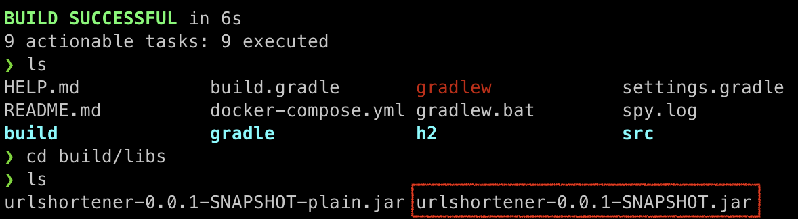
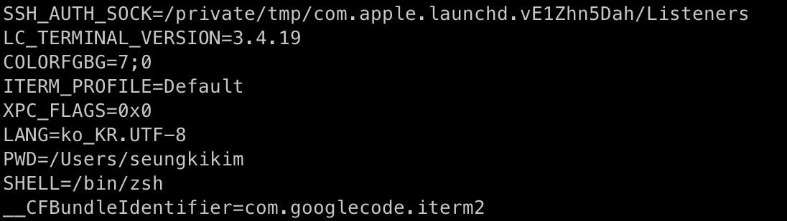

---

## 1. 스프링 부트 빌드

### 스프링 부트의 빌드 편리성

스프링 부트(Spring Boot)는 **스프링 프레임워크(Spring Framework)를 더 간편하게 사용하기 위해 만들어진 확장 프로젝트**이다.

기존 스프링 프로젝트는 **여러 설정 파일(XML 또는 Java Config), 다양한 의존성, 그리고 프로젝트 초기 설정이 복잡**했습니다. 스프링 부트는 이러한 복잡성을 해결하기 위해 다음과 같은 기능을 제공한다.

- **자동 설정(Auto-configuration)**: 스프링 부트는 프로젝트에서 필요로 하는 대부분의 설정을 자동으로 구성한다. 개발자는 설정해야 하는 부분을 최소화하고, 필요한 경우에만 직접 설정을 추가한다.
- **스타터 의존성(Starter Dependencies)**: 스프링 부트는 특정 기능(예: 웹 애플리케이션, JPA, 메시징 등)에 필요한 의존성을 한 번에 추가할 수 있는 스타터 의존성을 제공해준다. 예를 들어, `spring-boot-starter-web`를 추가하면 웹 애플리케이션에 필요한 모든 라이브러리들이 자동으로 포함된다.
- **Opinionated Defaults**: 스프링 부트는 **"Best Practice"**에 따른 기본 설정을 제공한다. 이는 개발자가 선택해야 할 사항을 줄여주어 더 빠르게 프로젝트를 시작할 수 있게 해준다.

<br>

---

### JAR 파일 빌드와 내장 WAS

전통적인 Java 애플리케이션에서는 애플리케이션 코드와 의존성 라이브러리를 각각 별도의 JAR 파일로 관리했다. 이로 인해 다음과 같은 문제가 발생할 수 있었다.

- **의존성 관리의 복잡성**: 모든 의존성 라이브러리를 명시적으로 관리하고, 이를 실행 시 CLASSPATH에 추가해야 했다. 만약 의존성 중 일부가 누락되거나 버전이 충돌하면 애플리케이션이 실행되지 않을 수 있다.
- **WAR 파일 배포의 번거로움**: 기존의 스프링 애플리케이션은 주로 WAR 파일로 패키징되어, 외부 웹 서버(Tomcat, JBoss 등)에 배포되었다. 이는 배포 및 설정 과정이 복잡해지는 단점이 있었다.

<br>

스프링 부트는 이러한 문제를 해결하기 위해 **Fat JAR**(또는 Uber JAR) 개념을 도입했다. Fat JAR는 **애플리케이션의 모든 클래스 파일 및 의존성 라이브러리를 하나의 JAR 파일에 포함**시켜, 독립 실행형 애플리케이션을 만들 수 있다.

* **Fat JAR의 구성**: 스프링 부트에서 생성하는 Fat JAR는 단순히 애플리케이션 코드뿐만 아니라, 내장 WAS와 모든 의존성 라이브러리도 함께 포함한다. 이를 통해 외부 의존성이나 설정 없이 JAR 파일 하나만으로 애플리케이션을 실행할 수 있다.
* **애플리케이션 실행**: Fat JAR로 패키징된 애플리케이션은 단순히 `java -jar` 명령으로 실행할 수 있다. 이는 개발과 배포 과정을 대폭 간소화했다.

<br>

스프링 부트는 특별한 **JarLauncher**를 사용하여 이 Fat JAR 파일을 실행한다.

* `JarLauncher`는 JAR 파일 내에서 필요한 클래스를 찾아서 로드하고, 스프링 부트 애플리케이션을 시작할 수 있도록 설정한다

<br>

스프링 부트는 Fat JAR에서 또 다른 중요한 기술인 **Class Loader Isolation**을 사용하여 JAR 파일 내부의 구조를 효과적으로 관리한다. 일반적으로, **Fat JAR의 내부는 중첩된 JAR 파일로 이루어지며, 이를 처리하는 방법이 필요**하다.

* **중첩 JAR 파일 지원**: 스프링 부트는 Fat JAR 내부에 중첩된 JAR 파일을 포함시키고, 이를 적절히 로딩하기 위해 고유의 클래스 로더를 사용한다. 이 클래스 로더는 JAR 파일 안의 또 다른 JAR 파일을 로드하여, 클래스 경로 문제를 해결한다.
* **클래스 경로 충돌 방지**: 스프링 부트의 클래스 로더는 애플리케이션의 클래스와 라이브러리 간의 클래스 경로 충돌을 방지하고, 필요한 파일만 메모리에 로드하여 실행 성능을 향상시킨다.

<br>

---

### 빌드 방법

먼저 빌드하고 싶은 프로젝트의 위치로 이동하고 `./gradlew clean build` 명령어를 사용한다.

_./gradlew clean build (Mac OS 기준)_

<br>

완료 문구를 확인했으면, `cd build/libs`로 디렉토리를 이동해서 `jar` 파일을 확인한다.

_libs의 jar 파일 확인_

* `plain.jar`에는 라이브러리가 포함되지 않고, 코드만 포함되어 있다

<br>

`java -jar urlshortener-0.0.1-SNAPSHOT.jar` 명령어로 애플리케이션의 실행이 가능하다.

_jar 실행_

<br>

`jar` 파일의 내용물을 확인하고 싶다면, `jar -xvf urlshortener-0.0.1-SNAPSHOT.jar` 명령어로 풀어서 확인해볼 수 있다. 확인해보면 다음의 3가지 폴더가 존재한다.

_jar -xcf {jarname}_

<br>

---

## 2. 외부 설정

### 외부 설정 소개

스프링 부트 애플리케이션에서 외부 설정을 사용하는 대표적인 이유는 **환경 간 설정을 분리**하기 위해서다. 개발, 테스트, 운영 등 다양한 환경에서 애플리케이션을 실행할 때 환경별로 설정이 달라질 수 있다. 예를 들어, **데이터베이스 연결 정보나 API 엔드포인트 등이 환경마다 다를 수 있다**. 애플리케이션 런 시, 외부 설정을 주입하여 각 환경을 분리해서 사용할 수 있다.

<br>

_외부 설정을 통한 환경 분리_

* 외부 설정을 사용하기 이전에는 코드에서 `dev`와 `prod`에 대해 각각 빌드를 해서 **개발과 프로덕션 `jar` 파일을 따로 만들어서 배포**하였다. 이는 환경 독립성, 재사용성, 유연성, 유지 보수성, 등 **외부 설정을 사용하는 것에 비해 비효율적**이다.

<br>

---

### 외부 설정 주입 방법

외부 설정을 불러와서 애플리케이션에 사용하는 방법에는 여러가지 방법이 존재한다.

* OS 환경 변수(OS enviroment variables)
* 자바 시스템 속성(Java system properties)
* 자바 커맨드 라인 인수(command line properties)
* `@Configuration` 클래스의 `@PropertySource` 애노테이션
* `SPRING_APPLICATION_JSON` 사용
* 외부 설정 파일(설정 데이터)

이외에도 여러가지 외부 설정을 사용하는 방법들이 존재한다.

<br>

> **스프링 공식 문서: 외부 설정(Externalized Configuration)**
>
> [https://docs.spring.io/spring-boot/reference/features/external-config.html](https://docs.spring.io/spring-boot/reference/features/external-config.html)
{: .prompt-tip }

<br>

각 외부 설정 방법을 간단히 살펴보자.

<br>

---

### OS 환경 변수 사용

**시스템 환경 변수로 설정을 전달**할 수 있다. 환경 변수는 컨테이너화된 환경에서 유용하며, 특정 설정 값을 외부에서 관리할 수 있다.

OS 환경 변수를 `printenv` 명령어를 통해 확인 해보자.

_OS env_

설정된 OS 환경 변수의 목록이 출력되는 것을 확인할 수 있다.

<br>

이번엔 OS 환경 변수를 설정하는 예시를 살펴보자.

`예시`

```bash
export SERVER_PORT=8081
export SPRING_DATASOURCE_URL=jdbc:mysql://localhost:3306/mydb
```

* 애플리케이션을 실행하면 환경 변수에서 설정 값을 읽어와 적용한다
  * `SERVER_PORT`: `server.port` 설정 대체
  * `SPRING_DATASOURCE_URL`: `spring.datasource.url` 설정 대체
* `bash`나 `zsh`에 설정하지 않을 경우, 해당 환경 변수는 휘발적이다

<br>

그러면 **애플리케이션에서는 이 환경 변수를 어떻게 읽어**드릴까? 코드를 통해 살펴보자.

<br>

```java
@Slf4j
public class ReadOsEnv {
    public static void main(String[] args) {
        Map<String, String> envMap = System.getenv();
        for (String key : envMap.keySet()) {
            log.info("{} : {}", key, System.getenv(key));
        }
    }
}
```

```
[main] INFO com.example.springbootpractice.ReadOsEnv -- _P9K_SSH_TTY : 
[main] INFO com.example.springbootpractice.ReadOsEnv -- RBENV_SHELL : zsh
[main] INFO com.example.springbootpractice.ReadOsEnv -- REDDIT_CLIENT_ID :
[main] INFO com.example.springbootpractice.ReadOsEnv -- REDDIT_CLIENT_SECRET :
[main] INFO com.example.springbootpractice.ReadOsEnv -- COMMAND_MODE : unix2003
[main] INFO com.example.springbootpractice.ReadOsEnv -- LOGNAME : seungkikim
[main] INFO com.example.springbootpractice.ReadOsEnv -- XPC_SERVICE_NAME : application.com.jetbrains.intellij.ce.7968666.7969370
[main] INFO com.example.springbootpractice.ReadOsEnv -- PYENV_VIRTUALENV_INIT : 1
[main] INFO com.example.springbootpractice.ReadOsEnv -- __CFBundleIdentifier : com.jetbrains.intellij.ce
[main] INFO com.example.springbootpractice.ReadOsEnv -- JAVA_MAIN_CLASS_66327 : com.example.springbootpractice.ReadOsEnv
[main] INFO com.example.springbootpractice.ReadOsEnv -- SHELL : /bin/zsh
```

* `System.getenv()`: 전체 OS 환경 변수를 `Map`으로 조회한다
* `System.getenv(key)`: 특정 OS 환경 변수 값을 `String`으로 조회한다

<br>

> **인텔리제이 환경 변수 설정**
>
> `Run > Edit Configurations > Environment Variables`에 `MY_API_URL=localhost:1234/myapi`를 추가해서 다음의 코드를 실행해보면 해당 환경 변수가 출력되는 것을 확인할 수 있다.
>
> ```java
> log.info("MY_API_URL = {}", System.getenv("MY_API_URL"));
> ```
{: .prompt-info }

<br>

---

### 자바 시스템 속성 사용

자바 시스템 속성은 **JVM 수준에서 설정을 관리하며, 스프링 부트 애플리케이션에서 이를 사용하여 설정 값을 정의하거나 덮어쓸 수 있다**. 이는 명령줄 인자 또는 환경 변수와 유사하게 동작하지만, JVM에 전달된다는 점에서 차이가 있다.

<br>

`예시1`

```bash
java -Dserver.port=9090 -Dspring.profiles.active=prod -jar myapp.jar
```

* `server.port=9090`: 스프링 부트 애플리케이션의 서버 포트를 9090으로 설정
* `spring.profiles.active=prod`: 활성화된 스프링 프로파일을 `prod`로 설정

<br>

`예시2`

```bash
java -Durl=dev -jar myapp.jar
```

* `-D` 옵션을 통해서 `key=value` 형식으로 값을 주면 된다
  * 위에서는 `url=dev`로 속성이 추가된다

<br>

스프링 부트 애플리케이션 내에서 자바 시스템 속성을 읽기 위해서 `getProperties()`을 사용할 수 있다.

```java
@Slf4j
public class JavaSystemProperties {
    public static void main(String[] args) {
        Properties properties = System.getProperties();
        for (Object key : properties.keySet()) {
            log.info("{} = {}", key, System.getProperty(String.valueOf(key)));
        }
    }
}
```

```
[main] INFO com.example.springbootpractice.JavaSystemProperties -- java.vm.vendor = Azul Systems, Inc.
[main] INFO com.example.springbootpractice.JavaSystemProperties -- sun.arch.data.model = 64
[main] INFO com.example.springbootpractice.JavaSystemProperties -- user.variant = 
[main] INFO com.example.springbootpractice.JavaSystemProperties -- java.vendor.url = http://www.azul.com/
[main] INFO com.example.springbootpractice.JavaSystemProperties -- user.timezone = Asia/Seoul
[main] INFO com.example.springbootpractice.JavaSystemProperties -- java.vm.specification.version = 17
[main] INFO com.example.springbootpractice.JavaSystemProperties -- os.name = Mac OS X
[main] INFO com.example.springbootpractice.JavaSystemProperties -- user.country = KR
[main] INFO com.example.springbootpractice.JavaSystemProperties -- sun.java.launcher = SUN_STANDARD
[main] INFO com.example.springbootpractice.JavaSystemProperties -- sun.boot.library.path = /Users/seungkikim/Library/Java/JavaVirtualMachines/azul-17.0.10/Contents/Home/lib
[main] INFO com.example.springbootpractice.JavaSystemProperties -- sun.java.command = com.example.springbootpractice.JavaSystemProperties
```

* `System.getProperties()`를 통해서 모든 자바 시스템 속성을 조회할 수 있다
* 정말 많은 자바 시스템 속성을 확인할 수 있는데, **자바는 내부적으로 이런 속성들을 사용**한다

<br>

> **인텔리제이에서 자바 시스템 속성 설정**
>
> `Run > Edit Configurations > Modify Options > Add VM options`로 `VM option`을 추가한다. 그 후 해당 공란에 사용할 자바 시스템 속성 명시하면 된다.
>
> _VM options_
>
> 오른쪽 위 디버그(debug) 버튼의 오른쪽을 클릭해서 `edit`을 통해 해당 창을 접근하는 것도 가능하다.
{: .prompt-info }

<br>

---

### 자바 커맨드 라인 인수 사용

#### 커맨드 라인 인수

애플리케이션을 실행할 때 **명령줄 인자로 설정 값을 전달**할 수 있다. 이는 **특정 환경에서 빠르게 설정을 변경**할 수 있는 방법이다.

<br>

`예시`

```bash
java -jar myapp.jar url=dev user=ksk
```

* **우선 적용**: 참고로 이 방법은 추후에 사용할 `application.yml` 파일에 정의된 설정을 덮어쓴다

<br>

> **main(String[] args)**
>
> 커맨드 라인 인수는 애플리케이션 실행 시점에 커맨드 라인을 통해 전달한 인자를 `main(args)`의 파라미터로 전달하는 방식이다.
>
> `args` 값을 찍어보면 넘어오는 값을 확인해 볼 수 있다. 
{: .prompt-info }

<br>

`예시2`

```bash
java -jar app.jar dataA dataB
```

* `dataA`, `dataB`가 `args`로 전달된다

<br>

찍어보면 다음과 같이 출력된다.

```java
for (String arg : args) {
  log.info("arg = {}", arg);
}
```

```
CommandLineV1 - arg = dataA
CommandLineV2 - arg = dataB
```

<br>

이 방법의 문제는 `String` 값이 통으로 전달되기 때문에, **`key=value` 형식으로 전달하는 경우 `=`을 기준으로 파싱을 해서 사용해야** 한다.

<br>

---

#### 커맨드 라인 옵션 인수(스프링 제공)

이 문제를 해결하기 위해서 커맨드 라인 옵션 인수를 사용한다.

`예시`

```bash
java -jar myapp.jar --server.port=9090 --spring.profiles.active=prod
```

* 이전과 다르게 `--`을 앞에 붙여서 사용한다
* `key=value` 형식으로 사용한다
* 하나의 키에 여러 값을 지정하는 것도 가능하다(잘 사용하지는 않는다)

<br>

해당 값을 읽는 방법은 다음과 같다.

```java
ApplicationArguments appArgs = new DefaultApplicationArguments(args);
log.info("OptionNames = {}", appArgs.getOptionNames());

Set<String> optionNames = appArgs.getOptionNames();
for (String optionName : optionNames) {
    log.info("option arg {} = {}", optionName, appArgs.getOptionValues(optionName));
}
```

<br>

만에 하나 실제 사용한다면 다음과 같은 형태로 사용할 수 있다.

```java
List<String> url = appArgs.getOptionValues("url");
```

<br>

스프링 부트는 해당 옵션 인수를 더욱 쉽게 사용할 수 있다.(자동으로 빈 등록한다)

<br>

---

### SPRING_APPLICATION_JSON

설정을 JSON 형식으로 환경 변수에 전달할 수 있다. 이는 복잡한 설정을 **한 번에 전달할 때 유용**할 수 있다.

<br>

`예시`

```bash
export SPRING_APPLICATION_JSON='{"server":{"port":8081},"app":{"name":"MyApp","description":"A sample application"}}'
```

<br>

설정한 환경 변수를 적용한 상태에서 애플리케이션을 실행하면 `SPRING_APPLICATION_JSON`에 정의된 설정 값이 자동으로 로드된다.

<br>

---

### Enviroment, PropertySource

지금까지 살펴본 외부 설정값을 읽는 방법은 각 방법 마다 모두 달랐다.

* **OS 환경 변수**: `System.getenv()`
* **자바 시스템 속성**: `System.getProperties()`
* **자바 커맨드라인 인수**: `args`
  * **옵션 인수**: `.getOptionNames()`

<br>

문제는, **해당 구현에 의존하게 되면 나중에 외부 설정값을 읽는 방법을 변경했을 때 관련 사용 코드도 함께 변경**해야 한다. 쉽게 말해서 특정 외부 설정 방법에 종속이 된다. 스프링은 `Enviroment`와 `PropertySource`라는 인터페이스를 통해 이런 문제를 해결한다.

1. `Environment`는 애플리케이션이 **실행되는 환경에 대한 정보를 제공하며, 환경 변수, 시스템 속성, 외부 설정 파일 등의 다양한 설정 소스를 통합적으로 관리**하는 인터페이스이다.
   * 쉽게 말해서, 애플리케이션의 다양한 설정 값을 한 곳에서 관리할 수 있도록 돕는다

2. `PropertySource` 인터페이스는 **스프링 프레임워크에서 설정 값을 읽어오는 방법을 추상화한 인터페이스**이다.
   * 쉽게 말해서, 스프링의 `Environment`에서 관리되는 다양한 설정 소스(예: `.properties` 파일, 환경 변수, 시스템 속성 등)로부터 설정 값을 읽어오는 역할을 한다
   * 커스텀 `PropertySource`를 구현해서, 표준 외의 특수한 설정 소스에서 값을 읽어올 수 있다 

<br>

`예시`

```java
@Slf4j
@RequiredArgsConstructor
public class EnvCheck {

    private final Environment env; // 스프링에서 자동 주입
  
    public void printAppConfig() {
        String serverPort = env.getProperty("port");
        String appName = env.getProperty("name");
        String appDescription = env.getProperty("description");
        
        log.info("Server Port: {}", serverPort);
        log.info("Application Name: {}", appName);
        log.info("Application Description: {}", appDescription);
    }
}
```

* 환경 변수를 사용하든, 시스템 속성을 사용하든, 어떤 방법을 사용하든 `Enviroment`는 전부 추상화 해놨기 때문에, 외부 설정을 읽는 방법을 변경해도 해당 코드는 변경하지 않아도 된다

<br>

---

## 3. 설정 파일

이전에 살펴본 외부 설정 사용법들은 그 때 마다 입력을 해야하기 때문에 불편하다. 이런 문제를 해결하기 위해서 설정값을 파일에 넣어두고 관리하는 방법을 사용한다.

설정 파일은 애플리케이션에서 **다양한 설정 값을 분리해 두고 관리하기 위해 사용**된다. 이를 통해 애플리케이션의 유연성과 유지보수성을 높이고, 코드와 설정을 분리하여 여러 환경에서 쉽게 적용할 수 있다.

<br>

---

### 외부 파일

**외부 설정 파일**은 애플리케이션이 실행되는 환경 외부에서 관리되는 설정 파일이다. 이는 애플리케이션이 실행될 때 동적으로 로드되며, **내부 설정 파일보다 우선순위가 높다**.

<br>

_외부 파일 사용_

<br>

```bash
java -jar myapp.jar
```

* `myapp.jar`의 디렉토리에서 `application.properties`를 찾아서 설정 파일로 사용한다
* `spring.config.name={설정파일 이름}`으로 특정 이름을 가진 설정 파일을 찾아서 로드하도록 할 수 있다

<br>

외부 파일의 단점은 **해당 설정 파일 자체에 대해 관리**를 해야 하고, 만약 **변경 사항이 생긴다면 모든 서버의 설정 파일을 각각 변경**해줘야 한다. 물론 특정 소프트웨어를 사용해서 관리할 수 있겠지만, 더 쉬운 방법이 존재한다.

<br>

---

### 내부 파일

이전 외부 파일의 문제를 해결하는 방법은 **설정 파일 자체를 프로젝트 내부에 포함해서 관리**하는 것이다. 보통 설정 파일이 애플리케이션 코드와 함께 패키징 되기 때문에, 배포도 함께 된다.

<br>

_내부 파일 사용_

* 다음의 두 설정 파일을 만들어서 운영과 개발 환경에 대한 설정값 넣는다
  * 개발용 설정 파일 `application-dev.properties`
  * 운영용 설정 파일 `application-prod.properties`
* 배포시 두 설정 파일도 함께 배포되기 때문에 어떤 **환경을 사용하는지에 대한 값을 넘기기만 하면 된다**. 이 값을 편의상 프로필(profile)이라고 하자.
  * 스프링에서는 다음과 같이 프로필 값을 넘길 수 있다
  * `--spring.profiles.active=dev` : `application-{profile}.properties`에서 `profiles` 대신 `dev`가 들어가서, `application-dev.properties`를 읽어서 사용하게 된다
  * 자바 시스템 속성으로도 가능하다. `-Dspring.profiles.active=dev`

<br>

---

### 내부 파일 통합

여기서 그치지 않고 한눈에 설정을 파악하기 위해서 **두 설정 파일을 통합하는 것도 가능**하다.

다음 그림 처럼 `dev`용 설정 파일과 `prod`용 설정 파일을 하나의 설정 파일 `application.yml`(또는 `properties`)으로 합칠 수 있다.

<br>


_설정 파일 통합_

* **properties 사용**
  * `#---` 또는 `!---`을 사용해서 논리적으로 나눌 수 있다
* **yml 사용**
  * `---`을 사용해서 나눌 수 있다

<br>

로컬 개발 환경에서 항상 **프로필을 지정하는 것이 귀찮기 때문에 사용할 수 있는 것이 기본 프로필(default profile)**이다. 

```yaml
url: default-db
port: 1234
---
spring:
  config:
    activate:
      on-profile: dev
url: dev-db
port: 3036
---
spring:
  config:
    activate:
      on-profile: prod
url: prod-db
port: 9090
```

* 스프링은 문서를 위에서 부터 읽는다
* 가장 첫 논리적 영역에는 `spring.config.activate.on-profile`과 같은 프로필 정보가 없기 때문에, 프로필과 무관하게 설정 데이터를 읽어서 사용한다

<br>

여기서 알아둘 것은 기본 프로필은 항상 먼저 적용된 후, 특정 프로필(`dev`, `prod`..)이 활성화되면 해당 프로필의 설정이 덮어쓰는 방식이다. 만약 `dev` 프로필에 `url` 설정이 없고, 기본 프로필에는 `url` 설정이 있다면, 기본 프로필의 `url` 설정을 사용하게 된다.

<br>

> **설정 파일 우선순위**
>
> 1. jar 내부 `application.properties`
> 2. jar 내부 프로필 적용 파일 `application-{profile}.properties`
> 3. jar 외부 `application.properties`
> 4. jar 외부 프로필 적용 파일 `application-{profile}.properties`
{: .prompt-info }

<br>

---

## 4. 외부 설정 사용

### @Value

`@Value` 애노테이션은 스프링 프레임워크에서 **프로퍼티 값을 주입하는 데 사용되는 애노테이션**이다. 이 애노테이션을 통해 애플리케이션의 **설정 값이나 다른 외부 소스의 값을 스프링 빈의 필드, 메서드 또는 생성자에 주입**할 수 있다.

<br>

#### 필드 주입

`application.properties`

```properties
app.name=MyApplication
server.port=8080
```

<br>

```java
@Component
@Slf4j
public class AppConfig {

    @Value("${app.name}")
    private String appName;

    @Value("${server.port}")
    private int serverPort;

    public void printConfig() {
        log.info("Application Name: {}", appName);
        log.info("Server Port: {}", serverPort);
    }
}
```

* `@Value("${app.name}")`: `application.properties`든 다른 외부에서 받은 설정값이든, `app.name`을 주입받아 `appName` 필드에 할당한다

* 다음과 같이 기본값 설정도 가능하다 `@Value("${server.port:5050}")`: 키가 없는 경우 기본값으로 `5050`을 사용한다

<br>

---

#### 메서드 주입

```java
@Component
@Slf4j
public class AppConfig {

    @Value("${app.name}")
    public void setAppName(String appName) {
        log.info("Application Name: {}", appName);
    }

    @Value("${server.port}")
    public void setServerPort(int serverPort) {
        log.info("Server Port: {}", serverPort);
    }
}
```

<br>

---

#### 생성자 주입

```java
@Component
public class AppConfig {

    private final String appName;
    private final int serverPort;

    public AppConfig(@Value("${app.name}") String appName,
                     @Value("${server.port}") int serverPort) {
        this.appName = appName;
        this.serverPort = serverPort;
    }

    public void printConfig() {
        log.info("Application Name: {}", appName);
        log.info("Server Port: {}", serverPort);
    }
}
```

<br>

---

#### SpEL(Spring Expression Language) 사용

[SpEL](https://docs.spring.io/spring-framework/reference/core/expressions.html)을 사용하여 동적으로 계산된 값을 주입하는 것도 가능하다.

<br>

```java
@Component
public class AppConfig {

    @Value("#{T(java.lang.Math).random() * 100.0}")
    private double randomValue;

    public void printConfig() {
        log.info("Random Value: {}", randomValue);
    }
}
```

* `Math.random()` 함수로 생성된 값을 `randomValue` 필드에 주입한다

<br>

---

### @ConfigurationProperties

`@ConfigurationProperties` 애노테이션은 스프링 부트에서 **설정 값을 Java 객체에 바인딩하는 데 사용**된다. 이 애노테이션을 활용하면 **애플리케이션 설정을 강력한 타입 안정성으로 관리**할 수 있으며, 복잡한 설정 구조를 효율적으로 처리할 수 있다.

* **타입 안전성 제공**
  - `@ConfigurationProperties`는 설정 값을 Java 객체에 바인딩하기 때문에, 설정 값의 타입과 구조를 컴파일 타임에 검사할 수 있다. 이는 타입 안전성을 보장하여 코드 오류를 줄인다.
* **구조적 설정 관리**
  * 복잡한 설정 구조를 관리할 때 유용하다. 여러 설정 항목이 있는 경우, 설정 값을 그룹화하여 하나의 Java 객체로 관리할 수 있다.

<br>

> **스프링이 자동으로 처리해주는게 아니였어?**
>
> 스프링 부트는 `application.yml`이나 `application.properties`에 정의된 설정 값을 자동으로 읽어와서, 많은 경우 별도의 추가 설정 없이 자동으로 적용해준다. 그럼에도 불구하고 다음과 같은 경우에 `@ConfigutationProperties`를 사용하는 것이 편할 수 있다.
>
> * **복잡한 설정**
>   * 간단한 설정 외에도, 애플리케이션에서 복잡한 구조를 가진 설정을 관리해야 할 때
>   * 예를 들어, 애플리케이션에서 여러 개의 데이터 소스를 관리하는 경우
> * **자동 구성되지 않는 사용자 정의 설정**
>   * 예를 들어, 특정 API의 인증 정보, 서비스 엔드포인트, 애플리케이션의 커스텀 로직에 필요한 설정 등을 객체로 관리할 수 있다
  {: .prompt-info }

<br>

`@ConfigurationProperties`를 사용해보자. 가상의 `MyDataSource`라는 데이터소스가 있다고 가정해보자.

<br>

```Java
@Slf4j
@Getter @Setter
@AllArgsConstructor
public class MyDataSource {

    private String url;
    private String username;
    private String password;
    private int maxConnection;
    private Duration timeout;
    private List<String> options;

    @PostConstruct
    public void init() {
        log.info("url={}", url);
        log.info("username={}", username);
        log.info("password={}", password);
        log.info("maxConnection={}", maxConnection);
        log.info("timeout={}", timeout);
        log.info("options={}", options);
    }

}
```

* `@PostConstruct`를 통해 애플리케이션 시작시 값이 출력된다

<br>

 다음의 값을 `application.properties`에 넣자.

```properties
my.datasource.url=local.db.com
my.datasource.username=local_user
my.datasource.password=local_pw
my.datasource.etc.max-connection=1
my.datasource.etc.timeout=3500ms
my.datasource.etc.options=CACHE,ADMIN
```

<br>

생성자 방식을 통해 사용할 수 있다.

```java
@Getter
@ConfigurationProperties("my.datasource")
public class MyDataSourceProperties {
    private String url;
    private String username;
    private String password;
    private Etc etc;

    public MyDataSourceProperties(String url, String username, String password, @DefaultValue Etc etc) {
        this.url = url;
        this.username = username;
        this.password = password;
        this.etc = etc;
    }

    @Getter
    @AllArgsConstructor
    public static class Etc {
        private int maxConnection;
        private Duration timeout;
        private List<String> options;
    }

}
```

* `@Getter`를 통해 값 접근
* `@Setter`를 달아서, 자바빈 프로퍼티 접근법으로 사용하는 것도 가능하나 생성자 방법보다 안전하지 않다
* `@DefaultValue`를 사용하면 해당 값을 찾을 수 없는 경우 기본값을 사용한다
  * `@DefaultValue Etc etc`: `etc`를 찾지 못하는 경우, 내부 값이 비어있는 `Etc` 객체를 생성해서 사용한다

<br>

```java
@Slf4j
@EnableConfigurationProperties(MyDataSourceProperties.class)
@RequiredArgsConstructor
public class MyDataSourceConfig {
    private final MyDataSourceProperties properties;

    @Bean
    public MyDataSource dataSource() {
        return new MyDataSource(
                properties.getUrl(),
                properties.getUsername(),
                properties.getPassword(),
                properties.getEtc().getMaxConnection(),
                properties.getEtc().getTimeout(),
                properties.getEtc().getOptions());
    }
}
```

* `MyDataSourceProperties`를 적용하고 빈 등록해준다

<br>

```java
@SpringBootApplication
@Import(MyDataSourceConfig.class)
public class SpringbootpracticeApplication {

	public static void main(String[] args) {
		SpringApplication.run(SpringbootpracticeApplication.class, args);
	}

}
```

* `@Import`를 통해 설정값을 가져온다

<br>

애플리케이션을 실행해보면 다음과 같이 출력되는 부분을 확인할 수 있다.

```
2024-06-03T15:00:00.115+09:00  INFO 23808 --- [           main] c.e.s.datasource.MyDataSource            : username=local_user
2024-06-03T15:00:00.115+09:00  INFO 23808 --- [           main] c.e.s.datasource.MyDataSource            : password=local_pw
2024-06-03T15:00:00.115+09:00  INFO 23808 --- [           main] c.e.s.datasource.MyDataSource            : maxConnection=1
2024-06-03T15:00:00.115+09:00  INFO 23808 --- [           main] c.e.s.datasource.MyDataSource            : timeout=PT3.5S
2024-06-03T15:00:00.115+09:00  INFO 23808 --- [           main] c.e.s.datasource.MyDataSource            : options=[CACHE, ADMIN]
```

<br>

---

### @ConfigurationProperties 검증

`@ConfigurationProperties` 애노테이션을 사용하여 설정 파일의 값을 Java 객체에 바인딩할 때, 설정 값이 유효한지 검증하는 기능을 추가할 수 있다.

다음의 의존성을 추가하자.

```groovy
implementation 'org.springframework.boot:spring-boot-starter-validation'
```

<br>

* 클래스에 `@Validated` 애노테이션을 추가해서 검증을 활성화한다.
* 설정 클래스의 필드에 유효성 검사를 위한 애노테이션을 추가한다
  * `@NotNull`
  * `@NotEmpty`
  * `@Min`, `@Max`
  * 기타

<br>

```java
@Getter
@ConfigurationProperties("my.datasource")
@Validated
public class MyDataSourceProperties {
    @NotEmpty
    private String url;
    @NotEmpty
    private String username;
    @NotEmpty
    private String password;
    private Etc etc;

    public MyDataSourceProperties(String url, String username, String password, @DefaultValue Etc etc) {
        this.url = url;
        this.username = username;
        this.password = password;
        this.etc = etc;
    }

    @Getter
    @AllArgsConstructor
    public static class Etc {
        @Min(1) @Max(999)
        private int maxConnection;
        @DurationMax(seconds = 60)
        private Duration timeout;
        private List<String> options;
    }

}
```

<br>

---

### 특정 프로파일에 따라 빈 등록: @Profile

`@Profile`은 **스프링 프레임워크에서 특정 프로파일(환경)에 따라 빈(Bean)을 등록하거나 제외하는 기능**을 제공한다. 이 애노테이션을 사용하면 개발, 테스트, 프로덕션과 같은 **다양한 환경에서 필요한 빈을 구분하여 사용**할 수 있다.

<br>

```java
@Configuration
public class DataSourceConfig {
    
    @Bean
    @Profile("default")
    public DataSource devDataSource() {
        // 로컬 환경에 적합한 데이터 소스 설정
        return new HikariDataSource();
    }
   
    @Bean
    @Profile("dev")
    public DataSource devDataSource() {
        // 개발 환경에 적합한 데이터 소스 설정
        return new HikariDataSource();  // 예: H2 또는 다른 개발용 데이터베이스
    }

    @Bean
    @Profile("prod")
    public DataSource prodDataSource() {
        // 프로덕션 환경에 적합한 데이터 소스 설정
        return new HikariDataSource();  // 예: 실제 운영 데이터베이스
    }
}
```

* 다음 처럼 **여러개의 프로파일에서 사용**하도록 적용할 수 있다: `@Profile({"dev", "test"})`

<br>

---

## 5. 특정 프로파일 적용: @ActiveProfiles

`@ActiveProfiles` 애노테이션은 **테스트 시 사용할 활성화된 프로파일을 지정하는 데 사용**된다. 스프링 애플리케이션은 프로파일(Profile)을 통해 서로 다른 환경(예: 개발, 테스트, 운영)에 따라 설정값을 다르게 적용할 수 있다. `@ActiveProfiles`는 이러한 **프로파일 중 어떤 것을 활성화할지를 지정하는 역할**을 한다.

```java
@RunWith(SpringRunner.class)
@SpringBootTest
@ActiveProfiles("test")
public class MyServiceTest {
    // 테스트 코드
}
```

* `@ActiveProfiles("test")`: `test` 프로파일을 활성화하도록 지정한다.
  * `application-test.yml`또는 `application-test.properties` 파일에 정의된 설정이 적용된다. 만약 `application.yml` 하나에 통합해서 관리하는 경우, `test` 프로파일을 찾아서 적용한다.

<br>

여러개의 프로파일을 적용하는 것도 가능하다.

```java
@ActiveProfiles({"test", "dev"})
```

<br>

디폴트 프로파일은 `dev`나 `local`을 설정해두고, 테스트 코드에는 `@ActiveProfiles("test")`을 추가해서 `test` 프로파일을 활성화 시키는 방식으로 활용할 수 있다.

<br>

---

## Reference

1. [김영한: 스프링 부트 핵심 원리와 활용](https://www.inflearn.com/roadmaps/373)
2. 스프링5: 프로그래밍 입문

---

## Icon

1. <a href="https://www.flaticon.com/kr/free-icons/" title="항아리 아이콘">Jar icon: Freepik - Flaticon</a>