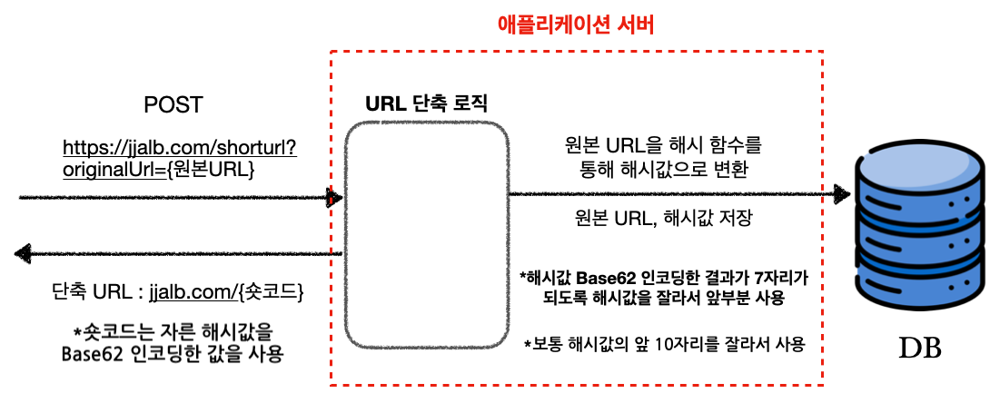

---

## URL 단축 소개

간단한 URL 단축 서비스를 구현해보고자 한다. 먼저 URL 단축이 무엇인지에 대해 알아보자.

URL 단축이라는 것은 말 그대로 기존 URL을 단축해서 더 짧은 URL로 만드는 것을 말한다. 이런 URL 단축을 제공하는 가장 대표적인 서비스는 [**Bitly**](https://bitly.com/pages/products/url-shortener)이다. Bitly를 사용해서 단축 URL을 얻어보자.

 

{: width="972" height="589" }
_Bitly를 사용해서 URL 단축_

* 원본 URL : [https://www.google.com/search?q=%EC%9E%90%EB%B0%94&oq=%EC%9E%90%EB%B0%94&gs_lcrp=EgZjaHJvbWUqDwgAEEUYOxiDARixAxiABDIPCAAQRRg7GIMBGLEDGIAEMgoIARAAGLEDGIAEMgoIAhAAGLEDGIAEMg0IAxAAGIMBGLEDGIAEMgYIBBBFGDwyBggFEEUYPDIGCAYQRRg8MgYIBxBFGEHSAQgyMjI4ajBqN6gCALACAA&sourceid=chrome&ie=UTF-8](https://www.google.com/search?q=%EC%9E%90%EB%B0%94&oq=%EC%9E%90%EB%B0%94&gs_lcrp=EgZjaHJvbWUqDwgAEEUYOxiDARixAxiABDIPCAAQRRg7GIMBGLEDGIAEMgoIARAAGLEDGIAEMgoIAhAAGLEDGIAEMg0IAxAAGIMBGLEDGIAEMgYIBBBFGDwyBggFEEUYPDIGCAYQRRg8MgYIBxBFGEHSAQgyMjI4ajBqN6gCALACAA&sourceid=chrome&ie=UTF-8)

* 단축된 URL : [https://bit.ly/3VzBS9q](https://bit.ly/3VzBS9q)

 

위에서 볼 수 있듯이 아주 긴 URL을 아주 짧은 링크를 통해서 접근할 수 있다. 

Bitly는 회원 가입해서 사용하는 경우, URL 단축 기능 외에도 해당 링크를 몇 명이 눌렀는지에 대한 통계 데이터를 확인할 수 있는 기능도 제공한다. 일단은 회원 가입 기능을 배제하고, 비회원이 사용하는 경우 원본 URL의 중복을 허용하지 않는 방식의 서비스를 고려하자.

---

## URL 단축 방법 1 (Hashing - Base62 Encoding)

### URL 단축, 조회 로직의 흐름

URL 단축은 여러가지 방법으로 구현할 수 있다. 가장 먼저 해싱과 Base62 인코딩을 사용하는 방법에 대해 알아보자.

URL 단축 실행 로직의 흐름을 다음 2 가지 경우에 대해 살펴보자.

* 사용자가 원본 URL을 입력해서 단축 URL을 얻는 경우
* 사용자가 단축 URL을 클릭해서 접속하는 경우

 

원본 URL을 입력해서 단축 URL을 얻는 경우를 살펴보자. 구현할 애플리케이션의 도메인명을 `jjalb.com`이라고 가정하자. (참고로 그림에서는 대략적인 과정만 표현한다.)

{: width="972" height="589" }_원본 URL 입력후 단축 URL을 얻는 과정_

- `shorturl`이라는 엔드포인트에서 원본 URL을 입력해서 `POST` 요청을 보낸다
- 원본 URL에 해시 함수를 사용해서 해시값을 얻는다
- 해시값에 Base62 인코딩을 적용했을 때 7자리가 나오도록 해시값 앞 10자리를 잘라서 사용한다
- 해당 원본 URL과 해시값(앞10자리)을 데이터베이스에 저장한다
- 해시값을 Base62 인코딩한 결과를 단축 URL 뒤의 [숏코드(short code, slug)](https://developer.mozilla.org/ko/docs/Glossary/Slug)로 활용한다

 

<!-- markdownlint-capture -->
<!-- markdownlint-disable -->

> 위의 경우, 데이터베이스에 이미 존재하는 원본 URL을 입력하는 경우에 대한 로직은 다루지 않았다.(중복 체크)
{: .prompt-tip }
<!-- markdownlint-restore -->

 

이번에는 사용자 단축 URL에 접속하는 경우를 살펴보자.

{: width="972" height="589" }_단축 URL 링크로 접속후 원본 URL로 리다이렉트 하는 과정_

* 단축 URL을 클릭하면, 단축 URL로 `GET` 요청을 보낸다
* 이때 해당 단축 URL의 숏코드를 Base62 디코딩해서 나온 해시값을 통해 데이터베이스를 조회한다
* 일치하는 값을 찾아서 해당 원본 URL을 반환한다
* 원본 URL로 `301 Redirect`한다

 

이제 대략적인 과정을 이해했을 것이다. 이제 이런 의문점을 가질 것이다.

> **"해시 함수, Base62 인코딩을 왜 사용하지? 숏코드는 왜 7자리를 사용하지?"**.

 

URL 단축의 내부 원리에 대해 자세히 살펴보자. 

 

<!-- markdownlint-capture -->
<!-- markdownlint-disable -->

> 참고로 회원 상태에서 사용하는 경우 단축 URL에 대한 클릭수, 위치 등을 제공하는 기능에 대해서는 나중에 생각하자. 
>{: .prompt-tip }
> <!-- markdownlint-restore -->

 

---

### 해시 함수(Hash Function)

> 기본적인 해시 알고리즘의 원리를 알고 있다는 가정하에 진행한다.

 

사실 URL 단축기를 구현하는데에 있어서 해심 알고리즘을 사용하는 것이 필수는 아니다. 그래도 해시 함수를 사용하는 경우 어떤 이점을 얻을 수 있는지 알아보자.

 

해시 함수의 특징을 살펴보자.

* 해시 함수는 결정론적(deterministic)으로 작동하며, 두 해시 값이 다르다면 그 해시값에 대한 원래 데이터도 달라야한다
  * 같은 데이터는 같은 해시값을 가진다(같은 원본 URL을 가지면 같은 해시값을 가지도록 오버라이딩한다고 가정하자)
  * 해시 값이 같다고 데이터가 같다고 보장하지는 않는다
  * 쉽게 말해서 서로 다른 입력에 대해 같은 해시 값이 나올 수 있고, 이를 해시 충돌(hash collision)이라고 한다

 

이런 해시 함수의 특징을 이용하면 다음과 같은 효과를 누릴 수 있다. 

* 같은 원본 URL에 대해서는 같은 단축 URL을 제공한다
* 해시 기반 숏코드는 원본 URL의 삽입 순서에 의존하지 않기 때문에 분산 시스템에 활용하기 용이하다

 

물론 위에서 언급한 효과 외에도 해시 함수를 이용해서 얻을 수 있는 다양한 이점들이 존재할 것이다.

 

> **해시 알고리즘의 종류에 대해서**
>
> 해시 알고리즘은 기능, 세부 구현, 용도, 등으로 종류를 구분할 수 있다. 가장 보편적으로 사용되는 Cryptographic Hash Function(암호화 해시 함수)에는 다음이 존재한다.
>
> * MD5(Message Digest 5)
> * SHA(Secure Hash Algorithm)
>   * SHA-1
>   * SHA-256
>   * 기타 SHA 변형(SHA2, SHA3 계열)
>
>  
>
> 아주 간단히 MD5와 SHA의 몇 가지 특징을 정리하면 다음과 같다.
>
> * MD5의 경우 SHA보다 상대적으로 빠르지만, 해시 충돌에 대한 취약점이 존재한다
> * 보안이 크게 중요하지 않은 애플리케이션의 경우 MD5를 여전히 사용(반대로 보안이 중요하면 SHA를 사용것을 권장)
>
>  
>
> 해시 함수의 선택은 성능과 보안 사이의 트레이드 오프(trade-off)를 고려해서 선택할 수 있다. 보안 방침은 시대에 따라 항상 변하기 때문에, 가장 권장되는 방법은 애플리케이션 구현 시기의 베스트 프랙티스(best practice)를 찾아서 적용하는 것이다. 대부분 경우 그냥 언어나 프레임워크에서 제공하는 해시 함수를 사용하면 될 것이다.

 

---

### Base62 인코딩(Encoding)

해시 함수에 대해서 알아보았으니, 이번에는 Base62 인코딩에 대해 알아보자. Base62 인코딩에 대해 알기 위해서는 먼저 Base64 인코딩에 대해 알아야한다.

>  인코딩(Encoding)이란?
>
> 

---

## Reference

1. [How to implemenet Tiny URL](https://www.youtube.com/watch?v=eCLqmPBIEYs&t=389s)
2. [Design a Shortener like Tiny URL](https://www.youtube.com/watch?v=zgIyzEEXfiA)
