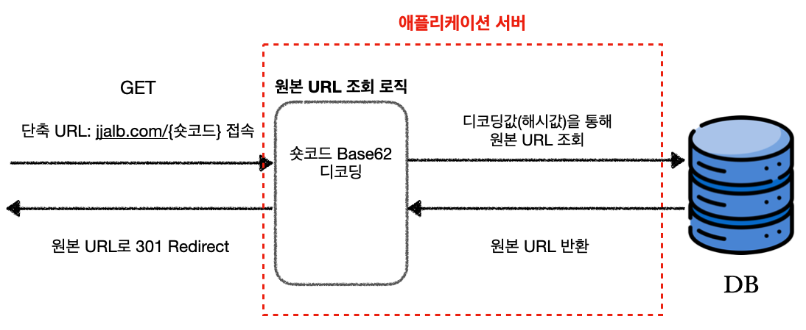

# URL 단축 소개

간단한 URL 단축 서비스를 구현해보고자 한다. 먼저 URL 단축이 무엇인지에 대해 알아보자.

URL 단축이라는 것은 말 그대로 기존 URL을 단축해서 더 짧은 URL로 만드는 것을 말한다. 이런 URL 단축을 제공하는 가장 대표적인 서비스는 [**Bitly**](https://bitly.com/pages/products/url-shortener)이다. Bitly를 사용해서 단축 URL을 얻어보자.

{: width="972" height="589" }
_Bitly를 사용해서 URL 단축_

* 원본 URL : [https://www.google.com/search?q=%EC%9E%90%EB%B0%94&oq=%EC%9E%90%EB%B0%94&gs_lcrp=EgZjaHJvbWUqDwgAEEUYOxiDARixAxiABDIPCAAQRRg7GIMBGLEDGIAEMgoIARAAGLEDGIAEMgoIAhAAGLEDGIAEMg0IAxAAGIMBGLEDGIAEMgYIBBBFGDwyBggFEEUYPDIGCAYQRRg8MgYIBxBFGEHSAQgyMjI4ajBqN6gCALACAA&sourceid=chrome&ie=UTF-8](https://www.google.com/search?q=%EC%9E%90%EB%B0%94&oq=%EC%9E%90%EB%B0%94&gs_lcrp=EgZjaHJvbWUqDwgAEEUYOxiDARixAxiABDIPCAAQRRg7GIMBGLEDGIAEMgoIARAAGLEDGIAEMgoIAhAAGLEDGIAEMg0IAxAAGIMBGLEDGIAEMgYIBBBFGDwyBggFEEUYPDIGCAYQRRg8MgYIBxBFGEHSAQgyMjI4ajBqN6gCALACAA&sourceid=chrome&ie=UTF-8)

* 단축된 URL : [https://bit.ly/3VzBS9q](https://bit.ly/3VzBS9q)

위에서 볼 수 있듯이 아주 긴 URL을 아주 짧은 링크를 통해서 접근할 수 있다. Bitly는 회원 가입해서 사용하는 경우, URL 단축 기능 외에도 해당 링크를 몇 명이 눌렀는지에 대한 통계 데이터를 확인할 수 있는 기능도 제공한다. 추후 프로젝트를 구현할 때 기본적으로 이 2 가지 기능을 구현할 예정이다.

---

# URL 단축의 실행 로직

위에서 살펴본 URL 단축 서비스의 실행 로직의 흐름을 다음 2 가지 경우에 대해 살펴보자.

* 사용자가 원본 URL을 입력해서 단축 URL을 얻는 경우
* 사용자가 단축 URL을 클릭해서 접속하는 경우

 

원본 URL을 입력해서 단축 URL을 얻는 경우를 살펴보자. 다음 그림에서 표현하는 흐름은 대략적인 과정만 표현한다.

구현할 애플리케이션의 도메인명을 `jjalb.com`이라고 가정하자.

{: width="972" height="589" }_원본 URL 입력후 단축 URL을 얻는 과정_

- `shorturl`이라는 엔드포인트에서 원본 URL을 입력해서 `POST` 요청을 보낸다
- 원본 URL에 특정 로직을 적용해서 유니크한 식별자로 만든다
- 해당 원본 URL과 식별자를 데이터베이스에 저장한다
- 해당 식별자에 인코딩 로직을 적용해서 나온 값을 단축 URL 뒤의 [슬러그(slug)](https://developer.mozilla.org/ko/docs/Glossary/Slug)로 활용한다

 

<!-- markdownlint-capture -->
<!-- markdownlint-disable -->
> 위의 경우에서 이미 데이터베이스에 존재하는 원본 URL을 입력하는 경우에 대한 로직은 나타내지 않았다.
{: .prompt-tip }
<!-- markdownlint-restore -->

 

이번에는 사용자 단축 URL을 클릭하거나 브라우저에 입력하여 접속하는 경우를 살펴보자.

{: width="972" height="589" }_단축 URL 링크로 접속후 원본 URL로 리다이렉트 하는 과정_

* 단축 URL을 클릭하면, 단축 URL로 GET 요청을 보낸다
* 이때 해당 단축 URL의 slug(현재의 경우 식별자를 인코딩한 값)를 디코딩해서 나온 식별자를 통해서 데이터베이스를 조회한다
* 일치하는 값을 찾아서 해당 원본 URL을 반환한다
* 원본 URL로 리다이렉트한다

 

URL 단축 서비스의 로직의 흐름을 대략적으로 파악했다. 그러면 위에서 계속 언급되는 식별자니, 인코딩이니 하는 것들에 대해서 알아보자.

 

<!-- markdownlint-capture -->
<!-- markdownlint-disable -->
> 추가로
>
> * 회원 상태에서 사용하는 경우 단축 URL에 대한 클릭수, 위치 등을 제공하는 기능에 대해서는 나중에 생각하자. 
> * 비회원 상태에서 원본 URL은 중복을 허용하지 않고, 같은 원본 URL에 대해서는 같은 단축 URL을 제공한다.
{: .prompt-tip }
<!-- markdownlint-restore -->

 

---

# URL 단축 원리

## 원본 URL 해싱

