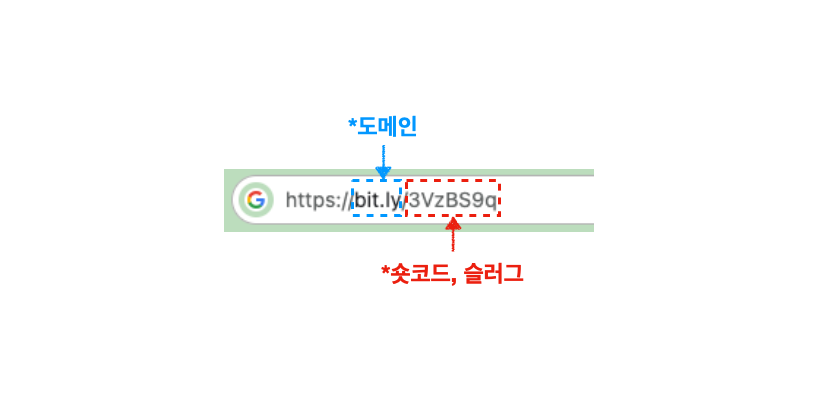

---

## URL 단축 소개

간단한 URL 단축 서비스를 구현해보고자 한다. 먼저 URL 단축이 무엇인지에 대해 알아보자.

URL 단축이라는 것은 말 그대로 기존 URL을 단축해서 더 짧은 URL로 만드는 것을 말한다. 이런 URL 단축을 제공하는 가장 대표적인 서비스는 [**Bitly**](https://bitly.com/pages/products/url-shortener)이다. Bitly를 사용해서 단축 URL을 얻어보자.

 

{: width="972" height="589" }
_Bitly를 사용해서 URL 단축_

* 원본 URL : [https://www.google.com/search?q=%EC%9E%90%EB%B0%94&oq=%EC%9E%90%EB%B0%94&gs_lcrp=EgZjaHJvbWUqDwgAEEUYOxiDARixAxiABDIPCAAQRRg7GIMBGLEDGIAEMgoIARAAGLEDGIAEMgoIAhAAGLEDGIAEMg0IAxAAGIMBGLEDGIAEMgYIBBBFGDwyBggFEEUYPDIGCAYQRRg8MgYIBxBFGEHSAQgyMjI4ajBqN6gCALACAA&sourceid=chrome&ie=UTF-8](https://www.google.com/search?q=%EC%9E%90%EB%B0%94&oq=%EC%9E%90%EB%B0%94&gs_lcrp=EgZjaHJvbWUqDwgAEEUYOxiDARixAxiABDIPCAAQRRg7GIMBGLEDGIAEMgoIARAAGLEDGIAEMgoIAhAAGLEDGIAEMg0IAxAAGIMBGLEDGIAEMgYIBBBFGDwyBggFEEUYPDIGCAYQRRg8MgYIBxBFGEHSAQgyMjI4ajBqN6gCALACAA&sourceid=chrome&ie=UTF-8)

* 단축된 URL : [https://bit.ly/3VzBS9q](https://bit.ly/3VzBS9q)

 

위에서 볼 수 있듯이 아주 긴 URL을 아주 짧은 링크를 통해서 접근할 수 있다. 

Bitly는 회원 가입해서 사용하는 경우, URL 단축 기능 외에도 해당 링크를 몇 명이 눌렀는지에 대한 통계 데이터를 확인할 수 있는 기능도 제공한다. 일단은 회원 가입 기능을 배제하고, 비회원이 사용하는 경우 원본 URL의 중복을 허용하지 않는 방식의 서비스를 고려하자.

---

## URL 단축 방법 1 (Hash Function)

### URL 단축, 조회 로직의 흐름

URL 단축은 여러가지 방법으로 구현할 수 있다. 가장 먼저 해싱과 Base62 인코딩을 사용하는 방법에 대해 알아보자.

URL 단축 실행 로직의 흐름을 다음 2 가지 경우에 대해 살펴보자.

* 사용자가 원본 URL을 입력해서 단축 URL을 얻는 경우
* 사용자가 단축 URL을 클릭해서 접속하는 경우

 

원본 URL을 입력해서 단축 URL을 얻는 경우를 살펴보자. 구현할 애플리케이션의 도메인명을 `jjalb.com`이라고 가정하자. (참고로 그림에서는 대략적인 과정만 표현한다.)

{: width="972" height="589" }_원본 URL 입력후 단축 URL을 얻는 과정_

- `shorturl`이라는 엔드포인트에서 원본 URL을 입력해서 `POST` 요청을 보낸다
- 원본 URL에 해시 함수를 사용해서 해시값을 얻는다
- 해시값에 Base62 인코딩을 적용했을 때 7자리가 나오도록 해시값 앞 10자리를 잘라서 사용한다
- 해당 원본 URL과 해시값(앞10자리)을 데이터베이스에 저장한다
- 해시값을 Base62 인코딩한 결과를 단축 URL 뒤의 [숏코드(short code, slug)](https://developer.mozilla.org/ko/docs/Glossary/Slug)로 활용한다

 

<!-- markdownlint-capture -->
<!-- markdownlint-disable -->

> 위의 경우, 데이터베이스에 이미 존재하는 원본 URL을 입력하는 경우에 대한 로직은 다루지 않았다.(중복 체크)
{: .prompt-tip }
<!-- markdownlint-restore -->

 

이번에는 사용자가 단축 URL에 접속하는 경우를 살펴보자.

{: width="972" height="589" }_단축 URL 링크로 접속후 원본 URL로 리다이렉트 하는 과정_

* 단축 URL을 클릭하면, 단축 URL로 `GET` 요청을 보낸다
* 이때 해당 단축 URL의 숏코드를 Base62 디코딩해서 나온 해시값을 통해 데이터베이스를 조회한다
* 일치하는 값을 찾아서 해당 원본 URL을 반환한다
* 원본 URL로 `301 Redirect`한다

 

이제 대략적인 과정을 이해했을 것이다. 이제 이런 의문점을 가질 것이다.

> **"해시 함수, Base62 인코딩을 왜 사용하지? 숏코드는 왜 7자리를 사용하지?"**.

 

그러면 URL 단축의 내부 원리에 대해 자세히 살펴보자. 

 

<!-- markdownlint-capture -->
<!-- markdownlint-disable -->

> 참고로 회원 상태에서 사용하는 경우 단축 URL에 대한 클릭수, 위치 등을 제공하는 기능에 대해서는 나중에 생각하도록 하자. 
>{: .prompt-tip }
> <!-- markdownlint-restore -->

 

---

### 해시 함수(Hash Function)

> 기본적인 해시 알고리즘의 원리를 알고 있다는 가정하에 진행한다.

 

사실 URL 단축기를 구현하는데에 있어서 해시 함수를 사용하는 것이 필수는 아니다. 그래도 해시 함수를 사용하는 경우 어떤 이점을 얻을 수 있는지 알아보자.

 

해시 함수의 특징을 살펴보자.

* 해시 함수는 결정론적(deterministic)으로 작동하며, 두 해시 값이 다르다면 그 해시값에 대한 원래 데이터도 달라야한다
  * 같은 데이터는 같은 해시값을 가진다(같은 원본 URL을 가지면 같은 해시값을 가지도록 오버라이딩한다고 가정하자)
  * 해시 값이 같다고 데이터가 같다고 보장하지는 않는다
  * 쉽게 말해서 서로 다른 입력에 대해 같은 해시 값이 나올 수 있고, 이를 해시 충돌(hash collision)이라고 한다

 

이런 해시 함수의 특징을 이용하면 다음과 같은 효과를 누릴 수 있다. 

* 같은 원본 URL에 대해서는 같은 단축 URL(숏코드)을 제공한다
  * 원본 URL의 중복을 허용하지 않는다
* 해시 기반 숏코드는 원본 URL의 삽입 순서에 의존하지 않기 때문에 분산 시스템에 활용하기 용이하다

 

반대로 다음의 잠재적 문제를 가진다.

* 해시 충돌의 가능성
* 계산이 다른 방식에 비해 상대적으로 복잡함
* 더 자세한 내용은 뒤에서 URL 단축을 구현하는 두 번째 방법을 소개할 때 알아보자

 

물론 위에서 언급한 효과 외에도 해시 함수를 이용해서 얻을 수 있는 다양한 이점들이 존재한다.

 

해시 알고리즘의 종류에 대해 간단하게 알아보자.

해시 알고리즘은 기능, 세부 구현, 용도, 등으로 종류를 구분할 수 있다. 가장 보편적으로 사용되는 Cryptographic Hash Function(암호화 해시 함수)에는 다음의 해시 함수들이 존재한다.

* MD5(Message Digest 5)
* SHA(Secure Hash Algorithm)
  * SHA-1
  * SHA-256
  * 기타 SHA 변형(SHA2, SHA3 계열)

 

아주 간단히 MD5와 SHA의 몇 가지 특징을 정리하면 다음과 같다.

* MD5의 경우 SHA보다 상대적으로 빠르지만, 해시 충돌에 대한 취약점이 존재한다
* 보안이 크게 중요하지 않은 애플리케이션의 경우 MD5를 여전히 사용(반대로 보안이 중요하면 SHA를 사용할 것을 권장한다)

 

해시 함수의 선택은 성능과 보안 사이의 트레이드 오프(trade-off) 등을 고려해서 선택할 수 있다. 그러나 보안 방침은 시대에 따라 항상 변하기 때문에, 가장 권장되는 방법은 애플리케이션 구현 시기의 베스트 프랙티스(best practice)를 찾아서 적용하는 것이다. 대부분의 경우 그냥 언어나 프레임워크에서 제공하는 해시 함수를 사용하면 될 것이다.

 

> 참고로 많은 경우 해시 함수의 결과는 Hexadecimal로 표현된다.

 

---

### Base62 인코딩(Encoding)

#### Base64란?

해시 함수에 대해서 알아보았으니, 이번에는 Base62 인코딩에 대해 알아보자. Base62 인코딩에 대해 알기 위해서는 먼저 Base64 인코딩에 대해 알아야한다.

 

>  인코딩(Encoding)이란?
>
> 어떤 데이터를 특정 규칙에 따라 변환하는 모든 과정을 의미한다. 인코딩은 다음으로 크게 분류할 수 있다. 보통 인코딩은 데이터를 효과적으로 전송 및 저장을 하기 위해 사용한다.
>
> * 문자 인코딩(character encoding) : 컴퓨터가 이해할 수 있도록 문자 코드를 0, 1로 표현할 수 있도록 변환하는 것
>   * ASCII
>   * UNICODE
>     * UTF-8
>     * 기타 유니코드 인코딩 방식
>   * 기타 방식
>
> * Binary-to-text Encoding : 이진(binary) 데이터를 인쇄 가능한 문자열로 인코딩하는 것
>   * Hexadecimal(Base16)
>   * Base62
>   * Base64
>   * 기타 방식
> * 멀티미디어 인코딩(multimedia encoding) : 비디오, 오디오를 저장/재생하기 위해 압축 하거나 호환하도록 변환하는 것.
>
>  
>
> 이외에도 다양한 인코딩 방식이 존재하며, 용도에 따라 다르게 분류할 수 있다.

 

그러면 이제 Base64 인코딩이 무엇인지부터 알아보자. Base64 인코딩은 6비트($64=2^6$​) 이진 데이터를 ASCII 영역의 문자들로만 이루어진 일련의 문자열로 바꾸는 인코딩 방식을 가리킨다. Base64 인코딩을 하는 방법은 8비트 3개를 6비트 4개로 쪼개어서 Base64 코드 4개로 바꾸어 표현한다. 조금더 쉽게 말하자면 그냥 기존에 문자당 8비트로 표현되던 데이터를 6비트씩 끊어서 표현하는 방식이다.

 

> Base64로 표현되는 ASCII 영역은 alphanumeric(영문자 + 숫자) 그리고 "+", "/"를 포함하는 총 64개의 문자 영역이다. 

 

글로만 보면 이해가 힘들기 때문에, 그림을 통해 살펴보자.

 

{: width="972" height="589" }_https://www.freecodecamp.org/news/what-is-base64-encoding/_

* `S` → `0x53` → `01010011`
* `u` → `0x75` → `01110101`
* `n` → `0x6E` → `01101110`
* `01010011 01110101 0110110`을 6비트씩 끊어서 ASCII 코드로 표현하면 된다
* 6비트씩 끊어서 표현하는 과정에서 애매하게 남는 데이터가 있으면, 강제로 패딩값을 넣어서 6비트가 되도록 맞춘다
* 패딩은 `=`로 표현된다

 

정리하자면 Base64는 바이너리 스트림 데이터을 전부 ASCII(영문자, 숫자, `+`, `/`)로 변환하는 인코딩 방식이다. Base64 인코딩은 3바이트의 인풋 데이터가 4바이트의 Base64 데이터가 되기 때문에 공간이 대략 33% 커진다.

그러면 이런 Base64를 도대체 왜 사용하는 것일까? Base64를 사용하는 몇 가지 이유와 용도를 찾아보면 다음과 같다.

1. ASCII만을 사용할 수 있는 시스템에 강제로 데이터를 보내기 위해서 사용(위장이라는 표현을 사용하는 것 같다)
  * 논 텍스트 데이터(이미지, 등)를 문자열을 다루는 HTML, JSON 같은 형식에 같이 포함해서 보내기 위해서 사용
    * 만약 이미지 같은 데이터를 같이 못 보낸다면 결국 이미지를 다시 받아오기 위해서 다시 요청을 보내야하는데, 그냥 처음부터 같이 포함해서 보낸다면 더 빠를것이다
    * 쉽게 말해서 공간의 손해를 보더라도, 더 빠르게 보낼 수 있게 해준다
  * 그 외에도 ASCII 만을 사용할 수 있는 시스템을 위해서 Base64를 사용할 수 있다

 

2. ~~시스템 마다 특정 문자가 가지고 있는 의미가 다를 수 있기 때문에, 최대한 영문자/숫자로 이루어진 ASCII 세트를 사용하기 위해서 Base64를 사용한다고 한다.~~
  * 이런 이유로 Base64를 사용한다고 주장하는 것은 나이브(naive)하다는 의견이 존재한다

 

3. 기타 여러 이유/용도

 

이제 Base64 인코딩이 무엇이고, 사용하는 대표적인 이유를 알았다.

그러면 Base62 인코딩이 무엇이고, 왜 단축 URL의 숏코드에 Base62 인코딩을 사용하는지 알아보자. Base64 인코딩을 이해했기 때문에 Base62 인코딩은 쉽게 이해할 수 있다.

---

#### Base62란?

단축 URL의 숏코드에 사용하기 위한 문자 조합을 만들어내기 위해서 해시값의 앞 10자리에 Base62 인코딩을 사용했다.

 

    

_숏코드_

 

대부분 이런 생각을 할 것이다. **"웬 Base62 인코딩?"**. Base 62 인코딩에 대해 알아보기 전에, 만약 Base 64 인코딩을 사용해서 숏코드를 만들면 어떤 일이 일어나는지 살펴보자.

예시를 하나 들어보자. `https://example.com/problemofbase64forshortcode` 라는 URL을 단축 URL로 만든다고 가정해보자.

단축 URL로 만들기 위해서 다음 과정을 거치게 된다.

1. `https://example.com/problemofbase64forshortcode`을 해시 함수를 통해 해시값 얻기
2. 해시값 : `dbe7d6a0fa3c4bc655deb876899e89a9`의 앞 10자리 `dbe7d6a0fa`를 Base64 인코딩
3. Base64 인코딩 결과 : `2+fWoPo`를 숏코드로 사용

 

Base64 인코딩을 사용할 경우의 문제점이 여기서 나온다. 숏코드에 `+`라는 문자가 포함된다는 것이 문제다! URL에 `+` 또는 `/`와 같은 문자가 포함되는 경우, `+`는 공백으로 해석되고 `/`는 경로 구분자로 해석된다.

결론적으로 말하자면, Base64의 문제는, 인코딩한 결과에 URL로 안전하게 사용할 수 없는 `+`와 `/`가 포함될 수 있다는 것이다.

눈치가 빠른 사람은 바로 알아차렸을 것이다. 그렇다, Base62는 기존 ASCII 세트에서 `+`와 `/`가 빠진 형태로 인코딩하는 방식이다. 쉽게 말하자면 기존 Base64에서 사용한 ASCII 세트에서 URL Safe한 문자만 사용하는 인코딩 방식이다.

 

> 참고로, `+`를 `-`로 바꾸고, `/`를 `_`로 바꾸는 URL and Filename safe Base64 방식도 존재한다.

 

지금까지 해시 함수와 Base62 인코딩의 사용 이유에 대해 알아보았다. 이제 URL 단축을 구현하는 두 번째 방법으로 넘어가기 전에 마지막 의문점을 해결해보자.

숏코드에 7자리를 사용하는 이유가 무엇일까?

 

---

### 숏코드에 7자리를 사용하는 이유

왜 6자리도 아니고, 8자리도 아니고 7자리일까?

먼저 6자리를 사용하는 경우를 살펴보자. 숏코드로 6자리를 사용하게 될 경우, 나올 수 있는 문자열 조합은 총 $62^6 = 56800235584$ 개의 조합이 나오게 된다. 대략적으로 `560억`개가 나오게 되는 것이다. 어떤 사람들은 "잉? 이정도면 충분하지 않나?"라고 생각할 수 있다. 그러나 장기적으로 서비스를 고려한다면 6자리로는 부족할 가능성이 높다.(물론 이것은 요구사항 또는 목표에 따라 달라질 수 있다)

간단한 수학을 해보자. 대략 1초에 새로운 단축 URL을 평균적으로 100개 생성한다고 가정해보자. 그렇다면 1년에 생성하게 되는 단축 URL은 $100\times60\times60\times24\times365 = 3153600000$ 개가 된다. 총 생성 가능한 조합의 수에서 이를 나누면 대략 18이 나온다. 즉 18년 안에 전부 소진된다는 의미다. 만약 1초당 생성량이 200, 300으로 올라간다면, 전부 소진되는 걸리는 기간은 10년도 되지 않는다.

그러나 숏코드에 7자리를 사용하게 되면 이야기는 달라진다. 총 나올 수 있는 조합의 수는 $62^7 = 3521614606208$개가 되며, 이는 대략 `3.5조`개의 조합이다.

이는 1초에 1000개의 URL을 생성해도 전부 소진하기 위해서는 약 111년이 걸린다.

결론적으로 단축 URL을 최대한 짧게 유지하면서, 키의 소진을 걱정하지 않아도 되는 숏코드의 적정 길이는 7자리다.

---

## URL 단축 방법 2 (Auto Increment Id)

---

## Reference

1. [How to implemenet Tiny URL](https://www.youtube.com/watch?v=eCLqmPBIEYs&t=389s)
2. [Design a Shortener like Tiny URL](https://www.youtube.com/watch?v=zgIyzEEXfiA)
3. [문자를 다루는 인코딩 규칙](https://www.youtube.com/watch?v=6hvJr0-adtg)
4. [Base64 인코딩 원리](https://www.youtube.com/watch?v=A8tO4D1Gtc0&t=3s)
5. [https://www.freecodecamp.org/news/what-is-base64-encoding/](https://www.freecodecamp.org/news/what-is-base64-encoding/)
6. [https://en.wikipedia.org/wiki/Binary-to-text_encoding](https://en.wikipedia.org/wiki/Binary-to-text_encoding)
