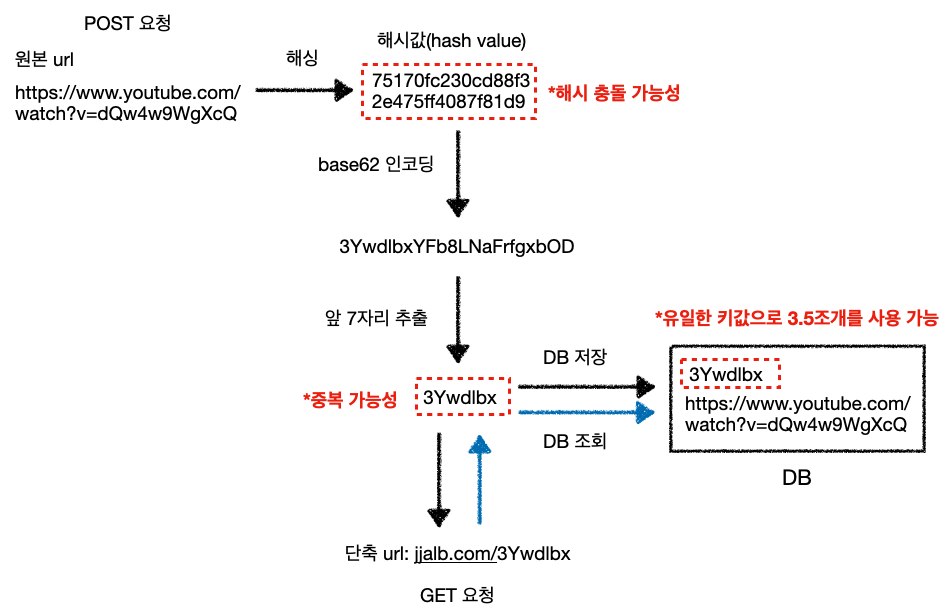

---

## 요구 사항

요구 사항을 정해보자.

필수적인 요구사항과 옵션인 요구사항을 구분해서 정리해보자.

* 필수
  * 메인 페이지에서 바로 URL을 입력할 수 있는 폼
  * 입력한 URL에 대한 단축 URL을 제공
  * HTTP API로도 제공
  * 동일한 URL에 대해서도 다른 숏코드가 존재할 수 있다
  * 클릭수 추적


* 옵션
  * 단축 URL에 비밀번호를 설정하는 기능
  * 단축 URL에 유효기간(expiration date) 설정

<br>

이제 도입할지 말지 고민 중인 회원가입과 관련된 요구 사항을 정리해보자.

- 회원 가입
  - OAuth를 통한 로그인
  - 회원(멤버) 전용 페이지
    - 단축 URL에 대한 클릭수 확인
    - 지금까지 단축한 URL에 대한 히스토리

---

## 기술 스택

다음의 기술 스택을 사용할 예정이다.

<br>

**Language**

* Java `17`

<br>

**Framework & Library**

* Spring Boot `3.3.1`
* Hibernate
* QueryDSL

* Junit5

* Thymeleaf

* Lombok

<br>

**Database**

* MySQL `8.0` (프로덕션)
* H2 `2.2.224` (테스트)

<br>

`build.gradle`

```java
plugins {
	id 'java'
	id 'org.springframework.boot' version '3.3.1'
	id 'io.spring.dependency-management' version '1.1.5'
}

group = 'com.seungki'
version = '0.0.1-SNAPSHOT'

java {
	toolchain {
		languageVersion = JavaLanguageVersion.of(17)
	}
}

configurations {
	compileOnly {
		extendsFrom annotationProcessor
	}
}

repositories {
	mavenCentral()
}

dependencies {
	implementation 'org.springframework.boot:spring-boot-starter-data-jpa'
	implementation 'org.springframework.boot:spring-boot-starter-thymeleaf'
	implementation 'org.springframework.boot:spring-boot-starter-web'
	compileOnly 'org.projectlombok:lombok'
	runtimeOnly 'com.h2database:h2'
	runtimeOnly 'com.mysql:mysql-connector-j'
	annotationProcessor 'org.projectlombok:lombok'
	testImplementation 'org.springframework.boot:spring-boot-starter-test'
	testRuntimeOnly 'org.junit.platform:junit-platform-launcher'

	implementation 'org.springframework.boot:spring-boot-devtools'

	implementation 'org.springframework.boot:spring-boot-starter-validation'

	implementation 'com.querydsl:querydsl-jpa:5.0.0:jakarta'
	annotationProcessor "com.querydsl:querydsl-apt:" +
			"${dependencyManagement.importedProperties['querydsl.version']}:jakarta"
	annotationProcessor "jakarta.annotation:jakarta.annotation-api"
	annotationProcessor "jakarta.persistence:jakarta.persistence-api"

	implementation 'com.github.gavlyukovskiy:p6spy-spring-boot-starter:1.9.0'
}

tasks.named('test') {
	useJUnitPlatform()
}

clean {
	delete file('src/main/generated')
}
```

---

## 설계

### 도메인 분석, 설계 

엔티티를 설계해보자.

먼저 원본 URL과 숏코드를 매핑하는 엔티티가 필요하다.

<br>


_추후에 Member를 추가하는 것을 고려하자_

* `Member`를 추가하는 것은 일단 나중에 생각하자

<br>

---

### 서비스 제공의 흐름

일단 이전에 우리가 사용하기로 정한 구현 방법을 다시 살펴보자.

<br>

{: width="972" height="589" }

<br>

로직의 흐름을 컨트롤러, 서비스, 레포지토리 계층을 표현한 그림으로 살펴보자.

<br>

{: width="972" height="589" }_로직의 흐름_

<br>

---

### 고민

경험이 없으니 이것이 제대로 된 설계인지 아직 감이 안잡힌다.

* 숏코드로 변환시키거나, 뷰카운트를 증가시키는 로직을 서비스 계층이 아니라 엔티티 클래스에 같이 넣어야할지 고민된다.
* 단순히 값만 조회하는 로직은 서비스 계층 없이 그냥 바로 레포지토리 계층에서 호출해도 될지 고민된다.

<br>

일단 개발을 시작하고, 차차 바꿔나갈 생각이다.

다음 포스트에서는 개발 도중 생겨난 이슈의 트러블슈팅을 다룰 예정이다.
