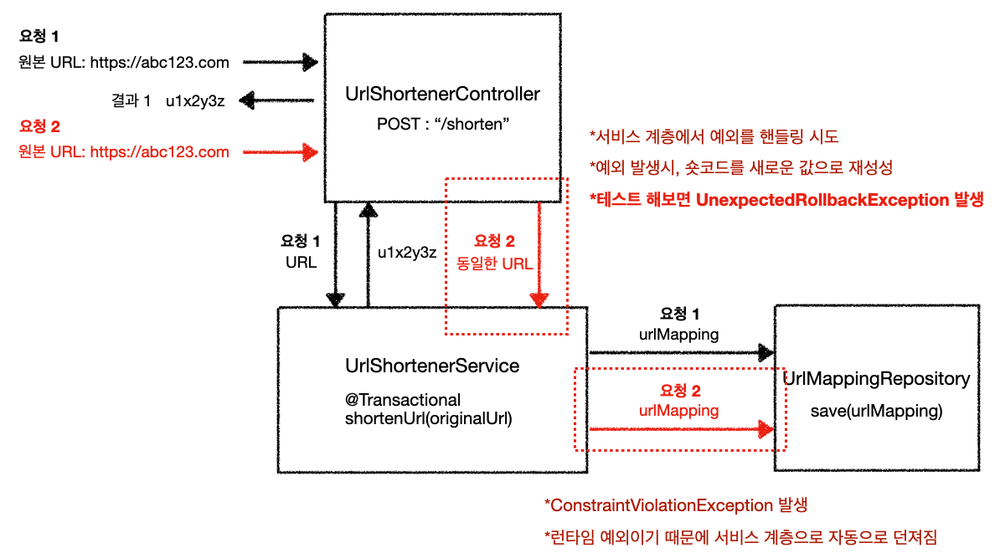
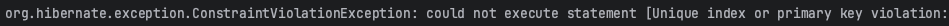
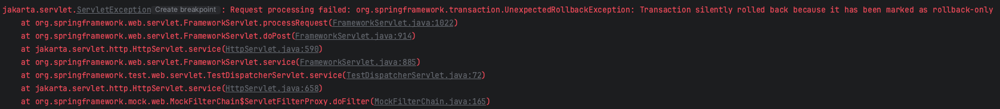
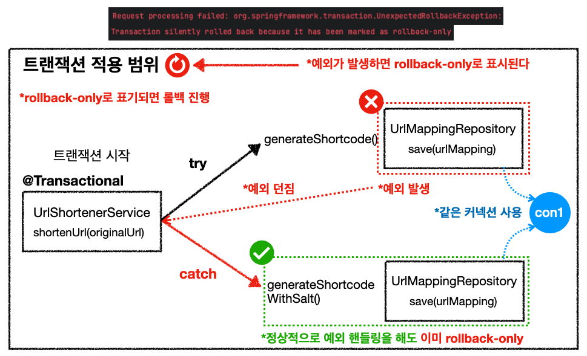
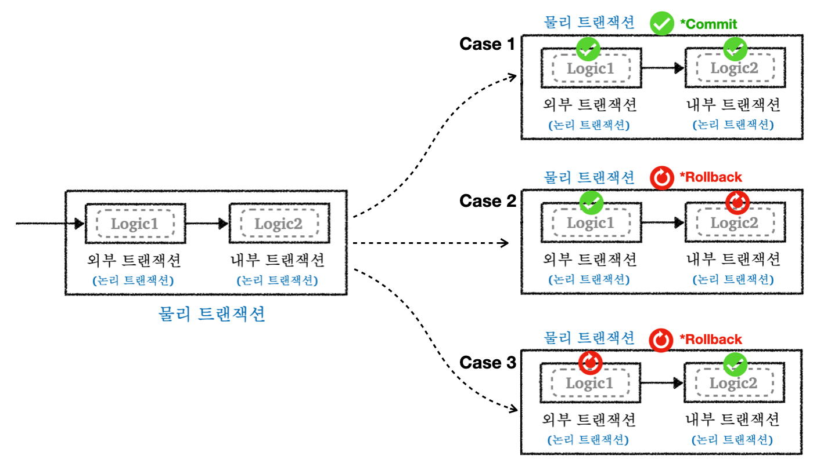
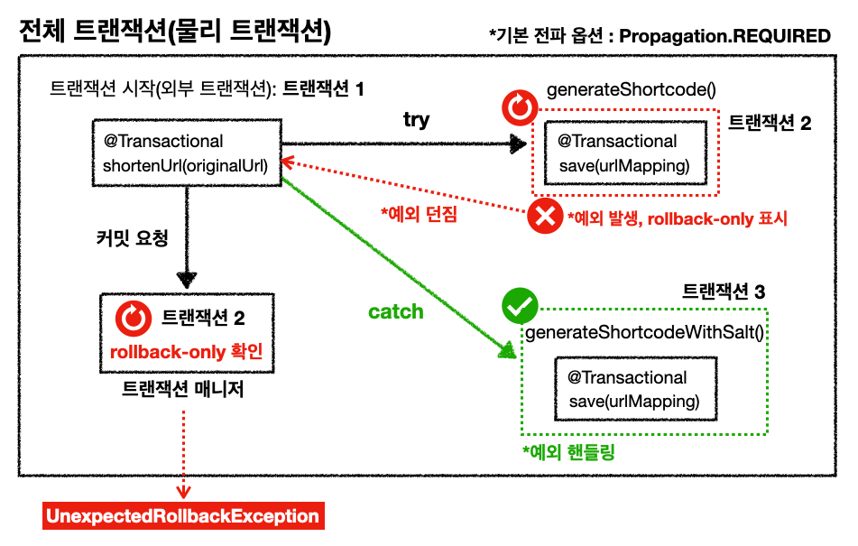
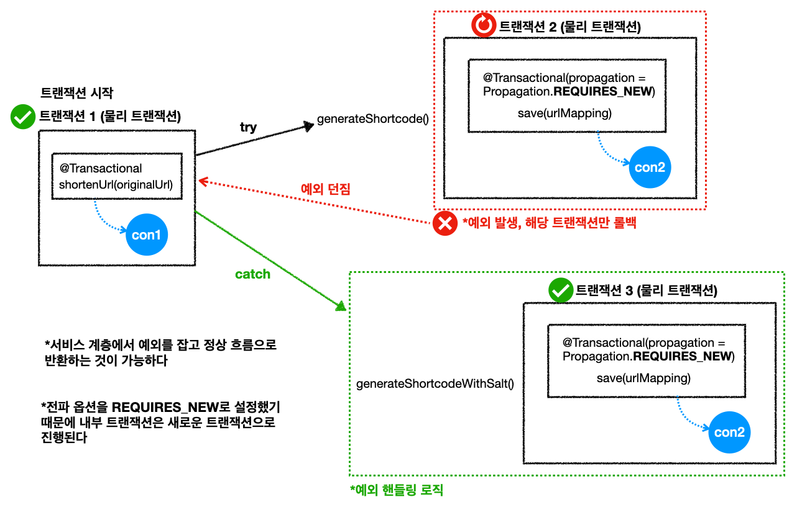
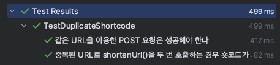
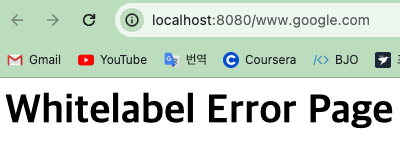
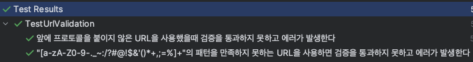

---

## 엔티티 클래스 작성

원본 URL과 숏코드를 저장할 엔티티 클래스.

```java
@Entity
@Getter
@Table(name = "url_mapping")
@NoArgsConstructor(access = AccessLevel.PROTECTED)
public class UrlMapping {

    @Id
    @GeneratedValue(strategy = GenerationType.SEQUENCE)
    private Long id;

    @Column(unique = true)
    private String shortcode;

    private String originalUrl;

    private LocalDateTime createdAt;
    private LocalDateTime viewedAt;
    private int viewCount = 0;

    public UrlMapping(String shortcode, String originalUrl, LocalDateTime createdAt) {
        this.shortcode = shortcode;
        this.originalUrl = originalUrl;
        this.createdAt = createdAt;
    }

    public void incrementViewCount() {
        this.viewCount++;
        this.viewedAt = LocalDateTime.now();
    }

    public void setShortcode(String shortcode) {
        this.shortcode = shortcode;
    }

    /*
      추후 회원 가입 기능을 추가할 때 사용
     */
    // @ManyToOne(fetch = FetchType.LAZY)
    // @JoinColumn(name = "member_id")
    // private Member member;

}
```

* `incrementViewCount()` : 단축 URL을 통해 원본 URL을 조회할 때, 해당 단축 URL의 `viewCount`를 `1` 증가시키고, 조회 시간(`viewedAt`)을 업데이트 한다
* 숏코드를 생성하기 위한 로직도 전부 엔티티 클래스에 작성할지 고민 했으나, 일단은 서비스 계층에서 구현하기로 했다
* 숏코드 생성 알고리즘 자체는 유틸 클래스로 빼서 작성(Base62 인코더, 해시 함수)
* 빌더 클래스는 사용하지는 않기로 함

<br>

개발을 시작하면서 만났던 문제들을 살펴보자.

<br>

---

## 이슈 1 : UnexpectedRollbackException

### 이슈 발생 배경

* 동일한 URL로 URL 단축을 위한 `POST` 요청을 보내게 되면 첫 번째 요청은 정상적으로 수행되지만, 두 번째 요청에서`ConstraintViolationException`이 발생한다.
* `ConstraintViolationException`이 발생하는 원인은 동일한 URL에 대해서는 같은 숏코드가 나오고, 중복 숏코드를 처리하는 로직을 구현하지 않았기 때문이다.


* 중복된 숏코드를 처리하기 위해서 다음의 중복 처리 로직을 구현하기로 했다.
  * 만약 `shortenUrl(originalUrl)`을 통해 숏코드를 생성했을 때 `ConstraintViolationException`이 발생한다면, 서비스 계충에서 잡아서 핸들링한다.
  * 핸들링 로직은 원본 URL에 램덤 솔트(salt)를 추가해서 솔트를 추가한 URL로 숏코드를 재생성하는 방법을 사용한다. 물론 원본 URL은 동일하게 저장한다.
  * 예시) `https://abc123.com` + `saltvalue` = `https://abc123.comsaltvalue`


* 문제는 다음과 같다
  * `@Transactional`이 붙은 테스트 코드에서 `shortenUrl`을 같은 `originalUrl`로 호출하는 경우 정상적으로 예외를 핸들링하고 숏코드로 새로운 값으로 재생성하는 것을 확인할 수 있었다
  * **컨트롤러 계층 테스트를 위해서 동일한 URL(`originalUrl`)로 포스트 요청을 두 번하는 경우, 두 번째 요청에서 `UnexpectedRollbackException`이 발생하고, 예상한대로 동작하지 않는다는 문제가 발생한다.**

<br>

{: width="972" height="589" }_문제 발생 상황_

<br>

{: width="972" height="589" }

{: width="972" height="589" }_ConstraintViolationException 발생_

* 테스트 코드에서는 숏코드가 중복되면 `ConstraintViolationException` 발생하고, 서비스 계층에서 정상적으로 처리하는 것 까지 확인 가능하다
* 내 예상은, 아마 `@Test`에서 동작하는 `@Transactional`의 특수성 때문에 정상적으로 동작하는 것 같지만, 다시 알아볼 예정이다

<br>

{: width="972" height="589" }_동일한 URL POST 요청 두 번_ 

* 반면에 동일한 URL에 대해서 `POST` 요청을 두 번 수행하는 경우, 두 번째 요청에서 `UnexpectedRollbackException` 발생

<br>

---

### 이슈 재현

이슈 상황을 재현해보자.

<br>

`UrlMappingRepository`

```java
public void save(UrlMapping urlMapping) {
        em.persist(urlMapping);
}
```

<br>

`UrlShortenerService`

```java
@Transactional
public String shortenUrl(String originalUrl) {
    String shortcode = generateShortcode(originalUrl);
    UrlMapping urlMapping = new UrlMapping(shortcode, originalUrl, LocalDateTime.now());

    try {
        umr.save(urlMapping);
        em.flush();
        log.info("[No Duplication] shortcode = {}", shortcode);
    } catch (ConstraintViolationException | DataIntegrityViolationException e) {
        log.info("[Exception!] ", e);
        log.info("[Shortcode Duplication] Original shortcode = {}", shortcode);
        shortcode = generateShortcodeWithSalt(originalUrl);
        urlMapping.setShortcode(shortcode);
        umr.save(urlMapping);
        log.info("[Shortcode Duplication] Salted shortcode = {}", shortcode);
    }
    return urlMapping.getShortcode();
}
```

* `generateShortcode()` : 원본 URL을 입력으로 받아서 숏코드를 생성해주는 메서드
* `generateShortcodeWithSalt()` : 원본 URL을 입력으로 받고, 해당 URL에 솔트를 추가해서 숏코드를 생성해주는 메서드
  * 이 메서드는 숏코드가 중복되어 예외가 발생한 경우, 핸들링을 위해서 사용한다

<br>

`UrlShortenerController`

```java
@PostMapping("/shorten")
public String shortenUrl(@RequestParam("url") String originalUrl, RedirectAttributes redirectAttributes) {
    String shortcode = uss.shortenUrl(originalUrl);
    redirectAttributes.addAttribute("shortcode", shortcode);
    return "redirect:/detail/{shortcode}";
}
```

* 단축하고 싶은 URL을 입력해서 `POST` 요청을 보내서 성공적으로 처리되면, 해당 숏코드를 `PathVariable`로 사용해서, `/detail/{shortcode}`로 리다이렉트한다
* 해당 페이지는 결과 단축 URL을 링크로 제공한다

<br>

다음은 테스트 코드이다.

<br>

`TestDuplicateShortcode`

```java
@SpringBootTest
@AutoConfigureMockMvc
public class TestDuplicateShortcode {

    @Autowired
    private MockMvc mockMvc;

    @Autowired
    private UrlShortenerService uss;

    @DisplayName("중복된 URL로 shortenUrl()을 두 번 호출하는 경우 숏코드가 서로 달라야 한다")
    @Transactional
    @Test
    public void test_duplicate_shortcode() {
        String originalUrl = "https://www.inflearn.com/";

        String originalShortcode = uss.shortenUrl(originalUrl);
        String saltUrlShortcode = uss.shortenUrl(originalUrl);

        assertThat(originalShortcode).isNotEqualTo(saltUrlShortcode);
    }
  
    @DisplayName("같은 URL을 이용한 POST 요청은 성공해야 한다")
    @Test
    public void test_post_shortenUrl() throws Exception {
        String originalUrl = "https://www.inflearn.com/";

        mockMvc.perform(post("/shorten")
                        .param("url", originalUrl))
                .andExpect(status().is3xxRedirection())
                .andExpect(redirectedUrl("/detail/naA5WFV"));

        // 같은 URL 두 번째 요청
        mockMvc.perform(post("/shorten")
                        .param("url", originalUrl))
                .andExpect(status().is3xxRedirection());

    }

}
```

* `test_duplicate_shortcode()`
  * 동일한 URL로 `shortenUrl(originalUrl)`을 두 번 호출하면, 두 번째 호출에서는 예외를 처리해서 숏코드를 재생성해야 한다
  * 기존 숏코드와 예외 핸들링 이후의 숏코드를 비교하면 달라야한다
  * 이 테스트의 경우 통과한다
* `test_post_shortenUrl()`
  * 동일한 URL로 `/shorten`으로 `POST` 요청을 두 번 수행하면, 두 번째 요청에서는 변경된 숏코드로 응답을 주어야한다
  * 두 번째 요청에서 `UnexpectedRollbackException`이 발생해서, 의도한 결과가 나오지 않는다

<br>

---

### 원인 파악 

`UnexpectedRollbackException`이기 때문에 트랜잭션 전파와 관련된 문제로 보인다.

<br>

> ```java
> public class UnexpectedRollbackException
> extends TransactionException
> ```
>
> Thrown when an attempt to commit a transaction resulted in an unexpected rollback.
>
> `rollback-only`로 표기된 트랜잭션을 커밋하려고 시도하는 경우 발생한다.
>
> 참고 : [https://docs.spring.io/spring-framework/docs/current/javadoc-api/org/springframework/transaction/UnexpectedRollbackException.html](https://docs.spring.io/spring-framework/docs/current/javadoc-api/org/springframework/transaction/UnexpectedRollbackException.html)
{: .prompt-info }

<br>

일단 현재 트랜잭션이 어떻게 수행되고 있는지 파악하기로 했다.

<br>

{: width="972" height="589" }_현재 상황_

위의 그림을 정리하자면 다음과 같다. 두 번째 요청에서 이전과 동일한 URL을 사용해서 같은 숏코드가 생성된 상황이라고 가정하자. 

* 서비스 계층의 `shortenUrl()` 부터 트랜잭션이 시작된다.
* `shortenUrl()`의 내부 로직에서 숏코드를 생성하고, 레포지토리 계층의 `save()`를 호출하게 된다
* 이미 존재하는 숏코드를 DB에 넣으려고 하면 `ConstraintViolationException`이 발생한다
* 예외가 발생했기 때문에 현재의 트랜잭션은 `rollback-only`로 표시된다
* 이 경우에 서비스 계층에서 예외를 받아서 처리해도, 트랜잭션은 이미 `rollback-only`로 표시되어 있기 때문에 `UnexpectedRollbackException`이 발생한다

<br>

그럼 이 문제를 해결하기 위해서는 서비스 계층의 `shortenUrl()`에서 시작된 트랜잭션을 어떻게든 정상적으로 커밋되도록 만들어야한다.

이를 위해서는 트랜잭션 전파의 속성 중에 `REQUIRES_NEW`를 사용해서 해결할 수 있다.

<br>

---

### 트랜잭션 전파(Transaction Propagation)

자세히 들어가기 전에 먼저 트랜잭션의 전파에 대해 복습해보자.

트랜잭션이 이미 진행중인 상황에서 추가로 트랜잭션을 수행하게 되는 경우 어떻게 동작할까? 트랜잭션 중에 새로운 트랜잭션이 수행되는 경우 어떻게 동작할지 결정하는 것을 트랜잭션 전파(Transaction Propogation)라고 한다.

스프링에서 이런 트랜잭션 전파의 속성을 설정할 수 있으며, 기본 옵션은 `REQUIRED`이다. `REQUIRED`의 경우 트랜잭션 전파는 다음과 같이 동작한다.

* 처음 수행되는 트랜잭션을 외부 트랜잭션이라고 한다
* 외부 트랜잭션이 진행 도중에 호출되는 트랜잭션은 내부 트랜잭션이 된다
* 내부 트랜잭션은 외부 트랜잭션에 참여한다고 표현한다
* 스프링은 외부 트랜잭션과 내부 트랜잭션을 하나의 물리 트랜잭션으로 묶는다
  * 물리 트랜잭션 : 실제 데이터베이스에 적용되는 트랜잭션
* 외부 트랜잭션과 내부 트랜잭션은 각각 논리 트랜잭션으로 취급된다

<br>

* 디폴트 옵션인 `REQUIRED`는 다음의 기본 원칙을 가진다
  * 모든 논리 트랜잭션이 커밋되어야 물리 트랜잭션이 커밋된다
  * 하나의 논리 트랜잭션이라도 롤백되면, 전체 트랜잭션도 롤백된다

<br>

{: width="972" height="589" }_기본 전파 옵션 REQUIRED_

정리하자면 `REQUIRED`는 다음 처럼 행동하게 된다.

- 외부/내부 트랜잭션 모두 커밋 되면 물리 트랜잭션도 커밋
- 내부 트랜잭션이 롤백되면 물리 트랜잭션도 롤백
- 외부 트랜잭션이 롤백되면 물리 트랜잭션도 롤백

<br>

여기서 알 수 있는 것은, 만약 나의 서비스 계층과 레포지토리 계층에 전부 `@Transactional`을 설정해서 사용하더라도, 전파 옵션이 `REQUIRED`로 설정되어 있는 한, 하나의 트랜잭셔이라도 `rollback-only`로 표시되어 있으면 전체 트랜잭션도 롤백된다. 

아래 그림은 레포지토리 계층의 `save()`에 `@Transactional`을 적용하는 경우이다.

<br>

{: width="972" height="589" }_현재 프로젝트의 레포지토리 계층에 @Transactional을 적용하는 경우_

* 이전에 레포지토리 계층의 `save()`에 `@Transactional`을 적용하지 않았던 케이스와 다른 점은
  * 전체 트랜잭션이 `rollback-only`로 표시되는 것이 아니라, 내부 트랜잭션인 `트랜잭션2`가 `rollback-only`로 표시된다.
  * 외부 트랜잭션의 커밋 시점에서 `rollback-only`를 확인해서 `UnexpectedRollbackException`가 발생한다.

<br>

이를 해결하기 위해서 전파 옵션 `REQUIRES_NEW`가 등장한다.

<br>

---

### Propagation.REQUIRES_NEW

전파 옵션인 `Propagation.REQUIRES_NEW`를 사용하게 되면, 항상 새로운 트랜잭션을 만들게 된다. 

쉽게 말해서 외부 트랜잭션과 내부 트랜잭션을 완전히 분리해서 사용할 수 있게 된다. 완전히 분리해서 별도의 물리 트랜잭션으로 사용하기 때문에, 당연히 커밋과 롤백도 각각 별도로 이루어지게 된다. 이렇게 되면 트랜잭션이 `rollback-only`로 표시되어 롤백되어도 다른 트랜잭션에 영향을 주지 않는다.

<br>

{: width="972" height="589" }_REQUIRES_NEW를 사용하는 경우_

<br>

결론적으로 `UnexpectedRollbackException`를 해결하기 위해서는 레포지토리 계층 `save()`의 트랜잭션의 전파 속성을 `REQUIRES_NEW`로 사용하면 해결할 수 있을거로 예상이 된다.

<br>

> `REQUIRES_NEW` 사용시 주의점은 새로운 트랜잭션을 위해 커넥션을 추가로 사용하기 때문에 성능에 영향을 줄 수 있다. 현재 프로젝트의 경우, 중복 숏코드 처리가 자주 일어나는 상황이 아니기 때문에 크게 신경쓰지 않아도 될 것 같다.
{: .prompt-warning }

<br>

---

### 문제 해결

코드에 해결 방안을 적용해보자.

<br>

`UrlShortenerService`

```java
@Transactional
public String shortenUrl(String originalUrl) {
    String shortcode = null;
    try {
        shortcode = saveUrlMapping(originalUrl);
        em.flush();
        log.info("[중복 없음] shortcode = {}", shortcode);
    } catch (DataIntegrityViolationException | ConstraintViolationException e) {
        log.info("[예외 발생] ", e);
        shortcode = handleShortcodeDuplication(originalUrl);
    }
    return shortcode;
}

public String saveUrlMapping(String originalUrl) {
    String shortcode = generateShortcode(originalUrl);
    UrlMapping urlMapping = new UrlMapping(shortcode, originalUrl, LocalDateTime.now());
    umr.save(urlMapping);
    return shortcode;
}

public String handleShortcodeDuplication(String originalUrl) {
    String newShortcode = generateShortcodeWithSalt(originalUrl);
    log.info("[숏코드 중복 발생] Salted shortcode = {}", newShortcode);
    UrlMapping urlMapping = new UrlMapping(newShortcode, originalUrl, LocalDateTime.now());
    umr.save(urlMapping);
    return newShortcode;
}
```

<br>

`UrlMappingRepository`

```java
@Transactional(propagation = Propagation.REQUIRES_NEW)
public void save(UrlMapping urlMapping) {
    em.persist(urlMapping);
}
```

<br>

테스트 코드를 실행해보면 이전과 다르게 전부 통과하는 것을 확인할 수 있다.

<br>

{: width="640" height="150" }_테스트 코드 실행_


<br>

---

## 이슈 2 : 리다이렉트 실패

### 이슈 발생 배경

원본 URL의 접두사(prefix)에 `http://` 또는 `https://`와 같은 프로토콜을 붙이지 않으면 리다이렉트가 정상적으로 이루어지지 않는다

<br>

---

### 이슈 재현

* 단축할 URL을 `www.google.com`으로 입력한다.
* 단축된 URL에 GET 요청을 보낸다
* 리다이렉트 결과는 `http://localhost:8080/www.google.com`로 나온다.
* 의도한 결과는 `https://www.google.com`으로 리다이렉트 되는 것이다

<br>

{: width="640" height="150" }_의도하지 않은 결과가 나왔다_

<br>

---

### 원인 파악

리다이렉트에 대한 스프링의 공식문서를 찾아보기로했다.

<br>

> The special `redirect:` prefix in a view name lets you perform a redirect. The `UrlBasedViewResolver` (and its subclasses) recognize this as an instruction that a redirect is needed. The rest of the view name is the redirect URL.
>
> The net effect is the same as if the controller had returned a `RedirectView`, but now the controller itself can operate in terms of logical view names. A logical view name (such as `redirect:/myapp/some/resource`) redirects relative to the current Servlet context, while a name such as `redirect:https://myhost.com/some/arbitrary/path` redirects to an absolute URL.
>
> 참고 : [https://docs.spring.io/spring-framework/reference/web/webmvc/mvc-servlet/viewresolver.html#mvc-redirecting-redirect-prefix](https://docs.spring.io/spring-framework/reference/web/webmvc/mvc-servlet/viewresolver.html#mvc-redirecting-redirect-prefix)
{: .prompt-warning }

<br>

스프링의 `redirect`는 접두사로 `http://` 또는 `https://`가 붙지 않으면 상대 경로로 취급하는 것 같다. 반면에 프로토콜 접두사를 붙이는 경우 절대 경로로 인식한다.

그러면 해결방법은 간단하다. URL 앞에 `http://` 또는 `https://`가 붙지 않은 경우를 검증해서 해당 프로토콜 URL 앞에 추가해주거나, URL에 프로토콜을 추가하라는 메세지를 보여주는 로직을 구현하면 된다.

<br>

---

### 문제 해결

다음 두 가지 방법을 생각했다. (클라이언트 사이드는 배제)

먼저 정규 표현식으로 사용자가 입력한 URL을 특정 패턴(프로토콜 여부, ASCII 이외의 문자인지 여부)에 속하는지 검증한다.

1. 검증에 통과하지 못하면 오류를 발생시키고, 알맞은 URL을 입력하라고 메세지를 보여준다
   * 패턴 검증
   * 검증 실패시 오류 발생
   * 해당 오류 메세지를 출력
2. 프로토콜 검증에 통과하지 못하는 경우 자동으로 `http://`를 붙여준다

<br>

이 중에서 1번 방법을 사용했다. 이유는 다음과 같다.

* 상대적으로 구현하기 쉽다
* 프로토콜이 붙었는지 검증하는 것도 포함해서, URL로 사용하는 것이 어려운 문자(한글, ASCII에 포함되지 않는 문자, 몇몇 특수 문자)가 들어가는 경우까지 한번에 검증할 수 있다
* 2번의 경우 클라이언트 사이드에서 해당 로직을 구현하는 것이 효율적일거라고 생각했다

<br>

먼저 테스트 코드를 작성했다.

```java
@Slf4j
@SpringBootTest
@AutoConfigureMockMvc
public class TestUrlValidation {

    @Autowired
    private MockMvc mockMvc;

    @Autowired
    private UrlShortenerService uss;

    @DisplayName("앞에 프로토콜을 붙이지 않은 URL을 사용했을때 검증을 통과하지 못하고 에러가 발생한다")
    @Test
    public void test_no_protocol() throws Exception {

        String invalidUrl = "www.google.com";

        ResultActions result = mockMvc.perform(MockMvcRequestBuilders.post("/shorten")
                .param("url", invalidUrl));

        result.andExpect(status().isOk())
                .andExpect(view().name("shortener_form"))
                .andExpect(model().attributeHasFieldErrors("urlShortenRequest", "url"));

    }

    @DisplayName("검증 패턴을 만족하지 못하는 URL을 사용하면 검증을 통과하지 못하고 에러가 발생한다")
    @Test
    public void test_unsafe_url() throws Exception {

        String invalidUrl = "한글이들어간Url.com";

        ResultActions result = mockMvc.perform(MockMvcRequestBuilders.post("/shorten")
                .param("url", invalidUrl));

        result.andExpect(status().isOk())
                .andExpect(view().name("shortener_form"))
                .andExpect(model().attributeHasFieldErrors("urlShortenRequest", "url"));

    }
    
}
```

* URL 앞에 프로토콜(`http://`, `https://`)이 붙지 않는 경우와 URL로 가능한 문자가 들어 있는 경우를 검증하기 위한 테스트를 작성했다
  * URL이 가능한 문자라는 것은 다음의 패턴을 말한다 `[a-zA-Z0-9-._~:/?#@!$&'()*+,;=%]+`
* 검증에 실패해서 에러가 생기는 경우, 기존 입력 폼의 뷰를 반환하도록 기존 컨트롤러를 수정할 것이다
  * 그렇기 때문에 `status().isOk()`를 기대한다
  * 해당 `url` 필드에 대한 에러도 기대한다

<br>

 테스트를 통과 시키기 위해서 `UrlShortenRequest`라는 DTO를 만들어서 두 가지 케이스에 대한 검증을 적용하면 된다.

<br>

`UrlShortenRequest`

```java
@Getter
public class UrlShortenRequest {
    @NotEmpty(message = "URL은 공백을 허용하지 않습니다")
    @Pattern.List({
            @Pattern(
                    regexp = "^(http://|https://).*",
                    message = "URL은 http:// 또는 https://로 시작해야 합니다"
            ),
            @Pattern(
                    regexp = "[a-zA-Z0-9-._~:/?#@!$&'()*+,;=%]+",
                    message = "URL은 영문자, 숫자 그리고 특수 문자(._~:/?#@!$&'()*+,;=%)만 허용합니다"
            )
    })
    private String url;

    public void setUrl(String url) {
        this.url = url;
    }
}
```

<br>

해당 `UrlShortenRequest`를 사용하기 위해서 컨트롤러를 다시 수정해야한다.

`UrlShortenerController`

```java
@GetMapping({"/", "/shorten"})
public String shortenerForm(Model model) {
    model.addAttribute("urlShortenRequest", new UrlShortenRequest());
    return "shortener_form";
}

@PostMapping("/shorten")
public String shortenUrl(@ModelAttribute("urlShortenRequest") @Validated UrlShortenRequest usr,
                         BindingResult bindingResult,
                         RedirectAttributes redirectAttributes) {
    if (bindingResult.hasErrors()) {
        return "shortener_form";
    }

    String shortcode = uss.shortenUrl(usr.getUrl());
    redirectAttributes.addAttribute("shortcode", shortcode);
    return "redirect:/detail/{shortcode}";
}
```

<br>

해당 컨트롤러에 맞게 에러가 발생할 경우 에러 메세지를 출력할 수 있도록 뷰에 타임리프 코드를 추가한다.

이제 다시 기존 테스트를 돌려보자.

<br>

기존에는 아무런 검증이 적용되어 있지 않았기 때문에 어떤 URL을 입력해도 단축 URL로 만들어서 보여줬다. 그러나 검증 적용 후에는 에러를 발생시킨다.

<br>

{: width="640" height="150" }_검증 테스트_

<br>

이제 테스트를 전부 통과한다.

<br>

---

## 중간 점검

추가해야할 부분과 개선점 등을 생각해보자.

* 굳이 `/shorten`을 경로로 매핑할 필요가 없을 것 같다. `/`을 사용하는 것을 고려하자

* 자바의 `UrlConnection` 클래스를 사용하도록 리팩토링을 고려하자
  * URL에 대한 다양한 API를 제공한다
  * (옵션) 사용자가 입력한 URL이 정말 존재하는 URL인지 확인하는 로직 (UrlConnection 사용 고려)

* 에러 페이지를 만들자
  * `404`,`500`, `4xx` 등..
  * 스프링 부트가 제공하는 에러 페이지 기능을 활용하면 된다

* 중복 숏코드를 처리하는 로직을 반복문을 사용하도록 수정하자


* `@ExceptionHandler`, `@ControllerAdvice`를 사용헤서 `GlobalExceptionHandler`를 만들어서 예외를 전역으로 처리하자 (서비스 계층에서 예외 처리하지 않도록 리팩토링)
* 필요한 추가적인 예외 핸들링은 다음과 같다
  * 숏코드를 통해 상세정보를 확인할때 해당 숏코드가 DB에 존재하지 않는 경우
  * 단축URL을 통한 요청(`GET: /{shortcode}`)을 하는 경우 해당 숏코드가 DB에 존재하지 않는 경우
  * 숏코드가 7자리가 아니거나 Base62가 아닌 경우


* 매개 변수가 많으면 빌더 패턴을 사용하는 것을 고려하자
* 로그를 AOP로 처리하는 방법을 찾아보자

* 다음 프로젝트에서는 스프링 데이터 JPA 사용하자
  * 레포지토리 계층의 구현이 더 간단해진다
  * `Audit`과 더불어서 많은 편의 기능을 제공

* 테스트 주도 개발(TDD)이나 테스트 프레임워크(Junit5, MockMvc)에 대한 공부가 필요하다

<br>

---

## 개선 : 예외를 전역으로 처리

`@ExceptionHandler`와 `@ControllerAdvice`를 사용해서 컨트롤러에서 예외를 처리하지 않고 `GlobalExceptionHandler`를 만들어서 전역으로 처리했다.

다음의 3가지 상황에 대한 예외를 처리해서 오류 페이지를 보여주도록 구현했다.

* `ShortcodeNotFoundException` : 단축 URL의 숏코드를 이용해서 상세 페이지를 접근할 때 해당 숏코드가 존재하지 않으면 발생
* `UrlNotFoundException` : 단축 URL을 접근할 때, 해당 단축 URL의 숏코드가 존재하지 않으면 발생
* `ShortcodeGenerationException` : 숏코드 중복시, 재생성 로직의 최대 재생성 횟수가 넘어가면 발생
  * 중복 숏코드를 처리하는 로직에서 반복문을 사용하도록 수정했다

<br>

> 다음 포스트에서 API 컨트롤러를 구현할 때 다시 살펴보겠지만, 보통은 미리 선언해둔 에러 코드와 메세지를 이용해서 응답을 한다.
>
> 지금은 서버 사이드에서 렌더링한 뷰만 다루고 있기 때문에 미리 만들어둔 에러 페이지를 응답으로 줄 것이다. 
{: .prompt-info }

<br>

서비스 계층에 대해 리팩토링을 진행했다.

```java
@Slf4j
@Service
@RequiredArgsConstructor
public class UrlShortenService {

    private final int MAX_RETRIES = 10;
    private final UrlMappingRepository umr;
    private final EntityManager em;
    
    @Transactional
    public String shortenUrl(String originalUrl) {
        String shortcode;

        for (int i = 0; i < MAX_RETRIES; i++) {
            try {
                shortcode = generateShortcode(originalUrl);
                if (i != 0) {
                    shortcode = generateShortcodeWithSalt(originalUrl);
                    log.info("[generateShortcodeWithSalt] shortcode = {}", shortcode);
                }
                UrlMapping urlMapping = new UrlMapping(shortcode, originalUrl, LocalDateTime.now());
                umr.save(urlMapping);
                em.flush();
                return shortcode;
            } catch (DataIntegrityViolationException | ConstraintViolationException e) {
                log.warn("[Shortcode Collision] Retrying... attempt {}", i + 1);
            }
        }

        throw new ShortcodeGenerationException(
                "Unable to generate unique shortcode after " + MAX_RETRIES + " attempts");
    }

    @Transactional
    public UrlMapping findOriginalUrl(String shortcode) {
        return umr.findByShortCode(shortcode)
                .map(urlMapping -> {
                    urlMapping.incrementViewCount();
                    return urlMapping;
                })
                .orElseThrow(() -> new UrlNotFoundException(shortcode));
    }

    @Transactional(readOnly = true)
    public UrlMapping findMatchingUrl(String shortcode) {
        return umr.findByShortCode(shortcode)
                .orElseThrow(() -> new ShortcodeNotFoundException(shortcode));
    }

}
```

<br>

`GlobalExceptionHandler`

```java
@Slf4j
@ControllerAdvice
public class GlobalExceptionHandler {

    @ExceptionHandler(ShortcodeNotFoundException.class)
    public String handleShortcodeNotFoundException(Model model) {
        model.addAttribute("error", "404 Not Found");
        return "error/404";
    }

    @ExceptionHandler(UrlNotFoundException.class)
    public String handleUrlNotFoundException(UrlNotFoundException ex, Model model) {
        model.addAttribute("error", "URL Not Found");
        model.addAttribute("shortcode", ex.getShortcode());
        return "error/UrlNotFound";
    }

    @ExceptionHandler(ShortcodeGenerationException.class)
    public String handleShortcodeGenerationException(Model model) {
        model.addAttribute("error", "Shortcode Recreation Failed");
        return "error/500";
    }

}
```

* 존재하지 않는 숏코드로 디테일 페이지 접근 → `ShortcodeNotFoundException` → `404` 오류 페이지
* 존재하지 않는 단축 URL 사용 → `UrlNotFoundException` → `UrlNotFound` 페이지
* 중복된 숏코드 처리 중에 재생성 횟수가 최대 재생성 횟수를 넘어가면 → `ShortcodeGenerationException` → `500` 오류 페이지
  * 중복 숏코드 처리의 경우 더 좋은 방법이 존재할 것 같지만 일단 지금은 내버려두기 했다

<br>

---

## 개선 목록

- [ ] 자바의 `UrlConnection` 클래스를 사용하도록 리팩토링
- [x] 에러 페이지를 만들기
- [x] 중복 숏코드를 처리하는 로직을 반복문을 사용하도록 수정
- [ ] 로그를 AOP로 처리
- [ ] 빌더 패턴 사용
- [x] `@ExceptionHandler`, `@ControllerAdvice`를 사용헤서 `GlobalExceptionHandler`를 만들어서 예외를 전역으로 처리
  - [x] 숏코드를 통해 상세정보를 확인할때 해당 숏코드가 DB에 존재하지 않는 경우
  - [x] 단축URL을 통한 요청(`GET: /{shortcode}`)을 하는 경우 해당 숏코드가 DB에 존재하지 않는 경우
  - [x] 중복된 숏코드 처리 중에 재생성 횟수가 최대 재생성 횟수를 넘어가는 경우
  - [ ] 숏코드가 7자리가 아니거나 Base62가 아닌 경우


<br>

다음 포스트에서는 API 컨트롤러의 개발과 API 예외 처리에 대한 내용을 다룰 예정이다.

