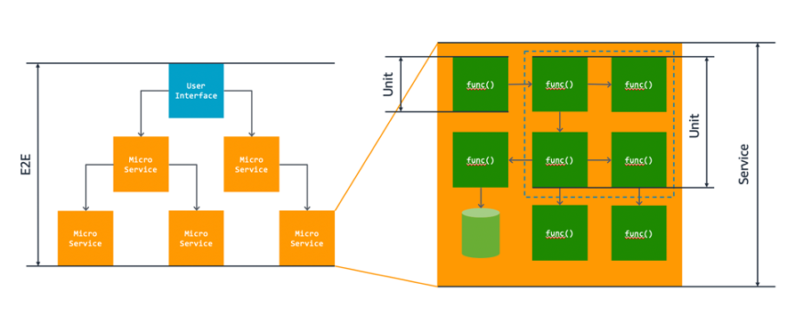
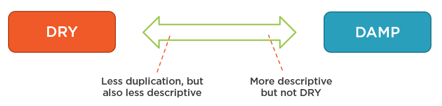

## 1. 단위 테스트(Unit Test) 소개

### 단위 테스트란

**단위 테스트(Unit Test)**라는 것은 코드의 가장 **작은 기능적 단위를 독립적으로 검증하는 테스트**를 일컫는다.

여기서 작은 기능적 단위(Unit)는 보통 내가 작성한 클래스 또는 메서드를 의미한다.

<br>

_https://aws.amazon.com/what-is/unit-testing/?nc1=h_ls_

<br>

단위 테스트는 기본적으로 개발자가 작성한 논리에 따라 코드가 의도대로 실행되는지 확인하기 위해서 설계한다. 그래서 단위 테스트는 보통 `assert`(참 또는 거짓)의 출력으로 코드의 동작을 확인한다.

다음은 단위 테스트에서 검사할 수 있는 몇 가지 기본적인 항목들이다.

* **논리 검사(logic check)**
  * 시스템이 올바른 계산을 수행해서 입력이 주어졌을 때 예상한 결과가 나오는지 확인한다
  * 코드의 모든 경로를 주어진 입력들로 커버할 수 있어야 한다
* **경계 검사(boundary check)**
  * 일반적인 입력, 극단적이거 잘 사용되지 않는 입력(edge case), 잘못된 입력에 대해 어떤 결과가 나오는지 확인한다
* **오류 처리(error handling)**
  * 입력에 오류가 있거나, 입력에 대해 오류가 예상되는 경우 시스템이 어떻게 반응하는지 확인한다
* **객체 지향 검사(object orientation check)**
  * 코드를 실행했을 객체의 상태가 변경되면 올바르게 업데이트 되는지 확인한다

<br>

위에서 언급한 항목 외에도 여러가지 항목에 대하여 테스트를 진행할 수 있다.

<br>

----

### 단위 테스트 프랙티스

그러면 단위 테스트를 작성할 때 참고하는 몇 가지 프랙티스(practice)를 알아보자.

<br>

#### FIRST 원칙

FIRST 원칙은 단위 테스트가 가져야하는 특성과 원칙에 대하여 이야기 한다.

* **Fast** : 단위 테스트는 빨라야한다
* **Isolated** : 단위 테스트는 외부 요인에 종속적이거나 다른 테스트에 의존적이면 안되고 독립적으로 실행되어야 한다
* **Repeatable** : 단위 테스트는 반복하여 실행해도 동일한 결과를 만들어야 한다
* **Self-validating** : 단위 테스트는 스스로 통과했는지 안했는지 판단할 수 있어야 한다
  * 만약 테스트 결과에 대해 개발자의 판단이 필요하다면 그것은 어중간한 단위 테스트를 의미한다
* **Timely** : 단위 테스트는 프로덕션 코드가 테스트에 성공하기 전에 구현되어야 한다

<br>

> **T**를 다음으로 해석하는 경우도 존재한다 
>
> **Thorough** : 단위 테스트는 성공적인 케이스뿐만 아니라 가능한 모든 에러나 비정상적인 흐름에 대해서도 대응해야 한다.
{: .prompt-info }

<br>

---

#### DAMP(Descriptive And Meaningful Phrases)

**단위 테스트를 최대한 읽기 쉽고 이해가능한 테스트로 작성하라는 의미**이다. DAMP를 추구한다는 것은 코드에 대한 중복이 발생하더라도 이해하기 쉬운 코드를 작성하려고 시도한다는 뜻이다. 이는 코드의 중복을 최소화해야 한다는 DRY(Dont Repeat Yourself)과 충돌한다는 뜻이기도 하다.

<br>

_https://enterprisecraftsmanship.com/posts/dry-damp-unit-tests/_

<br>

많은 자료를 구글링하면서 찾아보니 대부분의 경우 다음과 같이 테스트 작성하는 것을 추천한다.

* DAMP하게 테스트 코드를 작성하되, 최대한 중복을 최소화 한다(DRY를 적용한다)
* DAMP와 DRY는 이분법적인 개념이 아니다
* 정리하자면, 둘 사이의 트레이드-오프를 이해해서 저울을 잘 맞추라는 이야기를 많이 하는 것 같다
* 예시를 하나 들자면, 테스트 코드에서 DRY를 추구하기 위해서 반복적으로 사용되는 로직을 따로 메서드로 뽑으면 해당 메서드를 사용하는 테스트 사이에 커플링(coupling)이 생긴다. 상황 마다 다르겠지만, 이는 단위 테스트 작성에서는 안티패턴(anti-pattern)이 될 수 있다.

<br>

DAMP한 테스트 코드를 위해서 다음의 방법들을 사용한다.

* 개별 테스트 코드의 목적을 확실하게 정한다
* AAA, GTW와 같은 패턴을 사용해서 테스트를 작성한다
* 테스트 코드의 설명을 간결하고 명확하게 작성한다. 추상적으로 작성하지 말자.
  * 예시) `sum()의 합을 구하는 기능이 작동하는지 확인한다` → `sum()의 입력으로 정수 리스트 [1,2,3,4]를 주면, 합이 10이 나와야 한다.`
* 경우에 따라서 테스트 코드의 설명은 간결하고 명확한 명세와 정책(도메인)을 담아서 표현한다

<br>

> **AAA, GTW**
>
> 


<br>

---

## 2. 테스트 프레임워크(Test Framework)

단위 테스트


<br>

---

## 3. 단위 테스트 예시

단위 테스트 예시를 살펴보자.

<br>

> * 스프링 부트와 [https://start.spring.io/](https://start.spring.io/) 없이 `junit`과 `assertj`를 사용했다
> * `lombok` 사용
> * `자바17` 사용
{: .prompt-warning }

<br>

`build.gradle`

```groovy
dependencies {
    testImplementation platform('org.junit:junit-bom:5.9.1')
    testImplementation 'org.junit.jupiter:junit-jupiter'
    testRuntimeOnly 'org.junit.jupiter:junit-jupiter-engine:5.9.1'

    // AssertJ
    testImplementation 'org.assertj:assertj-core:3.25.1'

    // Lombok
    compileOnly 'org.projectlombok:lombok:1.18.34'
    annotationProcessor 'org.projectlombok:lombok:1.18.34'

    testCompileOnly 'org.projectlombok:lombok:1.18.34'
    testAnnotationProcessor 'org.projectlombok:lombok:1.18.34'
}
```

<br>

이제 쇼핑카트(`ShoppingCart`)라는 클래스를 만들어서 해당 쇼핑카트에 아이템(`Item`)을 추가/제거/총 가격 계산을 하는 기능을 추가하자.

<br>

`ShoppingCart`

```java
@Getter
public class ShoppingCart {

    private List<Item> items;

    public ShoppingCart() {
        this.items = new ArrayList<>();
    }

    public void addItem(Item item) {
        items.add(item);
    }

    public void removeItem(String name) {
        items.removeIf(item -> item.getName().equals(name));
    }

    public int calculateTotalPrice() {
        return items.stream()
                .mapToInt(item -> item.getPrice() * item.getQuantity())
                .sum();
    }

    @Getter
    @AllArgsConstructor
    public static class Item {
        private String name;
        private int price;
        private int quantity;

        @Override
        public String toString() {
            return "Item{" +
                    "name='" + name + '\'' +
                    ", price=" + price +
                    ", quantity=" + quantity +
                    '}';
        }
    }

}
```

* 쇼핑카트에 아이템을 추가/삭제하고, 단긴 모든 아이템의 총 가격을 계산하는 기능이 존재한다
* `getItems()`로 쇼핑카트에 담긴 아이템들의 리스트를 반환 받을 수 있다

<br>

이제 단위 테스트를 작성해보자. 


---

## Reference

1. [https://techblog.woowahan.com/17404/](https://techblog.woowahan.com/17404/)
2. [https://tosspayments-dev.oopy.io/share/books/unit-testing](https://tosspayments-dev.oopy.io/share/books/unit-testing)
3. [https://aws.amazon.com/what-is/unit-testing/?nc1=h_ls](https://aws.amazon.com/what-is/unit-testing/?nc1=h_ls)
4. [인프런 : 실용적인 테스트 가이드](https://www.inflearn.com/course/practical-testing-%EC%8B%A4%EC%9A%A9%EC%A0%81%EC%9D%B8-%ED%85%8C%EC%8A%A4%ED%8A%B8-%EA%B0%80%EC%9D%B4%EB%93%9C/dashboard)
5. [https://enterprisecraftsmanship.com/posts/dry-damp-unit-tests/](https://enterprisecraftsmanship.com/posts/dry-damp-unit-tests/)

