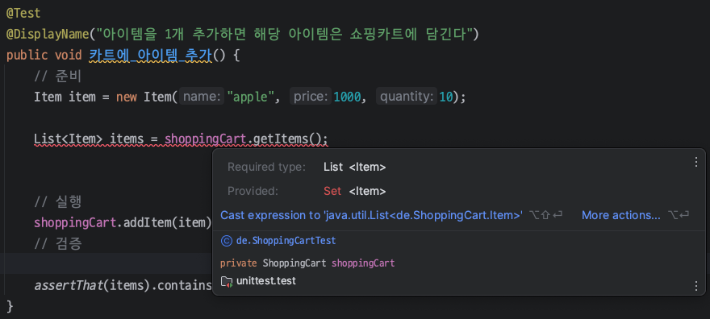

## 1. 단위 테스트(Unit Test) 소개

### 단위 테스트란

**단위 테스트(Unit Test)**라는 것은 코드의 가장 **작은 기능적 단위를 독립적으로 검증하는 테스트**를 일컫는다.

여기서 작은 기능적 단위(Unit)는 보통 내가 작성한 클래스 또는 메서드를 의미한다.

<br>

_https://aws.amazon.com/what-is/unit-testing/?nc1=h_ls_

<br>

단위 테스트는 기본적으로 개발자가 작성한 논리에 따라 코드가 의도대로 실행되는지 확인하기 위해서 설계한다. 그래서 단위 테스트는 보통 `assert`(참 또는 거짓)의 출력으로 코드의 동작을 확인한다.

다음은 단위 테스트에서 검사할 수 있는 몇 가지 기본적인 항목들이다.

* **논리 검사(logic check)**
  * 시스템이 올바른 계산을 수행해서 입력이 주어졌을 때 예상한 결과가 나오는지 확인한다
  * 코드의 모든 경로를 주어진 입력들로 커버할 수 있어야 한다
* **경계 검사(boundary check)**
  * 일반적인 입력, 극단적이거 잘 사용되지 않는 입력(edge case), 잘못된 입력에 대해 어떤 결과가 나오는지 확인한다
* **오류 처리(error handling)**
  * 입력에 오류가 있거나, 입력에 대해 오류가 예상되는 경우 시스템이 어떻게 반응하는지 확인한다
* **객체 지향 검사(object orientation check)**
  * 코드를 실행했을 객체의 상태가 변경되면 올바르게 업데이트 되는지 확인한다

<br>

위에서 언급한 항목 외에도 여러가지 항목에 대하여 테스트를 진행할 수 있다.

<br>

----

## 2. 단위 테스트 프랙티스(Unit Testing Best Practices)

그러면 단위 테스트를 작성할 때 참고할 수 있는 프랙티스(practice)들을 알아보자.

<br>

### FIRST 원칙

FIRST 원칙은 단위 테스트가 가져야하는 특성과 원칙에 대하여 이야기 한다.

* **Fast** : 단위 테스트는 빨라야한다
* **Isolated** : 단위 테스트는 외부 요인에 종속적이거나 다른 테스트에 의존적이면 안되고 독립적으로 실행되어야 한다
* **Repeatable** : 단위 테스트는 반복하여 실행해도 동일한 결과를 만들어야 한다
* **Self-validating** : 단위 테스트는 스스로 통과했는지 안했는지 판단할 수 있어야 한다
  * 만약 테스트 결과에 대해 개발자의 판단이 필요하다면 그것은 어중간한 단위 테스트를 의미한다
* **Timely** : 단위 테스트는 프로덕션 코드가 테스트에 성공하기 전에 구현되어야 한다

<br>

> **T**를 다음으로 해석하는 경우도 존재한다 
>
> **Thorough** : 단위 테스트는 성공적인 케이스뿐만 아니라 가능한 모든 에러나 비정상적인 흐름에 대해서도 대응해야 한다.
{: .prompt-info }

<br>

---

### DAMP(Descriptive And Meaningful Phrases)

**단위 테스트를 최대한 읽기 쉽고 이해가능한 테스트로 작성하라는 의미**이다. DAMP를 추구한다는 것은 코드에 대한 중복이 발생하더라도 이해하기 쉬운 코드를 작성하려고 시도한다는 뜻이다. 이는 코드의 중복을 최소화해야 한다는 DRY(Dont Repeat Yourself)과 충돌한다는 뜻이기도 하다.

<br>

_https://enterprisecraftsmanship.com/posts/dry-damp-unit-tests/_

<br>

많은 자료를 구글링하면서 찾아보니 대부분의 경우 DAMP와 DRY에 관해서 다음과 같이 테스트 작성하는 것을 권장한다.

* DAMP하게 테스트 코드를 작성하되, 최대한 중복을 최소화 한다(DRY를 적용한다)
* DAMP와 DRY는 이분법적인 개념이 아니다
* 정리하자면, 둘 사이의 트레이드-오프를 이해해서 저울을 잘 맞추라는 이야기를 많이 하는 것 같다
* 예시를 하나 들자면, 테스트 코드에서 DRY를 추구하기 위해서 반복적으로 사용되는 로직을 따로 메서드로 뽑으면 해당 메서드를 사용하는 테스트 사이에 결합(coupling)이 생긴다. 상황 마다 다르겠지만, 이는 단위 테스트 작성에서는 안티패턴(anti-pattern)이 될 수 있다. 

<br>

DAMP한 테스트 코드를 위해서 다음의 방법들을 사용한다.

* 개별 테스트 코드의 목적을 확실하게 정한다
* AAA, GTW와 같은 패턴을 사용해서 테스트를 작성한다
* 테스트 코드의 설명을 간결하고 명확하게 작성한다. 추상적으로 작성하지 말자.
  * 예시) `sum()의 합을 구하는 기능이 작동하는지 확인한다` → `sum()의 입력으로 정수 리스트 [1,2,3,4]를 주면, 합이 10이 나와야 한다.`
* 경우에 따라서 테스트 코드의 설명은 간결하고 명확한 명세와 정책(도메인)을 담아서 표현한다

<br>

> **AAA vs GTW**
>
> **AAA(Arrange-Act-Assert)**
>
> * **Arrange(준비)** : 시스템은 테스트를 실행하기 위한 모든 준비가 완료된 상태여야 한다.
>   * 필요한 객체 생성, 사전에 필요한 API 호출, 등
> * **Act(실행)** : 테스트 코드를 실행한다.
> * **Assert(검증)** : 실행한 코드가 예상한대로 동작했는지 검증한다. (결과 검증)
>   * 객체의 상태, 값, 등을 검증
>   * 예) `assertXXX()`같은 코드
>
> <br>
>
> AAA는 TDD(테스트 주도 개발)에서 온 개념이다. 이때 GWT라는 것도 있는데 이는 BDD(Behavior Driven Development)에서 온 개념이다. TDD와 BDD에 대한 내용은 나중 포스트에서 다룰 예정이다. 지금은 그냥 BDD는 **"비즈니스적으로 의미있는 시나리오를 기반으로 테스트 코드를 작성한다"** 정도로만 이해하자. (쉽게 말해서 BDD는 비즈니스 요구사항에 더 집중해서 테스트 코드를 짠다.)
>
> <br>
>
> **GWT(Given-When-Then)**
>
> * **Given(이런 상황, 환경이 주어졌을 때)**
>   * 예) 유저가 유저 페이지에 있다는 상황을 준비한다
> * **When(조건 만족 : 특정 행동을 유발 시키는 동작이나 이벤트를 실행한다)**
>   * 예) 유저가 올바른 인증을 입력했을 때
> * **Then(예상 결과 : 결과를 검증한다)**
>   * 예) 유저 페이지의 보안 항목으로 리다이렉트한다
>
> <br>
>
> 이후 포스트에서 자세히 다루겠지만 AAA는 개발자 중심적인 테스트 코드 패턴이며, 보통 코드 자체의 구현에 집중한다. 반면에, GWT는 비개발 직군의 사람까지 염두해서 작성하는 경우가 많다.
{: .prompt-info }

<br>

> 현재 다루고 있는 테스트 코드의 프랙티스에 관한 내용은 **정답이 아니다!**
>
> 애초에 TDD니 BDD는 아직도 친 TDD와 반 TDD 진영에서 그 효용성을 두고 싸운다. 이 포스트에서 설명하는 내용은 무조건 지켜야한다는 내용이라기 보다는, **"이런 프랙티스도 존재하니 참고하자~"** 같은 느낌으로 작성한 것이다.
{: .prompt-danger }

<br>

---

### 좋은 단위 테스트의 4대 요소(The 4 pillars of a good Unit Test)

[Khorikov, Vladimir : Unit Testing Principles, Practices and Patterns](https://product.kyobobook.co.kr/detail/S000003470704)에서 설명하는 좋은 단위 테스트의 4대 요소.

<br>

#### **1. 회귀 방지(Protection against regressions, bugs)**

* 테스트가 가능한 최대한 많은 코드를 실행하는 것을 목표로 한다
* 코드의 양이 많고 복잡도가 증가할 수록 회귀(버그)가 등장할 확률이 높다
* 너무 간단한 테스트는 회귀 방지에 취약할 수 있다


<br>

---

#### 2. ⭐**리팩터링 내성(Resistance to refactoring)**

* 단위 테스트를 바꾸지 않고 또한 실패로 만들지 않으면서 제품의 코드를 리팩토링할 수 있는지에 대한 척도
* 찾아본 대부분 자료에서 리팩터링 내성을 중요시 여기는 것 같다
* **거짓 양성(false positive)**
  * 리팩토링 후 기능은 정상적으로 동작하지만 테스트가 깨진다(실패한다)
  * 지속적인 거짓 양성은 테스트 코드의 신뢰도를 저하시킨다(테스트의 실패 원인을 모르면 나중에 테스트를 무시하게 된다)
  * 지속적인 거짓 양성은 리펙터링을 꺼리게되는 경향성을 만든다(회귀를 피하기 위해서 테스트를 작성하지 않으려고 한다)
* **거짓 양성을 피하는 방법**
  * 거짓 양성을 피하기 위해서 테스트가 구현 세부 사항과 결합(coupling)되지 않도록 해야한다
  * 최종 결과를 목표로 테스트를 해야한다. 더 풀어서 이야기 하자면 테스트 시 최종적으로 의미있는 결과만 검증하도록 한다.
  * 화이트박스 테스트가 아닌 블랙박스 테스트를 사용한다 

<br>

> **세부 구현 사항이란?**
>
> 메서드나 기능이 어떤 특정 알고리즘 또는 논리로 구현되어 있는지 검증할 필요 없다.
>
> 예를 들자면, 장바구니에 물건을 추가하는 경우 해당 장바구니에 물건이 들어있는지만 확인하면 되지, 어떤 알고리즘이 사용됐는지 검증하지 않도록한다.
{: .prompt-info }

<br>

> **블랙박스 vs 화이트박스**
>
> * **블랙박스 테스트(Blackbox Test)**
>   * 시스템의 내부 작동 원리나 구조를 몰라도 기능을 검사하는 테스트 방법
>   * 내부 구현이 아닌 기능을 위주로 테스트를 작성한다
>   * 요구사항(requirements), 명세(specification)를 통해 테스트를 작성한다
>
> 
>
> * **화이트박스 테스트(Whitebox Test)**
>   * 내부 구현과 동작을 세밀하게 검사하는 테스트 방법
>   * 요구 사항이나 명세가 아니라 소스 코드에서 파생된다
>
> 위는 대략적인 블랙박스, 화이트박스 테스트에 대한 설명이고, 각 테스트 방법을 세부적으로 살펴보면 무슨 동등 분할 기법이니, 오류 예측 기법이니, 경로 검증 기법이니 뭐니 아주 다양하다.
{: .prompt-info }


<br>

_Unit Testing Principles, Practices and Patterns_

<br>

---

#### **3. 빠른 피드백(Fast feedback)**

* 코드의 변경마다 테스트에 대한 통과/실패에 피드백이 즉각적으로 반영되어야(확인할 수 있어야) 한다
* 테스트가 빠를수록 더 많은 테스트를 수행할 수 있게 된다
* 테스트가 너무 오래걸리면 자주 실행하지 못하고 코드가 잘못된 방향으로 작성될 확률이 높아진다

<br>

---

#### **4. 유지 보수성(Maintainability)**

* 단위 테스트는 이해하기 쉽고 실행하기 쉬워야한다
* 만약 테스트의 실행을 위해 외부 의존 셋업 처럼 많은 노력이 들어간다면 그것은 실행이 어렵다는 뜻일 수 있다

<br>

---

#### 이상적인 테스트는?

* 테스트가 4가지 요소 모두 어느 정도 지켜야 한다.
* `1(회귀 방지)`, `2(리팩터링 내성)`, `3(빠른 피드백)`은 상호 배타적이다
* 2 가지 요소를 선택해서 극대화 하고, 하나는 희생하자
* 많은 경우 `리팩터링 내성`을 최대한 많이 갖는 것을 목표로 한다
  * 그 이후 `회귀 방지`와 `빠른 피드백` 사이에서 절충한다

<br>

_Unit Testing Principles, Practices and Patterns_

<br>

---

### 기타 프랙티스

> 위에서 설명한 프랙티스들과 중복될 수 있다.
{: .prompt-tip }

<br>

* 엣지 케이스(edge case)에 대해 테스트하기.
* 테스트 커버리지(test coverage)에 집착하지 말자.
* 가성비 좋은 테스트를 만들도록 노력하자.
  * 테스트에 대한 비용을 낮추고, 얻는 이득을 최대화하자.
* 제품 코드를 리팩토링 할때 테스트를 수행하고 관찰하자.
* 테스트는 코드의 단위를 검증하는 것이 아닌 동작(기능)의 단위를 검증해야 한다.
* 테스트 설명은 사실로 이루어져야하고, 개발자의 소망이나 욕구가 들어가선 안된다.
* 어설픈 추상화보다는 중복이 낫다. 중복되더라도 명확하고 일광성 있으면서 유지보수하기 쉬운 코드를 작성하자.

<br>

> **테스트 커버리지(test coverage)**
>
> `테스트 커버리지 = 실행 코드의 라인 수 / 전체 코드의 라인 수`
>
> 말그대로 테스트로 코드를 얼마나 커버(cover) 했는지를 나타내는 지표이다. 테스트 커버러지가 100%라고 해서 버그가 없다는 것을 보장하지 못한다.
{: .prompt-info }

<br>

> 다시 한번 말하지만 여기서 다루고 있는 베스트 프랙티스들이 무조건 정답이 아니다.
>
> 상황을 봐가면서 유연하게 적용할 수 있는 개발자가 되도록 노력해야겠다.
{: .prompt-danger }


<br>

---

## 3. 테스트를 도와주는 도구들

테스트를 도와주는 프레임워크, 라이브러리, 툴들에 대하여 알아보자.

* **Junit5**
  * 단위 테스트를 위한 테스트 프레임워크
  * `5`는 버전이다
  * Kent Back이 만든 Xunit 시리즈 중에서 자바를 위한 테스트 프레임워크이다
  * [https://junit.org/junit5/docs/current/user-guide/#writing-tests-annotations](https://junit.org/junit5/docs/current/user-guide/#writing-tests-annotations)


* **AssertJ**
  * 테스트 코드 작성을 위한 라이브러리
  * 다양한 assertion API와 메서드 체이닝을 지원한다
  * [https://assertj.github.io/doc/#assertj-guava-assertions-guide](https://assertj.github.io/doc/#assertj-guava-assertions-guide)


* **Mockito**
  * 자바에서 사용하는 Mock 프레임워크
  * BDDMockito라는 Mockito를 wrapping한 프레임워크도 존재한다
    * Mockito의 `when`, `thenReturn` 대신 `given`, `willReturn` 등을 사용한다
    * 쉽게 말해서 BDD 스타일의 가독성을 지원하는 Mockito의 확장 프레임워크로 볼 수 있다
  * [https://javadoc.io/doc/org.mockito/mockito-core/latest/org/mockito/Mockito.html](https://javadoc.io/doc/org.mockito/mockito-core/latest/org/mockito/Mockito.html)


* **JaCoCo**
  * 자바를 위한 코드 커버리지 도구
  * 커버리지에 대한 리포트를 생성할 수 있다
  * 오픈소스이다
  * [https://www.jacoco.org/jacoco/trunk/doc/index.html](https://www.jacoco.org/jacoco/trunk/doc/index.html)

<br>

이외에도 TestNG, Hamcrest, PowerMock, Cucumber 등 정말 많은 테스트를 위한 도구들이 존재한다.

<br>

---

## 4. 단위 테스트 예시

> * 스프링 부트와 [https://start.spring.io/](https://start.spring.io/) 없이 `junit`과 `assertj`를 사용했다
> * `lombok` 사용
> * `자바17` 사용
{: .prompt-warning }

<br>

`build.gradle`

```groovy
dependencies {
    testImplementation platform('org.junit:junit-bom:5.9.1')
    testImplementation 'org.junit.jupiter:junit-jupiter'
    testRuntimeOnly 'org.junit.jupiter:junit-jupiter-engine:5.9.1'

    // AssertJ
    testImplementation 'org.assertj:assertj-core:3.25.1'

    // Lombok
    compileOnly 'org.projectlombok:lombok:1.18.34'
    annotationProcessor 'org.projectlombok:lombok:1.18.34'

    testCompileOnly 'org.projectlombok:lombok:1.18.34'
    testAnnotationProcessor 'org.projectlombok:lombok:1.18.34'
}
```

<br>

> 들어가기에 앞서, 이 예시는 단위 테스트를 한번도 짜보지 않은 사람(~~필자 본인~~)이 여러가지 프랙티스를 참고하면서 작성했다는 것을 유의하자. (~~안티패턴 주의~~)
{: .prompt-danger }

<br>

이제 쇼핑카트(`ShoppingCart`)라는 클래스를 만들어서 해당 쇼핑카트에 아이템(`Item`)을 `추가/제거/총 가격 계산`을 하는 기능들을 추가한다고 해보자.

<br>

`ShoppingCart`

```java
@Getter
public class ShoppingCart {

    private List<Item> items;

    public ShoppingCart() {
        this.items = new ArrayList<>();
    }

    public void addItem(Item item) {
        items.add(item);
    }

    public void removeItem(String name) {
        items.removeIf(item -> item.getName().equals(name));
    }

    public int calculateTotalPrice() {
        return items.stream()
                .mapToInt(item -> item.getPrice() * item.getQuantity())
                .sum();
    }

    @Getter
    @AllArgsConstructor
    public static class Item {
        private String name;
        private int price;
        private int quantity;

        @Override
        public String toString() {
            return "Item{" +
                    "name='" + name + '\'' +
                    ", price=" + price +
                    ", quantity=" + quantity +
                    '}';
        }
    }

}
```

* 쇼핑카트에 아이템을 `추가/삭제/담긴 모든 아이템의 총 가격을 계산`하는 기능이 존재한다
* `getItems()`로 쇼핑카트에 담긴 아이템들의 리스트를 반환 받을 수 있다
* `Item`은 정적 중첩 클래스로 작성했다

<br>

이제 단위 테스트를 작성해보자. 

<br>

```java
class ShoppingCartTest {

    private ShoppingCart shoppingCart;

    @BeforeEach
    public void setUp() {
        shoppingCart = new ShoppingCart();
    }

    @Test
    @DisplayName("아이템을 1개 추가하면 해당 아이템은 쇼핑카트에 담긴다")
    public void 카트에_아이템_추가() {
        // 준비
        Item item = new Item("apple", 1000, 10);
        List<Item> items = shoppingCart.getItems();

        // 실행
        shoppingCart.addItem(item);
      
        // 검증
        assertThat(items).contains(item);
    }

    @Test
    @DisplayName("이름으로 명시한 아이템을 없애면, 해당 아이템은 쇼핑카트에 존재하지 않는다")
    public void 카트에서_아이템_제거() {
        Item item1 = new Item("apple", 1000, 10);
        Item item2 = new Item("banana", 2000, 20);
        shoppingCart.addItem(item1);
        shoppingCart.addItem(item2);
        List<Item> items = shoppingCart.getItems();
      
        shoppingCart.removeItem("apple");

        assertThat(items).doesNotContain(item1);
        assertThat(items).contains(item2);
    }

    @Test
    @DisplayName("쇼핑카트에 추가한 2개 아이템의 총 가격은 50000이 나와야한다")
    public void 카트안_아이템_총가격_계산() {
        Item item1 = new Item("apple", 1000, 10);
        Item item2 = new Item("banana", 2000, 20);
        shoppingCart.addItem(item1);
        shoppingCart.addItem(item2);

        int totalPrice = shoppingCart.calculateTotalPrice();

        assertThat(totalPrice).isEqualTo(50000);
    }

}
```

<br>

테스트 스위트를 실행 해보면 다음과 같이 전부 통과하는 모습을 볼 수 있다.

<br>

_과연 괜찮은 테스트일까?_

<br>

그러나 현재 테스트 코드에는 잠재적인 문제가 있다.

그것은 `ShoppingCart` 클래스의 내부 구현에 의존하고 있다는 것이다.

<br>

테스트 코드의 일부를 다시 살펴보자.

```java
@Test
@DisplayName("아이템을 1개 추가하면 해당 아이템은 쇼핑카트에 담긴다")
public void 카트에_아이템_추가() {
    // 준비
    Item item = new Item("apple", 1000, 10);
    // List로 정하는 것은 ShoppingCart 클래스의 내부 구조에 의존하게 되는 것이다
    List<Item> items = shoppingCart.getItems();

    // 실행
    shoppingCart.addItem(item);
      
    // 검증
    assertThat(items).contains(item);
}
```

<br>

현재 테스트 코드에서는 `shoppingCart.getItems()`을 `List`로 타입을 정했기 때문에 만약 `ShoppingCart`의 내부 구조가 바뀌면 해당 테스트가 깨질 위험이 생긴다.

예를 들어서 `ShoppingCart`를 다음과 같이 수정한다고 가정해보자.

<br>

```java
@Getter
public class ShoppingCart {
  
    private Set<Item> items;

    public ShoppingCart() {
        this.items = new HashSet<>();
    }
    
    // 기존과 동일
  
}
```

* `List`가 아니라 `Set`을 사용하도록 코드를 변경했다

<br>

이제 테스트 코드를 다시 실행해보려고 하자. 그러면 테스트 실행은 커녕 컴파일 단계에서 부터 막힌다.

<br>

_ShoppingCart의 내부 구현을 바꿨는데 테스트가 동작하지 않는다_

<br>

아마 이런 경우를 두고 리팩터링 내성이 없다고 말하는 것이 아닐까 생각한다.

이를 해결하기 위해서는 `List` 타입을 명시하지 않으면 된다. 그러니깐 `ShoppingCart` 클래스의 내부 구현에 의존하지 않도록 한다. 해당 `shoppingCart.getItems()`이 `Set`이든, `List`이든, 뭐든에 상관없이 테스트가 깨지지 않고 동작해야 하는 것이다.

<br>

`수정한 코드`

```java
@Test
@DisplayName("아이템을 1개 추가하면 해당 아이템은 쇼핑카트에 담긴다")
public void 카트에_아이템_추가() {
    // 준비
    Item item = new Item("apple", 1000, 10);

    // 실행
    shoppingCart.addItem(item);

    // 검증
    assertThat(shoppingCart.getItems()).contains(item);
}
```

<br>

테스트 코드를 실행해보면 `.getItems()`이 `Set`으로 구현되어 있든, `List`로 구현되어 있든 정상적으로 동작하고 통과한다.

<br>

---

## 후기

지금까지 단위 테스트에 대해 간략히 다루었다. 지금까지 단위 테스트를 작성했을 때는 그냥 남들이 하는거 보고 **"대충 기능의 결과에 대한 검증만 하면 되겠지?"**라고 생각하고 안일하게 작성했다. 이번에 여러 자료를 찾아보면서 단위 테스트에 대해 고민해 볼수 있었다.

다음 포스트는 TDD에 대한 내용을 다룰 생각이다.

---

## Reference

1. [https://techblog.woowahan.com/17404/](https://techblog.woowahan.com/17404/)
2. [https://tosspayments-dev.oopy.io/share/books/unit-testing](https://tosspayments-dev.oopy.io/share/books/unit-testing)
3. [https://aws.amazon.com/what-is/unit-testing/?nc1=h_ls](https://aws.amazon.com/what-is/unit-testing/?nc1=h_ls)
4. [인프런 : 실용적인 테스트 가이드](https://www.inflearn.com/course/practical-testing-%EC%8B%A4%EC%9A%A9%EC%A0%81%EC%9D%B8-%ED%85%8C%EC%8A%A4%ED%8A%B8-%EA%B0%80%EC%9D%B4%EB%93%9C/dashboard)
5. [https://enterprisecraftsmanship.com/posts/dry-damp-unit-tests/](https://enterprisecraftsmanship.com/posts/dry-damp-unit-tests/)

