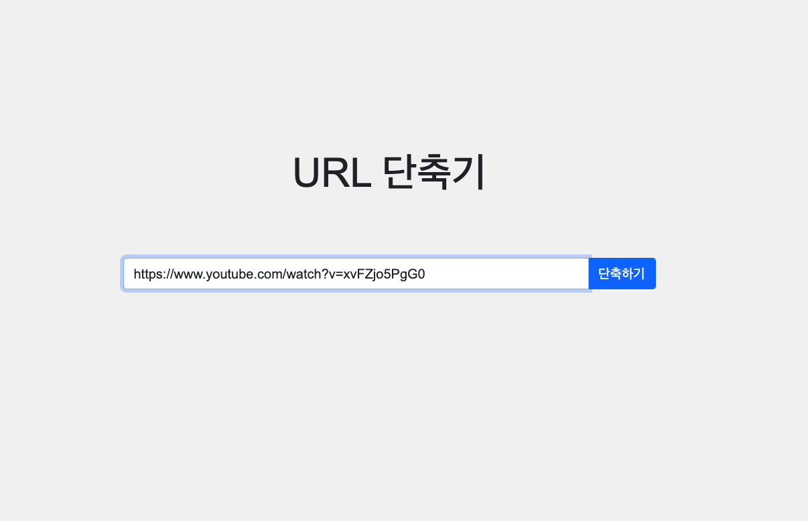
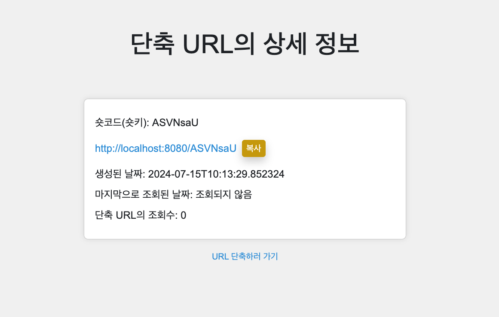
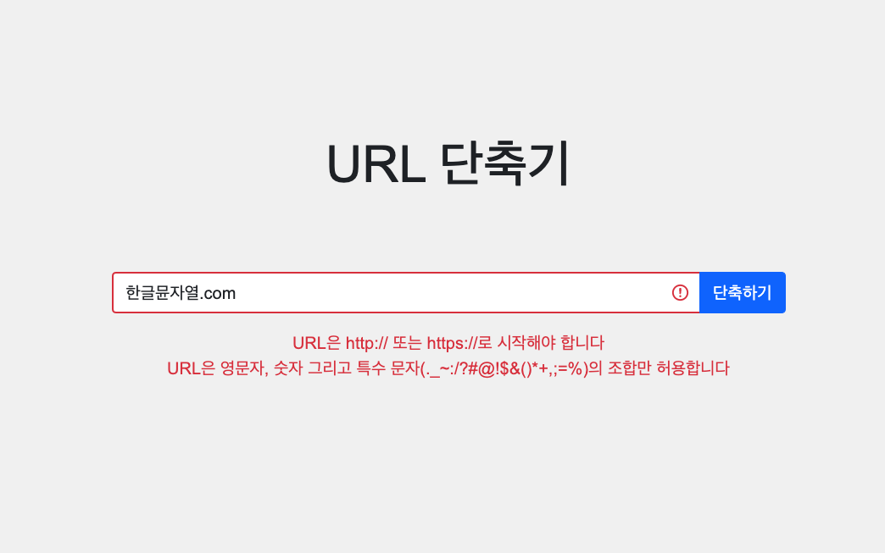
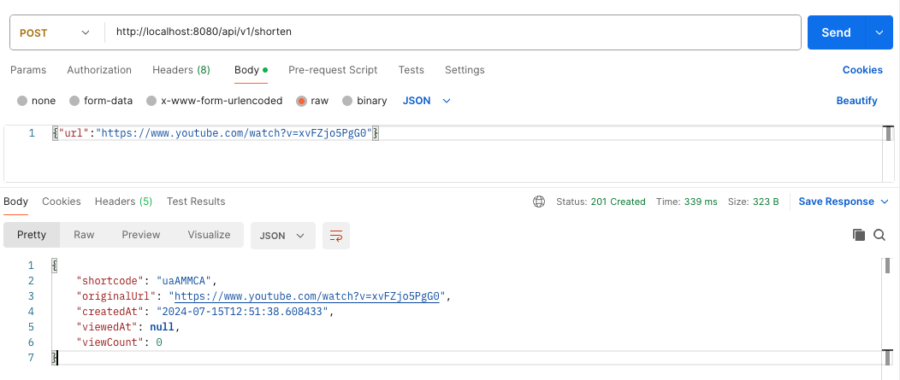
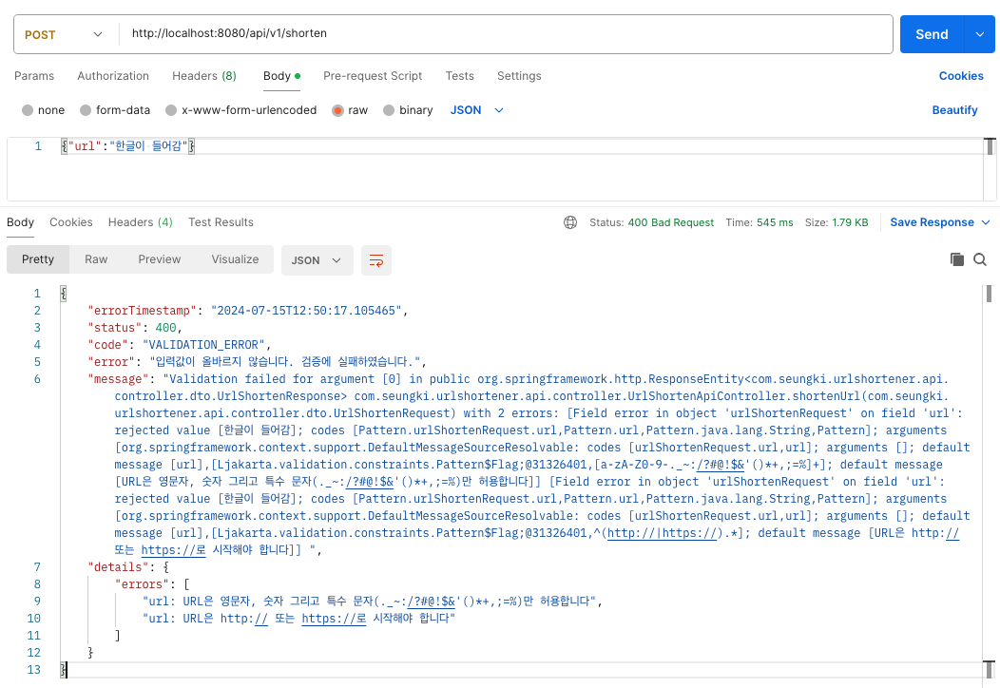
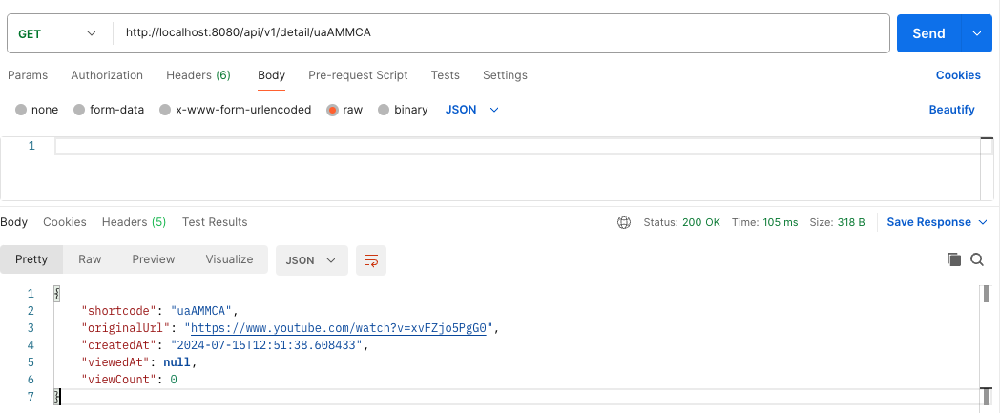
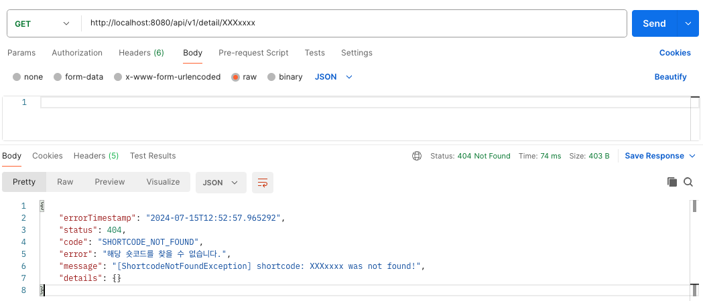

---

## API 설계

API는 다음과 같이 설계했다.

<br>

| 메서드 |          API 경로           | 출력 포맷 |              요청 파라미터               |           요청 본문            |          기능 설명          |
| :----: | :-------------------------: | :-------: | :--------------------------------------: | :----------------------------: | :-------------------------: |
| `POST` |      `api/v1/shorten`       |   JSON    |                                          | `url` : 단축할 원본 URL (JSON) |          URL 단축           |
| `GET`  | `api/v1/detail/{shortcode}` |   JSON    | `shortcode` : 단축 URL 숏코드 (`String`) |                                | 단축한 URL의 상세 정보 조회 |

<br>

---

## API 컨트롤러

프로젝트가 복잡하지 않아서 서비스와 레포지토리 계층을 따로 사용하지 않고 공통으로 사용했다.

아마 프로젝트가 커지거나 하면, 유지 보수를 위해 서로 분리해서 사용하는 것이 좋을거로 생각이 된다.

<br>

JSON 응답을 위한 DTO는 다음과 같이 사용했다.

```java
@Getter
public class UrlShortenResponse {

    private String shortcode;
    private String originalUrl;
    private LocalDateTime createdAt;
    private LocalDateTime viewedAt;
    private int viewCount;

    public UrlShortenResponse(UrlMapping urlMapping) {
        shortcode = urlMapping.getShortcode();
        originalUrl = urlMapping.getOriginalUrl();
        createdAt = urlMapping.getCreatedAt();
        viewedAt = urlMapping.getViewedAt();
        viewCount = urlMapping.getViewCount();
    }
  
}
```

<br>

`UrlShortenerApiController`

```java
@Slf4j
@RestController
@RequestMapping("/api/v1")
@RequiredArgsConstructor
public class UrlShortenApiController {

    private final UrlShortenService uss;

    @PostMapping("/shorten")
    public ResponseEntity<UrlShortenResponse> shortenUrl(@RequestBody @Validated 
      UrlShortenRequest urlShortenRequest) {
        String originalUrl = urlShortenRequest.getUrl();
        UrlMapping urlMapping = uss.shortenUrl(originalUrl);
        UrlShortenResponse response = new UrlShortenResponse(urlMapping);
        return new ResponseEntity<>(response, HttpStatus.CREATED);
    }

    @GetMapping("/detail/{shortcode}")
    public ResponseEntity<UrlShortenResponse> getDetail(@PathVariable String shortcode) {
        UrlMapping urlMapping = uss.findMatchingUrl(shortcode);
        UrlShortenResponse response = new UrlShortenResponse(urlMapping);
        return new ResponseEntity<>(response, HttpStatus.OK);
    }

}
```

<br>

---

## API 예외 처리

웹 브라우저로 화면을 제공하는 경우에 에러가 발생하면 단순히 `4xx`, `5xx`와 관련된 오류 화면을 보여주거나, 정 필요하면 특정 에러 페이지를 만들어서 보여주면 된다. 반면에 API는 상황과 예외에 따라서 응답으로 출력하는 데이터가 달라질 수 있다. 쉽게 말해서 세밀한 제어가 필요하다.

이전 포스트에서 HTML 화면을 제공할 때 `@ControllerAdvice`와 `@ExceptionHandler`를 사용해서 특정 예외 별로 오류 페이지가 나가도록 설정을 했다. 그러나 **보통의 경우 `@RestControllerAdvice`와 `@ExceptionHandler`를 이용한 전역 `ApiExceptionHandler`를 만들어서 API에 대한 예외 처리**를 한다.

많은 경우 API 예외를 처리하기 위해서 다음의 클래스를 구성한다. 

* 전역으로 API 예외를 처리하기 위한 핸들러 클래스인 `ApiExceptionHandler`
* 예외 케이스를 관리하기 위한 `enum` 클래스인 `ErrorCode` 클래스
* 예외 발생시의 응답을 형식화하기 위한 `ApiErrorResponse`라는 DTO

<br>

`ErrorCode`

```java
@Getter
@AllArgsConstructor
public enum ErrorCode {
    VALIDATION_ERROR(HttpStatus.BAD_REQUEST.value(),
            "VALIDATION_ERROR",
            "입력값이 올바르지 않습니다. 검증에 실패하였습니다."),
    SHORTCODE_NOT_FOUND(HttpStatus.NOT_FOUND.value(),
            "SHORTCODE_NOT_FOUND",
            "해당 숏코드를 찾을 수 없습니다."),
    URL_NOT_FOUND(HttpStatus.NOT_FOUND.value(),
            "URL_NOT_FOUND",
            "해당 숏코드를 이용해 URL을 찾을 수 없습니다."),
    SHORTCODE_GENERATION_FAILED(HttpStatus.INTERNAL_SERVER_ERROR.value(),
            "SHORTCODE_GENERATION_FAILED",
            "중복된 숏코드에 대한 숏코드 재생성에 실패했습니다. 관리자에 문의를 해주세요.");

    private final int status;
    private final String code;
    private final String message;
}
```

<br>

`ApiErrorResponse`

```java
@Getter
public class ApiErrorResponse {

    private final LocalDateTime errorTimestamp = LocalDateTime.now();
    private int status;
    private String code;
    private String error;
    private String message;
    private Map<String, Object> details;

    public ApiErrorResponse(ErrorCode errorCode, String message) {
        this.status = errorCode.getStatus();
        this.code = errorCode.getCode();
        this.error = errorCode.getMessage();
        this.message = message;
        this.details = new HashMap<>();
    }

    public void addDetail(String key, Object value) {
        this.details.put(key, value);
    }

}
```

* `detail`은 오류 메세지와 함께 추가적인 정보를 전달하기 위해서 사용

<br>

`ApiExceptionHandler`

```java
@Slf4j
@RestControllerAdvice(annotations = RestController.class)
public class ApiExceptionHandler {

    @ExceptionHandler(ShortcodeNotFoundException.class)
    public ResponseEntity<ApiErrorResponse> handleShortcodeNotFoundException(ShortcodeNotFoundException ex) {
        log.info("[ShortcodeNotFoundException] message: {}", ex.getMessage());
        ApiErrorResponse response = new ApiErrorResponse(ErrorCode.SHORTCODE_NOT_FOUND, ex.getMessage());
        return new ResponseEntity<>(response, HttpStatus.NOT_FOUND);
    }

    @ExceptionHandler(UrlNotFoundException.class)
    public ResponseEntity<ApiErrorResponse> handleUrlNotFoundException(UrlNotFoundException ex) {
        log.info("[UrlNotFoundException] message: {}", ex.getMessage());
        ApiErrorResponse response = new ApiErrorResponse(ErrorCode.URL_NOT_FOUND, ex.getMessage());
        return new ResponseEntity<>(response, HttpStatus.NOT_FOUND);
    }

    @ExceptionHandler(ShortcodeGenerationException.class)
    public ResponseEntity<ApiErrorResponse> handleShortcodeGenerationException(ShortcodeGenerationException ex) {
        log.info("[ShortcodeGenerationException] message: {}", ex.getMessage());
        ApiErrorResponse response = new ApiErrorResponse(ErrorCode.SHORTCODE_GENERATION_FAILED, ex.getMessage());
        return new ResponseEntity<>(response, HttpStatus.INTERNAL_SERVER_ERROR);
    }

    @ExceptionHandler(MethodArgumentNotValidException.class)
    public ResponseEntity<ApiErrorResponse> handleValidationExceptions(MethodArgumentNotValidException ex) {
        log.info("[ValidationException] message: {}", ex.getMessage());
        List<String> errors = ex.getBindingResult()
                .getAllErrors()
                .stream()
                .map(error -> ((FieldError) error).getField() + ": " + error.getDefaultMessage())
                .toList();
        ApiErrorResponse response = new ApiErrorResponse(ErrorCode.VALIDATION_ERROR, ex.getMessage());
        response.addDetail("errors", errors);
        return new ResponseEntity<>(response, HttpStatus.BAD_REQUEST);
    }

}
```

* `@RestControllerAdvice`에 `@RestController`가 붙은 컨트롤러만 적용되도록 옵션을 설정했다.
* 검증에 대한 처리는 아마 `BindException`으로 처리할 수 있을 것이다

<br>

---

## 개선할 점

- [ ] 자바의 `UrlConnection` 클래스를 사용하도록 리팩토링
- [ ] 코드 리팩토링
- [ ] 에러 핸들링을 더 깔끔하게 처리할 방법이 있을 것이다
- [ ] API 개선
  - [ ] URL을 리스트로 여러 개 받아서 단축 URL로 변환 할 수 있도록 구현
  - [ ] URL을 단축하는 API의 결과를 상세 정보로 받는 것이 아닌 원본 URL과 단축 URL만 받을 수 있도록 구현
  - [ ] 요청 검증을 더 세분화(현재 검증이 너무 단순하다. 검증을 해야하는 부분이 훨씬 많을 것이다.)
  - [ ] 단축 URL의 숏코드를 파라미터로 줘서 원본 URL로 바로 리다이렉트 하는 API 추가
  - [ ] 에러 메세지에 필요 없는 내용은 출력하지 않도록 수정(`trace`를 로그를 통해서 확인하도록 수정. 유저는 굳이 `trace`를 알 필요 없다.)


<br>

---

## 결과

### 서버 사이드 랜더링

<br>

_URL 입력 폼_

<br>

_단축 결과 상세 페이지_

<br>

_URL 검증_

<br>

---

### API

포스트맨(PostMan)을 통해서 확인.

<br>

_URL 단축 요청 성공_

<br>

_URL 단축 요청 실패_

<br>_단축 URL 상세 정보 조회 성공_

<br>

_단축 URL 상세 정보 조회 실패_

<br>

---

## 후기

### 느낌점

지금까지 간단한 URL 단축기를 구현해보았다. 스프링과 하이버네이트 학습 이후 연습하기 위한 프로젝트인 만큼 부족한 점이 정말 많다.

그래도 Base62 인코딩, 해시 함수, 등 여러가지 내용을 학습할 수 있어서 나름 재밌게 한 것 같다.

<br>

### 힘들었던 점

멘토가 없이 혼자 공부하는 것이 정말 어렵다고 느꼈다. 코드 리뷰가 없으니 내가 정말 똑바로 만들고 있는지 의심이 들어서 참 힘들었다..

~~열심히 구글링하면서, 다른 사람들 깃헙에서 코드 리뷰 받은 것을 최대한 활용하려고 했다~~

<br>

### 앞으로 공부/적용할 내용

* TDD와 더불어서 여러 테스트 프레임워크의 사용법 학습
  * 이번 프로젝트에서도 테스트를 하면서 진행하긴 했지만 그냥 남들이 작성한 테스트를 참고하면서 감으로 구현한 것에 불과하다
* Spring Data JPA 학습
  * 스프링 데이터를 학습해서 다음 프로젝트에 적용하기
* AOP 적용
  * 로깅 등의 부가적인 관심사를 분리해서 모듈화하기
* 조금 더 복잡한 도메인을 사용하는 프로젝트 진행하기
  * 이번 프로젝트는 너무 단순해서 데이터 모델링을 제대로 해볼 기회가 없었다
* API 보안 적용
  * OAuth2
  * JWT
  * 스프링 시큐리티
* 모니터링 적용
  * 스프링 부트 액츄에이터 사용 vs 사용하지 않고 적용
  * Prometheus
  * Grafana
* 캐시 서버 적용
  * Redis
* 배포해보기
  * AWS

<br>

프로젝트 깃헙 주소 : [https://github.com/seungki1011/url-shortener](https://github.com/seungki1011/url-shortener)

