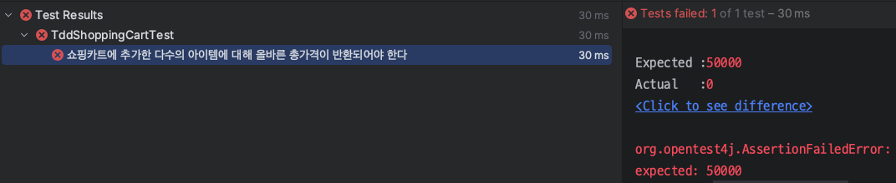

## 1. TDD(Test Driven Development) 소개

> TDD의 효용성은 지금까지도 토론의 쟁점이 되는 내용이다.
>
> **"TDD가 짱이다!"** 같은 접근 보다는 **"이런 개발 방법론이 있고, 이런 상황에 적용해서 효과를 볼 수 있다"**와 같은 방식으로 다가가려고 하자.
{: .prompt-warning }

<br>

**TDD(Test Driven Development)**, 한글로 번역하면 **테스트 주도 개발**이 무엇인지 알아보자.

먼저 TDD라는 것은 **프로덕션 코드보다 테스트 코드를 먼저 작성해서 테스트가 코드의 구현 과정을 주도**하도록 하는 개발 방법론이다.

<br>

> **TDD의 등장배경**
>
> * 80 ~ 90년대에 반복적 점진적 개발(Iterative and Incremental Development)이 인기를 얻으면서 관련 개발 방법론들이 대두된다.
> * 특히 90년대 후반에 들어서면서 Kent Back의 **Extreme Programming(익스트림 프로그래밍, XP)**과 더불어서 여러 에자일(Agile) 방법론들이 등장한다.
> * **TDD는 XP의 일부로 처음 제안되면서 알려졌다**
> * 이후 2001년의 [에자일 선언문(Agile Manifesto)](https://agilemanifesto.org/iso/ko/manifesto.html), 2002년에 출간된 [Kent Back : Test Driven Development](https://www.amazon.com/Test-Driven-Development-Kent-Beck/dp/0321146530), 등에 의해 점점 인기를 얻기 시작했다
{: .prompt-info }

<br>

> **Extreme Programming(익스트림 프로그래밍, XP)**
>
> * Kent Back이 제안한 소프트웨어 개발 방법론
>* 12개 정도의 구체적인 실천 방법(practice)을 정의하고 있다
> * 소프트웨어의 품질을 올리고, 지속적으로 변하는 고객 요구 사항에 대응하기 위해서 짧은 주기로 프로토타입을 완성하는 에자일(Agile) 방법론 중 하나이다.
{: .prompt-info }

<br>

TDD로 다시 돌아와서, **테스트 코드를 먼저 작성해서 테스트가 코드의 구현 과정을 주도**한다는 것이 무엇인지 그 과정을 구체적으로 살펴보자.

TDD는 보통 다음의 3 단계를 하나의 사이클로 운영한다. 

<br>

_TDD cycle_

* **RED**
  * 제일 먼저 실패하는 테스트 코드를 작성한다
  * 이때 테스트 코드는 컴파일 조차 안돼도 괜찮다
* **GREEN**
  * 테스트를 통과하도록 위해 실제(프로덕션) 코드를 작성한다
  * 이때 작성하는 코드는 테스트를 통과할 정도로만 최소한의 코드를 작성하도록 한다
  * 최대한 빠르게 작성하려고 노력한다
* **BLUE**
  * 코드를 리팩토링한다
  * 설계나 구현을 개선한다
  * 이때 테스트의 통과 상태는 유지되어야 한다

<br>

예시를 통해 알아보자.

<br>

---

## 2. TDD 예시

`ShoppingCart`와 `Item`이 존재한다고 해보자.

<br>

```java
public class ShoppingCart {

    private List<Item> items;

    public ShoppingCart() {
        this.items = new ArrayList<>();
    }
    
    public void addItem(Item item) {
        items.add(item);
    }

    public void removeItem(String name) {
        items.removeIf(item -> item.getName().equals(name));
    }
}
```

* 장바구니에 아이템을 추가하고 삭제하는 기능은 이미 구현되어 있는 상황이다

<br>

```java
@Getter
@AllArgsConstructor
public class Item {
    private String name;
    private int price;
    private int quantity;

    @Override
    public String toString() {
        return "Item{" +
                "name='" + name + '\'' +
                ", price=" + price +
                ", quantity=" + quantity +
                '}';
    }
}
```

<br>

---

### RED

> **RED**
>
> * 제일 먼저 실패하는 테스트 코드를 작성한다
> * 이때 테스트 코드는 컴파일 조차 안돼도 괜찮다
{: .prompt-danger }

<br>

이제 `ShoppingCart`에 담긴 아이템의 **총 가격을 계산하는 기능**을 TDD로 구현한다고 해보자.

먼저 **RED**에서는 실패하는 테스트 코드를 작성한다.

<br>

```java
class TddShoppingCartTest {

    private TddShoppingCart shoppingCart;

    @BeforeEach
    public void setUp() {
        shoppingCart = new TddShoppingCart();
    }

    @Test
    @DisplayName("쇼핑카트에 추가한 다수의 아이템에 대해 올바른 총가격이 반환되어야 한다")
    public void 장바구니에_담긴_아이템의_총가격_계산() {

        Item item1 = new Item("apple", 1000, 10);
        Item item2 = new Item("banana", 2000, 20);
        shoppingCart.addItem(item1);
        shoppingCart.addItem(item2);

        int totalPrice = shoppingCart.calculateTotalPrice();

        assertThat(totalPrice).isEqualTo(50000);

    }

}
```

* 컴파일이 실패해도 괜찮지만, 지금은 최소한의 컴파일을 만족시키기 위해 `calculateTotalPrice()`를 만들어 놓겠다

<br>

```java
public int calculateTotalPrice() {
    return 0;
}
```

* `0`을 반환하기 때문에 테스트는 당연히 실패한다

<br>

_TDD RED_

<br>

---

### GREEN

> **GREEN**
>
> * 테스트를 통과하도록 위해 실제(프로덕션) 코드를 작성한다
> * 이때 작성하는 코드는 테스트를 통과할 정도로만 최소한의 코드를 작성하도록 한다
> * 최대한 빠르게 작성하려고 노력한다
{: .prompt-tip }

<br>

**GREEN**에서는 최대한 빠르게 테스트를 통과하기 위한 실제 코드를 작성한다. 이때 코드를 어떻게든 작성해도 상관 없다. 통과하기만 하면된다.

<br>

```java
public int calculateTotalPrice() {
    int totalPrice = 0;
    for (Item item : items) {
        totalPrice += item.getPrice()*item.getQuantity();
    }
    return totalPrice;
}
```

<br>

테스트를 수행하면 통과하는 것을 확인할 수 있다.

<br>

_TDD GREEN_

<br>

---

### BLUE

> **BLUE**
>
> * 코드를 리팩토링한다
> * 설계나 구현을 개선한다
> * 이때 테스트의 통과 상태는 유지되어야 한다
{: .prompt-info }

<br>

**BLUE**에서는 테스트의 통과 상태를 유지하면서 실제 코드의 구현이나 설계를 개선한다.

기존 구현을 스트림을 이용해서 총 가격을 계산할 수 있도록 구현을 변경해보겠다.

<br>

```java
public int calculateTotalPrice() {
    return items.stream()
            .mapToInt(item -> item.getPrice() * item.getQuantity())
            .sum();
}
```

<br>

테스트를 다시 돌려도 통과 상태를 유지하는 것을 확인할 수 있다.

<br>

_TDD BLUE : 테스트는 통과 상태를 유지한다_

<br>

**BLUE**의 과정을 반복하면 코드를 개선해도 된다(그래도 테스트 가성비는 염두해둬야 한다). 중요한 것은 테스트를 통과 상태로 유지해야 한다는 것이다. 

물론 여기서 테스트가 정확하게 짜여져서 기능을 제대로 검증한다는 보장이 되어 있어야 한다.

이런 **RED-GREEN-BLUE** 사이클을 돌면서 개발을 진행하는 것이 TDD의 핵심이다.

<br>

---

## 3. TDD의 효과

여러 자료를 찾아보면서 사람들이 말하는 TDD의 장점을 적어봤다.

* 구현에 대한 빠른 피드백을 받을 수 있다
* 기능 수정이나 리팩토링에 대한 기준(테스트)이 있기 때문에 확신을 가지고 과감하게 변경할 수 있다
* 테스트 코드를 먼저 작성하기 때문에 목표를 정의하고 개발을 시작한다
  * 실제 그 구현(알고리즘, 로직)을 먼저 생각하는 것이 아닌 역할과 행동에 집중해서 개발을 할 수 있도록 도와준다
  * 쉽게 말해서 설계부터 고민하게 된다
* 장기적인 관점에서 유지보수 비용을 줄일 수 있다
  * 처음에는 테스트를 작성하면서 개발을 해야하기 때문에 개발 속도가 느린것 처럼 보이지만, 이후에 새로운 피쳐를 추가해도 테스트를 통해 기능이 깨지는지 바로 피드백을 받을 수 있기 때문에 신규 개발에 대한 부담감을 줄일 수 있다
* 코드에 대한 테스트가 존재하기 때문에 초기에 버그를 찾아낼 확률이 증가한다

<br>

_TDD vs Waterfall : https://semaphoreci.com/blog/economics-of-tdd_

<br>

---

## 4. BDD(Behavior Driven Development)

### BDD 소개

BDD(행동 주도 개발)은 TDD에서 파생된 개발 방법론이다. BDD는 TDD와 달리, **사용자의 행동을 기반으로 시나리오를 구성하고 테스트 케이스(TC)를 작성**한다.

<br>

> **사용자의 행동**
>
> 사용자의 행동은 보통 서비스 기획서의 요구 사항이나 명세서에 적혀있는 내용이다.
>
> 몇 가지 예를 들어 보겠다.
>
> * 장바구니 관리
>   * 시나리오 : 장바구니에 아이템을 추가
>   * 시나리오 : 장바구니에서 아이템을 제거
> * SNS의 상태 업데이트
>   * 시나리오 : 새로운 포스트 게시
>   * 시나리오 : 포스트에 좋아요 누르기
    {: .prompt-info }

<br>


BDD는 기본적으로 개발직군과 비개발직군 간의 협업을 중요시 여기고, 서로 요구 사항에 대한 공유된 이해를 가지도록 만드는 것이 목표이다. 이렇게 때문에 테스트 케이스는 **비개발직군이 봐도 이해할 수 있을 정도의 추상화 수준을 권장**한다. 

<br>

---

### GWT(Given-When-Then)

* **Given(이런 상황, 환경이 주어졌을 때)**
  * 시나리오에 필요한 모든 준비 과정
  * 예) 사용자가 유저 페이지에 있다는 상황을 준비한다
* **When(사용자 행동 : 사용자의 행동인 특정 조건이나 이벤트 서술)**
  * 시나리오에 대한 행동을 진행
  * 예) 사용자가 올바른 인증을 입력하고 `인증 확인` 버튼을 누르면
* **Then(예상 결과 : 결과를 검증한다)**
  * 시나리오 진행 후 결과를 명시, 검증한다
  * 예) 유저 페이지의 보안 항목으로 리다이렉트한다

<br>

## Reference

1. [https://tech.kakaopay.com/post/implementing-tdd-in-practical-applications/](https://tech.kakaopay.com/post/implementing-tdd-in-practical-applications/)
2. [인프런 : 실용적인 테스트 가이드](https://www.inflearn.com/course/practical-testing-%EC%8B%A4%EC%9A%A9%EC%A0%81%EC%9D%B8-%ED%85%8C%EC%8A%A4%ED%8A%B8-%EA%B0%80%EC%9D%B4%EB%93%9C/dashboard)
3. [https://developer.ibm.com/articles/5-steps-of-test-driven-development/](https://developer.ibm.com/articles/5-steps-of-test-driven-development/)