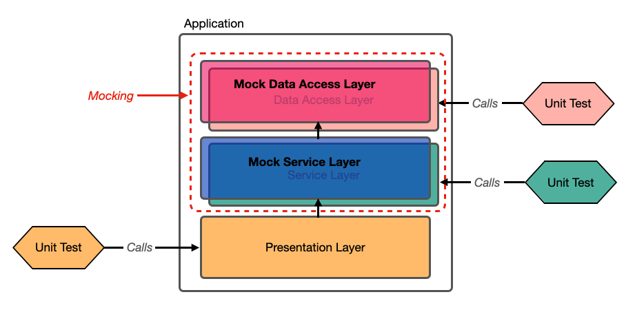
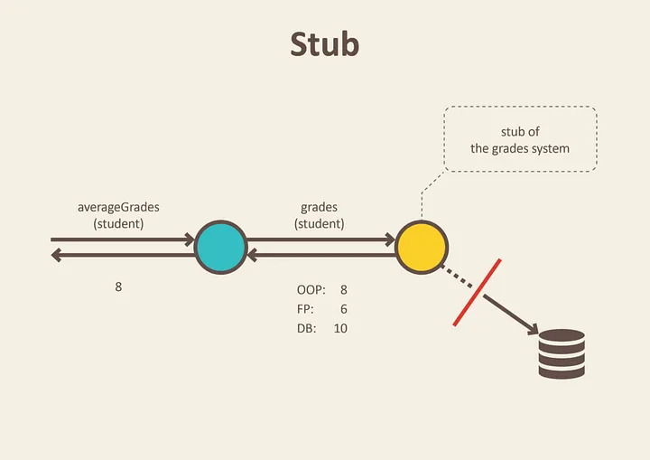
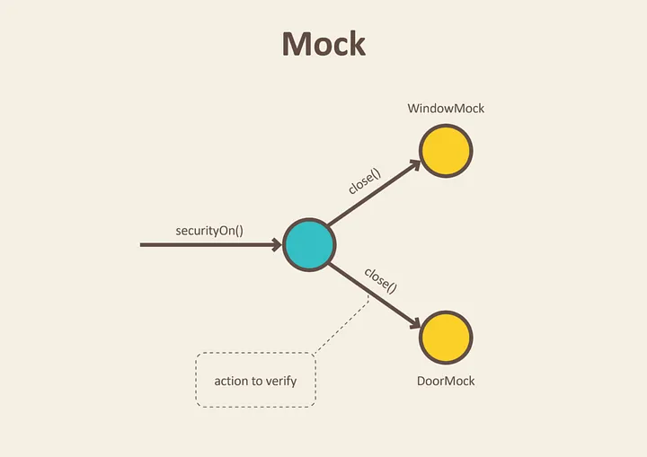
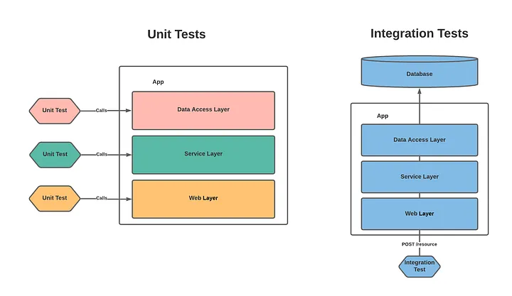

## 1. Mock(모의 객체)

### Mock 소개

Mock이 무엇인지 알아보자.

Mock은 **진짜 객체와 비슷하게 동작하지만 개발자가 직접 그 객체의 행동을 관리하는 모의 객체**이다. (가짜 객체라고 부르기도 한다.) Mocking은 테스트를 작성할 때 시스템의 특정 부분을 Mock(모의 객체)으로 대체하는 것을 말한다. 

Mock을 사용하는 몇 가지 이유는 다음과 같다.

* 격리(Isolation) : 특정 의존 시스템으로 부터 완전히 격리해서 독립적으로 단위 테스트를 진행하기 위해서.
* 제어(Control) : 특정 의존 시스템의 행동을 세밀하게 제어해서 다양한 시나리오를 테스트하기 위해서.
* 성능(Performance) : 의존성(dependency, system)을 사용해서 테스트를 하는 경우 성능 오버헤드를 발생 시킬 수 있다. 단위 테스트만 진행하는 상황이라면 이런 상황을 피하고 싶을 수 있다.
* 성능과는 관련 없지만 성능과 마찬가지로 의존성을 사용해서 테스트하는 경우, 해당 의존성을 위한 환경을 구축하기 위한 시간이 오래 걸리면 테스트를 하기 싫을 수 있다.

 

이외에도 Mock을 사용하는 여러 이유가 존재할 수 있다.

 

레이어드 아키텍쳐(Layered Architecture)에서 Mocking하는 경우를 그림으로 살펴보면 다음과 같다. 

 

_Mocking in a Layered Architecture_

 

---

## 2. Test Double(테스트 대역)

### Test Double 소개

**Test Double은 테스트 용도의 객체 대역을 의미한다.**

 

> Test Double이라는 표현은 배우의 stunt double(스턴트 대역)에서 유래된다.
{: .prompt-info }

 

바로 이전에서 Mock(모의 객체)이라는 것을 배웠는데, 왜 Test Double이라는 표현이 등장하는지 의아할 것이다. 우리가 사용하는 Mock은 사실 더 세분화 해서 분류할 수 있다.

이때 Test Double은 종류에 상관없이 테스트 용도로 사용하는 모든 대역 객체를 의미한다. (컨텍스트에 따라 Test Double과 Mock은 상호교환적으로 사용될 수 있다.)

 

> **Test Double**
>
> - **Dummy** objects are passed around but never actually used. Usually they are just used to fill parameter lists.
> - **Fake** objects actually have working implementations, but usually take some shortcut which makes them not suitable for production (an [InMemoryTestDatabase](https://martinfowler.com/bliki/InMemoryTestDatabase.html) is a good example).
> - **Stubs** provide canned answers to calls made during the test, usually not responding at all to anything outside what's programmed in for the test.
> - **Spies** are stubs that also record some information based on how they were called. One form of this might be an email service that records how many messages it was sent.
> - **Mocks** are pre-programmed with expectations which form a specification of the calls they are expected to receive. They can throw an exception if they receive a call they don't expect and are checked during verification to ensure they got all the calls they were expecting.
>
> 출처 : [https://martinfowler.com/bliki/TestDouble.html](https://martinfowler.com/bliki/TestDouble.html)
{: .prompt-info }

 

* **Dummy** : 아루런 동작도 하지 않는 객체. 잘 사용되진 않지만, 보통 파라미터 전달용으로 사용된다.
* **Fake** : 실체 객체와 동일한 기능은 수행하지만, 프로덕션 용도로 사용하기에는 적합하지 않은 객체.
  * 예: 인메모리로 맵을 사용해서 가짜 레포지토리를 구현하는 경우

* **Stubs** : 테스트에서의 요청에 대해 미리 준비된 결과를 제공하는 객체. 미리 반환할 데이터가 정의되어 있고, 호출하는 경우 해당 데이터를 반환한다. 미리 정의되어 있지 않은 것들은 응답하지 않는다.

* **Spies** : **Stub**이지만 정복 기록도 함께하는 객체. 호출 여부, 호출 횟수 등의 정보를 기록할 수 있다. 일부는 실제 객체 처럼 동작하고, 일부는 **Stubbing**할 수 있다.
* **Mocks** : 행위에 대한 기대를 명세하고, 그 명세에 따라 동작되도록 설계 된 객체. 그러니깐 개발자가 직접 그 객체의 행동을 관리하는 객체이다.

 

---

### Stub vs Mock

많은 자료를 찾아보면 **Stub**과 **Mock**을 혼동하지 말고 확실하게 분류해서 사용하자고 한다.

참고 : [https://martinfowler.com/articles/mocksArentStubs.html](https://martinfowler.com/articles/mocksArentStubs.html)

 

위에서도 설명했듯이, **Stub**과 **Mock**은 다음과 같다. 

* **Stub** : 테스트에서의 요청에 대해 미리 준비된 결과를 제공하는 객체. 미리 반환할 데이터가 정의되어 있고, 호출하는 경우 해당 데이터를 반환한다. 미리 정의되어 있지 않은 것들은 응답하지 않는다.
* **Mocks** : 행위에 대한 기대를 명세하고, 그 명세에 따라 동작되도록 설계 된 객체. 그러니깐 개발자가 직접 그 객체의 행동을 관리하는 객체이다.

 

많은 개발자들은 **Mock**을 **Stub**과 헷갈려하는데, 이 둘은 다음으로 확실하게 분류할 수 있다.

 

_https://blog.pragmatists.com/test-doubles-fakes-mocks-and-stubs-1a7491dfa3da_

* **Stub** : 상태 검증(State Verification)
* 테스트에서 어떤 기능을 사용 후에 상태가 어떻게 변하는지 검증
* **Stub**인데 행위 검증도 하는 경우 **Test Spy**라고 한다

 

_https://blog.pragmatists.com/test-doubles-fakes-mocks-and-stubs-1a7491dfa3da_

* **Mock** : 행동 검증(Behavior Verification)
* 어떤 기능의 행위 자체애 대해 검증

 

> 너무 용어에 매몰되기 보다는 Test Double의 컨셉과 사용 이유를 이해하려고 노력하자.
{: .prompt-warning }

 

---

## 3. 통합 테스트(Integration Test) 소개

단위 테스트(Unit Test)의 경우 가장 기능적 단위를 독립적으로 검증하는 테스트이다. 반면에 **통합 테스트(Integration Test)는 여러 모듈들이 협력하는 시스템을 통합적으로 검증하는 테스트**이다.

통합 테스트를 하는 이유는 좁은 범위의 테스트만 진행 단위 테스트의 특성상 전체 시스템에 대한 신뢰성을 보장할 수 없기 때문이다. 예를 들자면 단위 테스트와 달리 통합 테스트는 개발자가 건드릴 수 없는 부분(외부 API)까지 묶어서 검증한다.

 

_Unit Test vs Integration Test_

 

만약 SpringMVC 기반의 애플리케이션을 개발한다면, 많은 경우 **Presentation, Business, Persistance** 계층으로 이루어진 **Layered Architecture**를 사용한다. (레이어드 아키텍쳐라는 이름을 사용하지 않고, 그냥 3-tier 아키텍쳐 구조 처럼 표현하는 경우도 많다)

통합 테스트는 관심사가 분리된 계층끼리 협력하는 큰 기능을 테스트한다고 보면된다.

 

---

## 다음 포스트

다음 포스트는 Mockito라는 Mock 프레임워크의 사용법에 대해 알아볼 예정이다.

 

---

## Reference

1. [https://tecoble.techcourse.co.kr/post/2021-05-25-unit-test-vs-integration-test-vs-acceptance-test/](https://tecoble.techcourse.co.kr/post/2021-05-25-unit-test-vs-integration-test-vs-acceptance-test/)
2. [https://techblog.woowahan.com/14874/](https://techblog.woowahan.com/14874/)
3. [https://martinfowler.com/bliki/TestDouble.html](https://martinfowler.com/bliki/TestDouble.html)
4. [https://martinfowler.com/articles/mocksArentStubs.html](https://martinfowler.com/articles/mocksArentStubs.html)
5. [인프런 : 실용적인 테스트 가이드](https://www.inflearn.com/course/practical-testing-%EC%8B%A4%EC%9A%A9%EC%A0%81%EC%9D%B8-%ED%85%8C%EC%8A%A4%ED%8A%B8-%EA%B0%80%EC%9D%B4%EB%93%9C/dashboard)
6. [https://circleci.com/blog/unit-testing-vs-integration-testing/](https://circleci.com/blog/unit-testing-vs-integration-testing/)
7. [https://blog.pragmatists.com/test-doubles-fakes-mocks-and-stubs-1a7491dfa3da](https://blog.pragmatists.com/test-doubles-fakes-mocks-and-stubs-1a7491dfa3da)
8. [https://s3anmcdowell.medium.com/integration-testing-with-serverless-aws-microservices-and-sql-server-f413bd2ba88b](https://s3anmcdowell.medium.com/integration-testing-with-serverless-aws-microservices-and-sql-server-f413bd2ba88b)
