---

> * **첫 작성:** 2023-09-06
> * **업데이트:** 2024-07-20
> 
> 모든 코드는 다음 레포지토리에서 확인할 수 있습니다. 
> [https://github.com/seungki1011/CICD-using-Github-Actions](https://github.com/seungki1011/CICD-using-Github-Actions)
{: .prompt-info }


---

## 1. CI/CD

### 개발 환경

소프트웨어 개발에서는 **코드 작성, 테스트, 배포 등 다양한 단계를 효과적으로 관리**하기 위해 **개발 환경을 구분하여 사용**한다. **각 환경은 소프트웨어가 개발, 테스트, 운영되는 장소와 프로세스를 말하며, 각기 다른 목적을 가지고 설정**된다. 이러한 환경은 개발자가 실험하고 테스트할 수 있도록 지원하고, 최종 사용자가 사용할 때 오류나 문제가 발생하지 않도록 미리 예방하는 역할을한다.

한마디로, **용도에 맞게 환경을 구분해서 문제가 발생하지 않고 효율적으로 개발할 수 있도록 도와준다**고 보면 된다.

주요 개발 환경은 보통 다음과 같이 나눈다.

<br>

1. **로컬 환경(Local Enviroment)**
   * 개발자가 자신의 컴퓨터에서 직접 코드를 작성하고 실행하는 환경
   * 새로운 기능을 개발하거나 기존 코드를 수정할 때 실험적으로 코드를 작성하고 실행해보는 환경이다
   * 각 환경을 통일시키키 위해 도커(docker) 같은 도구를 적용할 수 도 있다
   * 로컬 데이터베이스나 모의 서버를 사용하여 외부 의존성 없이 작업할 수 있다
2. **개발 환경(Development Enviroment)**
   * 팀 단위로 공유하는 개발 환경으로, 모든 **개발자가 작성한 코드를 통합하고 기능을 실험하는 환경**이다
   * 개발자들이 서로의 코드가 잘 결합되는지 확인하고, 공동 작업에 필요한 실험과 테스트를 진행한다
   * 보통 외부 API나 데이터베이스와의 연동 테스트를 위한 환경이 설정되어 있다
3. **스테이징 환경(Staging Enviroment)**
   * 실제 운영 환경과 최대한 유사하게 구성된 테스트 환경이다
   * **사용자에게 제공되기 전에 소프트웨어가 제대로 동작하는지 마지막으로 점검**하는 곳이다
   * 운영 환경에서 발생할 수 있는 문제를 사전에 발견하고 해결하는 것이 주 목적이다. 실제 배포 전에 테스트하고, QA(Quality Assurance) 팀이 품질을 확인하는 단계로 보면 된다.
   * **운영 환경과 거의 동일**한 설정을 가지며, 운영에 가까운 조건에서 성능 테스트나 로드 테스트를 진행한다
4. **운영 환경(Production Enviroment)**
   * 실제 사용자에게 서비스가 제공되는 환경이다. **소프트웨어가 배포되어 사용자가 직접 사용하는 최종 단계**이다.
   * 소프트웨어가 사용자에게 안정적으로 제공되고, 운영 중 발생할 수 있는 모든 상황을 고려하여 시스템을 관리한다
   * 장애 발생 시 **신속한 대응이 필요**하며, **시스템의 모니터링과 로깅이 중요**하게 작동한다

<br>

중간의 개발, 스테이징 환경은 상황에 따라 더 세분화 되어 나뉠 수도 있다.

<br>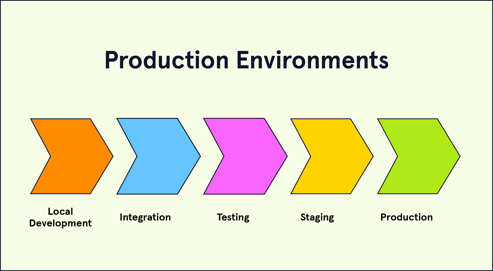_https://www.codecademy.com/article/environments_

<br>

---

### CI/CD란?

오늘날의 개발 생태계를 살펴보면 **클라우드 네이티브(Cloud Native)**와 더불어서 **CI/CD**라는 용어를 자주 접할 수 있다.

그러면 CI/CD는 도대체 무엇일까?

소프트웨어 엔지니어링에서 CI/CD는 **소프트웨어 개발과 배포 과정에서 효율성을 높이고 품질을 보증하기 위한 자동화된 접근 방식**을 의미한다. CI/CD는 각각 **지속적 통합(CI, Continuous Integration)** 그리고 **지속적 배포(CD, Continuous Deployment)**로 직역할 수 있다.

각 요소가 무엇인지 더 자세히 살펴보자.

1. **지속적 통합(CI, Continuous Integration)**
   * 지속적 통합은 **개발자가 작성한 코드를 자주, 그리고 자동으로 중앙 저장소에 통합하는 과정**을 말한다. CI의 주 목표는 코드 변경이 전체 애플리케이션에 미치는 영향을 조기에 발견하고, 이를 해결하는 것이다.
   * 어떻게 보면 회귀(regression) 방지의 측면에서 TDD와 비슷한 철학을 지니고 있다고 볼 수 있다
   * CI의 주요 특징은 다음과 같다
     * **자동 테스트와 빌드**: 코드가 중앙 저장소에 푸시될 때마다 자동으로 빌드와 테스트를 실행하여, 코드 변경으로 인해 발생할 수 있는 문제를 즉시 식별한다
     * **빠른 피드백**: 문제가 발견되면 즉시 개발자에게 피드백을 제공하여 문제를 신속하게 해결할 수 있도록 한다
2. **지속적 배포(CD, Continuous Deployment)**
   * 지속적 배포는 (중앙 저장소에) **통합된 코드를 자동으로 프로덕션 환경에 배포하는 과정**을 말한다
   * CD의 주요 특징은 다음과 같다
     * **자동 배포**: 빌드와 테스트가 성공하면, 코드 변경 사항을 자동으로 프로덕션 환경에 배포 한다
     * **빠른 릴리즈**: 새로운 기능이나 버그 수정을 신속하게 사용자에게 제공하고, 빠른 대응을 한다
     * **지속적인 개선**: 애플리케이션을 빈번하게 배포하면서 지속적으로 개선하고 최적화 한다

<br>

소프트웨어 개발 과정에서 이 **CI와 CD 과정을 자동화하는 일련의 과정을 CI/CD 파이프라인**이라고 한다. 이런 CI/CD 파이프라인의 기능을 제공하는 여러 오픈소스 또는 상용 도구들이 존재한다.

<br>

아주 간단하게 요약하자면

* CI(지속적 통합): 빌드, 테스트의 자동화
* CD(지속적 배포): 배포의 자동화
* CI/CD 파이프라인: 전체 자동화 과정을 아우르는 일련의 과정 또는 도구

<br>

> **클라우드 네이티브(Cloud Native)**
>
> **클라우드 네이티브(Cloud Native)**는 **클라우드 환경을 최대한 활용하여 애플리케이션을 설계하고 개발하는 접근 방식**을 의미한다. 클라우드 네이티브 애플리케이션은 클라우드 인프라의 특성을 고려하여 최적화된다. 보통 다음의 주요 요소들이 고려된다. (각 요소에 대한 간단 소개만 다룬다. 장단점은 다루지 않는다.)
>
> * **컨테이너(Containerization)**
>   * 애플리케이션과 그 의존성을 패키징하여 컨테이너화한다. 이를 통해 일관된 실행 환경을 제공하고, 배포와 이동이 용이해진다.
> * **마이크로서비스 아키텍처(Microservices Architecture, MSA)**
>   * 애플리케이션을 독립적이고 작은 서비스들로 나누어 개발한다. 각 서비스는 독립적으로 배포되고 확장될 수 있으며, 전체 시스템의 유연성을 높인다.
> * **오케스트레이션(Orchestration)**
>   * 여러 컨테이너와 마이크로서비스를 관리하고 조율하는 도구(예: Kubernetes)를 사용하여 자동화된 배포, 확장, 복구를 지원한다.
> * **동적 관리(Dynamic Management)**
>   * 클라우드 환경의 동적인 특성을 활용하여 리소스를 자동으로 할당하고 조절한다. 이는 애플리케이션의 가용성과 확장성을 높인다.
> * **DevOps 및 CI/CD 통합**
>   * 개발과 운영을 통합하여 애플리케이션의 지속적인 개선과 배포를 지원한다
>
> <br>
>
> CI/CD는 클라우드 네이티브 애플리케이션의 배포와 운영을 효율적으로 지원하며, 클라우드 네이티브 아키텍처는 CI/CD 프로세스의 이점을 극대화하는 데 도움을 준다.
{: .prompt-info }

<br>

---

### CI/CD 도구

**CI/CD 도구**는 **지속적 통합(CI)**과 **지속적 배포(CD)**를 자동화하는 역할을 수행하며, 소프트웨어 개발 프로세스에서 빌드, 테스트, 배포 등의 단계를 자동으로 처리해준다. 이러한 도구들은 개발자가 효율적으로 코드를 통합하고, 자동화된 테스트와 빌드를 거쳐 안정적으로 배포할 수 있도록 돕는다.

상용이든 오픈소스이든, 정말 많은 도구들이 존재한다.

<br>

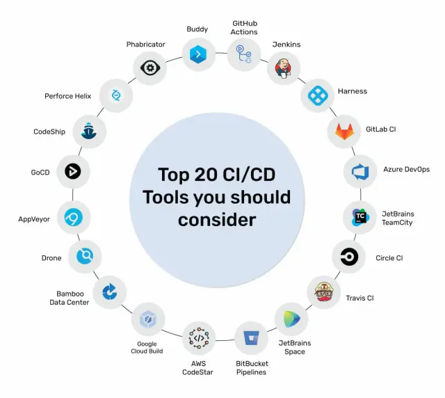_https://www.mindbowser.com/ci-cd-pipeline-tools/_

<br>

다음과 같은 도구들이 존재한다.

* Jenkins
* Github Actions
* GitLab CI/CD
* Circle CI
* Travis CI

<br>

각 도구는 서로 다른 환경에 맞춰 최적화되어 있으며, 프로젝트의 규모, 사용 기술, 배포 환경에 따라 적절한 도구를 선택하는 것이 중요하다.

이 포스트에서는 **Github Actions**를 소개하고, 간단한 사용법에 대해 다룰 예정이다.

<br>

---

## 2. Github Actions

### Github Actions 소개

**GitHub Actions**는 GitHub에서 제공하는 **자동화 도구**로, CI/CD(지속적 통합 및 지속적 배포) 파이프라인과 같은 **자동화 워크플로우를 구성할 수 있다**. GitHub Actions는 GitHub 리포지토리와 통합되어 있어, 개발자들이 **Push**나 **Pull Request**와 같은 **이벤트에 따라 자동으로 워크플로우를 실행**하고, 소프트웨어 빌드, 테스트, 배포 등의 과정을 자동화할 수 있다.

<br>

> **CI/CD외의 작업에도 사용한다**
>
> 위에서도 설명했듯이 깃헙 이벤트와 YAML 기반의 자동화된 워크플로우를 구현하기 위해서 사용되는 도구이다. CI/CD외에도 여러가지 용도로 활용할 수 있다.
>
> * 예시
>   * 스케쥴링 작업: `schedule` 이벤트를 활용한 주기적인 작업 설정
>   * 프로젝트 관리: 지라와 같은 이슈 트래킹 도구와 통합한 워크플로우 생성
  {: .prompt-info }

<br>

Github Actions를 사용할 수 있는 몇 가지 사용 케이스를 살펴보자.

* 깃헙 tag, release 자동 설정
* 새로운 브랜치 생성시 특정 작업 실행
* CI/CD 파이프라인 구현
* 일정 주기 또는 특정 조건에 따른 문서화 작업

이외에도 다양한 use case가 존재한다.

<br>

Github Actions 문서: [https://docs.github.com/ko/actions](https://docs.github.com/ko/actions)

<br>

---

### Github Actions 주요 개념

Github Actions의 주요 개념들을 살펴보자.

1. **워크플로우(Workflow)**
   * Github Actions에서 자동화 작업의 정의를 담고 있는 YAML 파일
   * `.github/workflows/` 디렉토리에 저장해서 사용한다
   * **Enviroment**
     * **워크플로우가 배포되는 대상**을 관리하는 개념으로, 개발, 스테이징, 프로덕션 환경에 대해 서로 다른 설정과 시나리오를 적용할 수 있다
     * 환경별로 배포 승인 절차를 추가하거나, 특정 Secrets를 설정할 수 있다
   * **Event**
     * 워크플로우가 실행되는 트리거**를 의미한다. `push`, `pull_request`, `schedule`과 같은 다양한 이벤트가 존재한다
   * **Job**
     * 하나의 **워크플로우는 여러 개의 Job으로 구성**될 수 있다
     * 각각의 Job은 병렬로 실행될 수 있다. 예를 들어, 하나의 워크플로우에서 빌드, 테스트, 배포가 각각 다른 Job으로 나뉠 수 있다.
     * 서로 다른 Job에 대한 의존 관계를 설정할 수도 있고, 순차적 실행도 가능하다
   * **Step**
     * 각 **Job은 여러 Step로 이루어지며**, 이 Step들은 **개별적으로 실행되는 스크립트(명령어) 또는 액션**이다
     * 쉽게 말해서 Job에서 실행되는 개별 작업을 Step이라고 보면 된다
2. **액션(Action)**
   * 워크플로우 내에서 실행되는 **작업 단위**이다.
   * 액션은 **재사용 가능한 코드 조각(컴포넌트)**이다.
     * 예를 들어 특정 프로그래밍 언어의 테스트를 실행하거나, 클라우드에 애플리케이션을 배포하는 등의 작업을 처리할 수 있다
   * Github Marketplace에서 다양한 사전 정의된 액션을 찾을 수 있다
3. **러너(Runner)**
   * 워크플로우가 실행될 때, GitHub Actions는 해당 **워크플로우를 러너라는 가상 머신에서 실행**한다
   * 러너는 GitHub에서 제공하는 **호스티드 러너** 또는 **자체 호스팅 러너**가 있다.
     * **호스티드 러너(GitHub Hosted Runner)**: GitHub에서 제공하는 기본적인 러너로, 일반적인 OS(예: Ubuntu, Windows, macOS)를 지원하며, 각 워크플로우 실행 시 새롭게 생성되는 가상 머신이다
     * **자체 호스팅 러너(Self-Hosted Runner)**: 사용자가 직접 러너를 설정하여 사용할 수 있으며, 더 많은 제어권을 필요로 할 때 유용하다. 자체 서버나 IDC에서 실행할 수 있다.
4. **시크릿(Secrets)**
   * API 키나 비밀번호 같은 **민감한 정보**를 보관하는 기능이다
   * 워크플로우에서 **Secrets**로 저장된 값은 보안된 방식으로 사용되며, 리포지토리, 환경, 조직 등 다양한 수준에서 설정할 수 있다

<br>

---

## 3. Github Actions 사용법

### 베이스 코드

예시를 통해 Github Actions의 사용법을 익혀보자.

<br>

> **예시 환경**
>
> * Java 17
> * Spring Boot 3.3.3
> * h2 database 2.2.224
> * Spring Data JPA
{: .prompt-info }

<br>

> [해당 코드 깃헙](https://github.com/seungki1011/github-action-jacoco)
{: .prompt-tip }

<br>

다음과 같이 포스트를 생성하는 API를 만들었다고 가정해보자.

```java
@RestController
@RequestMapping("/api/v1")
@RequiredArgsConstructor
public class PostController {

    private final PostService postService;

    @PostMapping("/posts")
    public ResponseEntity<PostResponse> createPost(@RequestBody PostCreateRequest request) {
        PostResponse response = postService.createPost(request);
        return ResponseEntity.status(HttpStatus.CREATED)
                .body(response);
    }

}
```

* `PostCreateRequest`: 포스트 생성을 위한 DTO
* `PostResponse`: 응답을 위한 DTO

<br>

```java
@Service
@RequiredArgsConstructor
public class PostService {

    private final PostRepository postRepository;

    @Transactional
    public PostResponse createPost(PostCreateRequest request) {
        return PostResponse.fromEntity(postRepository.save(request.toEntity()));
    }

}
```

* `toEntity()`: 요청 DTO를 엔티티로 변환
* `fromEntity()`: 엔티티를 응답 DTO로 변환

<br>

다음은 해당 컨트롤러에 대한 테스트이다.

```java
@WebMvcTest(PostController.class)
class PostControllerTest {

    @Autowired
    private MockMvc mockMvc;
    @Autowired
    private ObjectMapper objectMapper;
    @MockBean
    private PostService postService;

    @Test
    @DisplayName("POST /posts: 포스트 생성에 성공하면 201 CREATED를 응답으로 받는다")
    void 테스트1() throws Exception {
        PostCreateRequest request = PostCreateRequest.builder()
                .title("Test title")
                .content("Test content")
                .build();
        String requestBody = objectMapper.writeValueAsString(request);

        mockMvc.perform(post("/api/v1/posts")
                        .contentType(MediaType.APPLICATION_JSON)
                        .content(requestBody))
                .andExpect(status().isCreated())
                .andDo(print());
    }

}
```

* 위의 테스트는 현재 통과하는 상태이다

<br>

---

### 워크플로우 YAML 작성

#### 워크플로우 설명

Github Action으로 워크플로우를 정의해서 사용하기 위해서는 크게 다음의 단계를 거친다.

1. **YAML 파일 작성**

   * 사용할 워크플로우를 `.github/workflows/` 디렉토리에 **YAML** 파일로 작성한다
   * 다음의 순서의 내용을 해당 파일에 작성한다

2. **Triggers(Event)**

   * 워크플로우가 실행되는 이벤트를 정한다

   * 예: `push`, `pull_request`

3. **Jobs**

   * 워크플로우는 여러 개의 Job으로 나눌 수 있다
   * 각 Job은 병렬, 순차, 의존성에 의한 순차에 따라 실행될 수 있다
   * 각 Job은 서로 독립된 러너(Runner) 환경에서 동작하기 때문에, 어떤 환경(운영체제)에서 실행할지 명시해야 한다

4. **Steps**

   * Job안에서 Step을 정의하여 각 단계를 실행한다
   * 각 Step은 `run`을 사용한 명령어를 실행하거나, `uses`를 사용한 액션이 될 수 있다

5. **Secrets**

   * 필요한 경우 민감한 정보(SSH, API 키)는 Github Secrets에 저장해서, 안전하게 관리합니다

<br>

실제 예시를 통해 알아보자.

현재 **자바17를 사용한 프로젝트를 진행**중이고 다음과 같은 CI 파이프라인을 구현한다고 가정해보자.

* `test` 브랜치로 PR 요청을 하는 경우 트리거 된다
* `build`와 `test`라는 2 개의 Job으로 구성된다. 이때 `test`는 `build`가 성공적으로 완료되어야 수행된다
* 각 Job의 목적은 다음과 같다
  * `build`: Gradle 빌드
  * `test`: Gradle 테스트
* `build` 또는 `test`가 **실패하면 CI 파이프라인도 실패하고 PR을 수행하지 못한다**

<br>

워크플로우를 정의해서 사용하기 위해서 `.github/workflows/` 아래에 `ci.yml`이라는 파일을 만들어서 사용한다.

`ci.yml`

```yaml
# 워크플로우의 이름을 지정합니다
# 대시보드에서 워크플로우를 구분할 때 사용됩니다
name: CI Pipeline

# Event
on:
  pull_request: # Pull Request가 test 브랜치로 들어올 때 실행
    branches:
      - test

# Jobs: 필요한 Job을 병렬 또는 (의존성에 의해)순차적으로 실행
jobs:
  # Build Job
  build:
    runs-on: ubuntu-latest

    steps:
      # 1. 리포지토리에서 소스 코드를 체크아웃
      - name: Checkout code
        uses: actions/checkout@v3

      # 2. Gradle 라이브러리 캐싱
      - name: Cache Gradle packages
        uses: actions/cache@v3
        with:
          path: |
            ~/.gradle/caches
            ~/.gradle/wrapper
          key: ${{ runner.os }}-gradle-${{ hashFiles('**/*.gradle*', '**/gradle-wrapper.properties') }}
          restore-keys: |
            ${{ runner.os }}-gradle-

      # 3. Java 17 설치
      - name: Set up JDK 17
        uses: actions/setup-java@v3
        with:
          distribution: 'temurin'
          java-version: '17'
          
      # 4. gradlew에 권한 부여
      - name: Grant execute permission for gradlew
        run: chmod +x gradlew

      # 5. 의존성 설치 및 빌드
      - name: Build with Gradle
        run: ./gradlew build --no-daemon

  # Test Job
  # 빌드에서 테스트를 진행하기 때문에 해당 Job은 제외해도 됩니다. 그러나 needs를 설명하기 위해 편의상 추가했습니다.
  test:
    runs-on: ubuntu-latest # Job들은 서로 별개의 환경에서 수행 됨
    needs: build  # build Job이 성공해야 실행
    
    steps:
      # 기존 체크아웃, JDK 설치 과정
      - name: Checkout code
        uses: actions/checkout@v3
      
      - name: Set up JDK 17
        uses: actions/setup-java@v3
        with:
          distribution: 'temurin'
          java-version: '17'
          
      # 6. 테스트 실행
      - name: Run tests
        run: ./gradlew test --no-daemon
```

* **Event**

  * ```yaml
    on: # 워크플로우가 실행될 조건을 정의합니다
      pull_request: # PR을 조건으로 설정합니다
        branches:
          - test # test 브랜치로 PR이 열리면 실행되도록 지정
    ```

* **Jobs**

  * ```yaml
    jobs: # 아래 계층에 수행할 Job을 정의합니다
      # (1)build라는 Job
      build:
        runs-on: ubuntu-latest # 해당 Job의 러너 환경을 지정합니다
        # 아래에 build의 Step들을 정의합니다
        step:
          # 아래 계층에 수행할 Step을 정의합니다
        	# Step 체크아웃, JDK 설정, 캐싱, 권한, 빌드...
        	
      # (2)test라는 Job
      test:
        runs-on: ubuntu-latest
        needs: build  # build가 성공적으로 완료되어야 수행된다는 의미
    ```

  * `runs-on`: **Job**이 실행될 환경을 지정한다. 위 예시의 경우 `ubuntu-latest`를 통해 최신 버전의 Ubuntu 환경에서 동작하도록 한다. **Job들은 서로 별개의 환경을 사용**한다. 

  * `needs`: **Job**의 의존성을 지정한다

  * 의존하는 **Job**을 명시적으로 **지정하지 않는 경우 병렬로 수행**된다

* **Steps**

  * ```yaml
    # 하나의 Job안에 정의된 Step들은 기본적으로 순차적으로 실행됩니다
    steps:
          # 1. 리포지토리에서 소스 코드를 체크아웃(복제)
          - name: Checkout code # name으로 각 Step의 이름을 부여합니다
            uses: actions/checkout@v3 # uses를 통해 액션을 호출합니다
    
          # 2. Gradle 라이브러리 캐싱
          - name: Cache Gradle packages
            uses: actions/cache@v3
            with: # with를 통해 액션에 대한 추가적인 설정을 지정할 수 있습니다
              path: |
                ~/.gradle/caches
                ~/.gradle/wrapper
              key: ${{ runner.os }}-gradle-${{ hashFiles('**/*.gradle*', '**/gradle-wrapper.properties') }}
              restore-keys: |
                ${{ runner.os }}-gradle-
    
          # 3. Java 17 설치(JDK 설치)
          - name: Set up JDK 17
            uses: actions/setup-java@v3
            with:
              distribution: 'temurin'
              java-version: '17'
              
          # 4. gradlew에 권한 부여
          - name: Grant execute permission for gradlew
            run: chmod +x gradlew # run으로 직접 명령어를 실행할 수 있습니다
    
          # 5. 의존성 설치 및 빌드
          - name: Build with Gradle
            run: ./gradlew build --no-daemon
    ```

  * `steps`: 아래 계층에 순차적으로 수행할 **Step**들을 명시

  * `name`: **Step**에 부여할 이름. GitHub Action 로그에 표시.

  * `uses`: **액션(Action)을 호출**하기 위해서 사용

  * `run`: **직접 명령어를 실행**하기 위해서 사용

  * `id`: 예시에서 사용하지 않았지만 `id`를 부여해서 다른 **Step**이 `id`를 사용해서 해당 `id`의 **Step**의 출력값이 상태를 참조해서 사용할 수 있다

<br>

> **`gradle/gradle-build-action`을 사용할 수 있다**
>
> `gradle`에서 제공하는 액션이다. Gradle을 사용해서 빌드하는데 도움을 준다. 해당 액션을 사용하면 다음의 이점을 얻을 수 있다.
>
> * `run`을 사용하지 않고 Gradle 관련 설정과 명령어를 더 쉽게 실행할 수 있도록 도와준다
> * 기존의 `actions/cache`를 사용하지 않고 캐싱 관련 설정을 할 수 있다
>
> <br>
>
> 간단히 사용법을 알아보자.
>
> ```yaml
> - name: Build with Gradle
>   uses: gradle/gradle-build-action@v2
>   with:
> 	  arguments: build
> 	  cache-disabled: false 
> ```
>
> * `cache-disabled`: 캐시를 비활성화 할 수 있는 옵션이다. 기본값이 `false`이다
>
> <br>
> 
> ```yaml
> - name: Build with Gradle
>   uses: gradle/gradle-build-action@v2
>   with:
> 	  arguments: build
>	  cache-read-only: ${{ github.ref != 'refs/heads/main' && github.ref != 'refs/heads/develop' }}
> ```
> 
  * `cache-read-only`: `true`일 경우 캐시를 읽기만 하고 저장하지 않는다. `false`일 경우 캐시 읽기/저장 모두 수행한다.
    * 위 예시에서는 `main`과 `develop` 브랜치일 때만 `false`로 설정한다
  {: .prompt-info }

<br>

---

#### uses 필드

**`uses` 필드를 자세히 살펴보자.**

`uses` 필드는 GitHub Actions의 워크플로우 파일에서 **다른 사람이 작성한 액션(Action)을 호출**할 때 사용되는 필드이다. 즉, `uses` 필드를 통해 **GitHub Marketplace에 등록된 액션이나 공용 리포지토리에서 제공하는 액션을 가져와서 사용**할 수 있다. 

`uses` 필드는 기본적으로 다음과 같은 구조를 사용한다.

```yaml
uses: {repository}@{version or branch or commit}
```

* **repository**: 액션이 위치한 리포지토리의 경로를 지정한다. 예를 들어 `actions/checkout`은 `actions`라는 사용자 또는 조직이 만든 `checkout`이라는 리포지토리를 의미한다.
* **version or branch or commit**: 액션의 특정 버전(`@v2`), 브랜치(`@main`), 또는 커밋 해시(`@a1b2c3d4`)를 지정할 수 있다

<br>

정리하자면 `uses` 필드를 통해서 특정 **액션을 재사용**하고 해당 **액션에 대한 버전 지정**을 할 수 있다.

<br>

> **액션 커스터마이즈**
>
> 커스터마이즈하고 싶은 액션의 레포지토리를 포크하고, 커스텀 후에 기존 사용자 또는 조직 대신 내 깃헙 아이디를 사용하면 된다.
>
> * 예: `slackapi/slack-github-action`을 포크하고 필요한 부분을 커스터마이징 후에 `myrespository/slack-github-action` 같은 형태로 사용이 가능하다
>
{: .prompt-tip }


<br>

> **`actions/checkout`**
>
> 레포지토리의 코드를 **체크아웃(checkout)** 한다는 것은, **GitHub 리포지토리에 저장된 소스 코드를 워크플로우가 실행되는 환경(예: 가상 머신, 컨테이너 등)으로 가져오는 작업**을 의미한다. 체크아웃의 주요 역할은 다음과 같다.
>
> * **코드 가져오기**: 체크아웃은 GitHub 리포지토리에서 소스 코드와 그에 관련된 파일들을 복제(clone)하여, 워크플로우가 실행되는 환경에 다운로드한다. 이로 인해 **해당 환경에서 코드에 접근하고 빌드, 테스트, 배포 등의 작업을 수행할 수 있게 된다**.
> * **특정 브랜치/커밋/태그 선택**: 체크아웃 과정에서는 **특정 브랜치, 커밋, 또는 태그를 지정하여 해당 시점의 코드를 가져올 수 있다**. 예를 들어, PR이 특정 브랜치로 생성된 경우, 해당 브랜치의 코드를 체크아웃하여 워크플로우가 실행 된다.
> * **코드 변경 사항 반영**: 만약 PR이 생성되었거나 특정 커밋에서 워크플로우가 실행되는 경우, **체크아웃 과정에서 그 변경 사항이 반영된 코드를 가져오게 된다**.
{: .prompt-info }

<br>

---

#### run 필드

이번에는 **`run` 필드를 자세히 살펴보자.**

`run` 필드는 GitHub Actions의 워크플로우에서 **직접 명령어를 실행**할 때 사용된다. 주로 **쉘 스크립트나 단일 명령어를 실행하는 데 사용**되며, CI/CD 파이프라인의 다양한 단계에서 커스텀 작업을 수행할 수 있게 해준다.

`run` 필드를 통한 명령어를 사용해서 **빌드 도구를 사용하여 애플리케이션을 빌드하거나 테스트 스크립트를 실행**할 수 있다.

<br>

`run`에서 여러 명령어를 한번에 실행하는 것도 가능하다.

```yaml
# 한번에 여러 명령어를 사용하는 예시
- name: Install dependencies and build
  run: |
    npm install
    npm run build
```

<br>

---

#### 캐싱(Caching)

CI 파이프라인에서 라이브러리를 캐싱하는 것은 **빌드 시간을 단축**하고 **리소스 사용량을 줄이는 데 효과적**이다. 특히, Gradle과 같은 빌드 도구를 사용하는 경우 의존성 **캐싱을 통해 매번 라이브러리를 다시 다운로드하지 않도록** 할 수 있다.

캐싱은 캐시 액션인 `actions/cache`를 통해서 설정할 수 있다.

<br>

```yaml
- name: Cache Gradle packages
  uses: actions/cache@v3
  with:
    path: |
      ~/.gradle/caches
      ~/.gradle/wrapper
    key: ${{ runner.os }}-gradle-${{ hashFiles('**/*.gradle*', '**/gradle-wrapper.properties') }}
    restore-keys: |
      ${{ runner.os }}-gradle-
```

* `uses: actions/cache@v3`: 깃헙에서 제공하는 캐시 액션을 `v3`로 사용한다
* **`path`**
  * **캐시할 경로를 지정**한다
  * `~/.gradle/caches`: Gradle이 다운로드한 의존성이 저장되는 경로
  * `~/.gradle/wrapper`: Gradle 래퍼의 캐시 경로
  

<br>

```yaml
key: ${{ runner.os }}-gradle-${{ hashFiles('**/*.gradle*', '**/gradle-wrapper.properties') }}
```

* **`key`**
  * **캐시 식별**: `key`는 저장된 캐시를 식별하고 검색하는 데 사용된다. 동일한 `key`를 가진 캐시가 존재하면, 해당 캐시가 복원된다.
  * **캐시 업데이트**: 캐시를 저장할 때 `key`를 사용하여 기존 캐시와 구분한다. `key`가 변경되면 새로운 캐시가 생성된다.
* **캐시 무효화**
  * 프로젝트의 **의존성이나 Gradle 설정 파일이 변경**될 경우, **이전 캐시가 더 이상 유효하지 않게 된다**. 예를 들어, `build.gradle` 파일이나 `gradle-wrapper.properties` **파일이 수정되면 새로운 캐시가 필요**할 수 있다.
  * 이 설정에서는 `build.gradle`, `settings.gradle`, `gradle-wrapper.properties` 파일의 해시 값을 기반으로 `key`를 생성한다. 이러한 **파일이 변경되면 해시 값이 바뀌고, 캐시 키도 변경되면서 캐시가 무효화**된다.


<br>

```yaml
restore-keys: |
      ${{ runner.os }}-gradle-
```

* **`restore-keys`**
  * `key`와 **정확히 일치하지 않는 경우에도 유사한 키를 가진 캐시를 복원**할 수 있다
  * **`key`와 비슷한 값을 가진 캐시를 찾기 위한 보조 역할**을 한다고 보면 된다

* `${{ runner.os }}-gradle-`이라는 prefix 기준으로, 캐시에 저장된 `key` 중에서 prefix를 포함하는 `key`를 찾고 가장 최근의 캐시를 복원한다

<br>

정리하자면 캐시 설정을 통해서 다음의 효과를 얻을 수 있다.

* **빌드 시간 단축**: 캐시된 의존성을 재사용하여 의존성 다운로드 시간을 줄이고, 전체 빌드 시간을 단축할 수 있다
* **네트워크 트래픽 절약**: 의존성을 매번 다운로드하지 않고, 캐시에서 복원함으로써 네트워크 사용을 줄일 수 있다

<br>

---

#### 테스트가 실패하는 경우

테스트가 실패하도록 테스트 코드를 수정하고`dev` 브랜치에서 `test` 브랜치로 PR을 진행하면 어떤 일이 일어나는지 확인해보자.

<br>

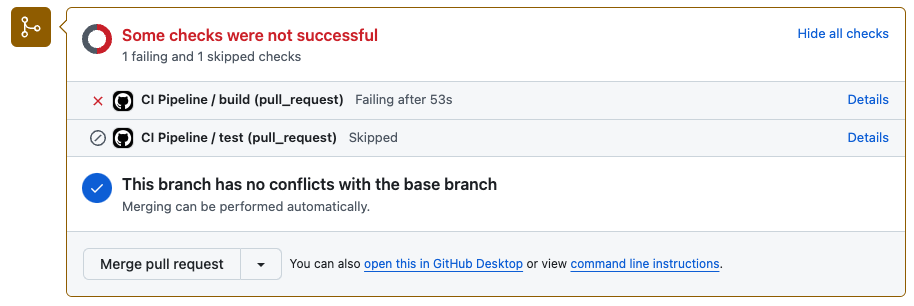_CI 파이프라인 build 실패_

* **테스트(테스트 코드)가 실패하니 빌드도 실패**하는 것을 확인할 수 있다.

<br>

상세 내용을 파악하기 위해서 `Details`를 누르고 로그를 살펴보자.

<br>

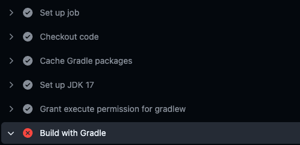_통과한 Step과 실패한 Step을 확인할 수 있다_

<br>

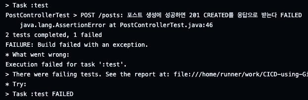_테스트가 실패했다는 것을 확인 가능_

* 로그를 통해서 테스트가 실패하여 빌드에 실패했다는 것을 파악할 수 있다. 

현재 상황은 `dev` → `test`로 PR 요청 중에 CI 파이프라인이 실패하여 PR 통과가 안되는 상황이다. 이번에는 테스트를 통과하도록 코드를 수정하고, `dev` 브랜치로 푸시를 넣어보자.

<br>

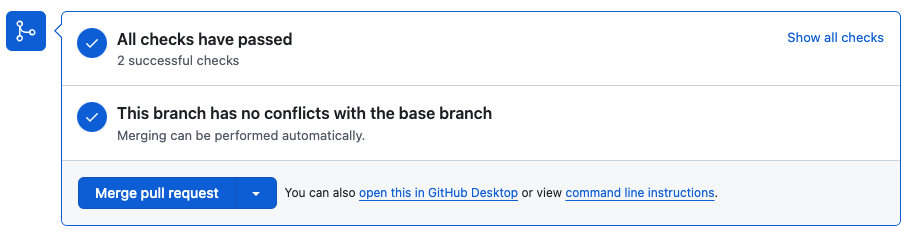_테스트 통과하기 때문에 Check 성공_

* 이제 성공하는 모습을 볼 수 있다

<br>

---

#### 조건문: 특정 브랜치에 대한 Job 정의

조건문을 사용해서 특정 브랜치에 대해서만 실행되는 Job을 정의해보자.

이번엔 이런 상황을 가정해보자.

* 모든 브랜치에 대해서 PR 요청을 하면 `build` Job 수행
* `dev` 브랜치에 푸시가 일어나면 `test` Job 수행

<br>

**YAML** 코드를 통해 바로 알아보자.

```yaml
name: CI Pipeline

on:
  pull_request:
    branches:
      - '**'  # 모든 브랜치에 대해 PR이 생성될 때 실행

  push:
    branches:
      - dev  # dev 브랜치에 푸시될 때 실행

jobs:
  build:
    runs-on: ubuntu-latest

    steps:
      - name: Checkout code
        uses: actions/checkout@v3

      - name: Cache Gradle packages
        uses: actions/cache@v3
        with:
          path: |
            ~/.gradle/caches
            ~/.gradle/wrapper
          key: ${{ runner.os }}-gradle-${{ hashFiles('**/*.gradle*', '**/gradle-wrapper.properties') }}
          restore-keys: |
            ${{ runner.os }}-gradle-

      - name: Set up JDK 17
        uses: actions/setup-java@v3
        with:
          distribution: 'temurin'
          java-version: '17'
          
      - name: Grant execute permission for gradlew
        run: chmod +x gradlew

      - name: Build with Gradle
        run: ./gradlew build --no-daemon

  test:
    runs-on: ubuntu-latest
    if: github.ref == 'refs/heads/dev'  # dev 브랜치로 푸시될 때만 실행
    steps:
      - name: Checkout code
        uses: actions/checkout@v3

      - name: Set up JDK 17
        uses: actions/setup-java@v3
        with:
          distribution: 'temurin'
          java-version: '17'

      - name: Run tests
        run: ./gradlew test --no-daemon
```

* `if: github.ref == 'refs/heads/dev'` (dev 브랜치에서만 실행)
  * `dev` 브랜치로 푸시될 때만 해당 Job이 실행되도록 한다

<br>

위의 케이스 말고도 다음과 같은 케이스에서도 활용 가능하다.

* **상태 기반의 조건문**
  * `success()`: 이전 모든 Step이 성공한 경우 참(`true`)
  * `failure()`: 이전 Step 중 하나라도 실패한 경우 참(`true`)
  * `always()`: 모든 조건에 관계없이 항상 참(`true`)
  * `cancelled()`: 워크플로우가 취소된 경우 참(`true`)
* **브랜치 기반 조건문**
  * `github.ref`: 참조를 나타내며, 특정 브랜치나 태그에서만 **Step**을 실행하도록 조건을 설정한다
  * 예시: `github.ref == 'refs/heads/main'` (main 브랜치에서만 실행)
* **환경 변수 또는 시크릿 기반 조건문**
  * 환경 변수나 시크릿 값을 비교하여 조건을 설정할 수 있다
  * 예시: `if: env.MY_ENV_VAR == 'production'`
  * 당연히 `env`에 환경 변수를 정의하거나, 시크릿에 등록해야 한다
* **결과 기반 조건문**
  * 이전 `Job`의 결과에 따라 실행할 수 있다
  * 예시: `needs.job1.result == 'success'` (job1이 성공한 경우)

<br>

---

## 4. Secrets 사용(슬랙 알림 설정 해보기)

### 소개

**시크릿(Secrets)**의 사용법에 대해 알아보자. CI/CD 파이프라인을 구성하면 많은 경우 외부 API, 서버 등과 요청과 응답을 주고 받는 과정이 포함된다. 하지만 API 또는 서버와 통신하기 위해서 **YAML** 파일에 **그대로 하드 코딩하는 것은 보안에 민감한 정보를 그대로 노출시키는 것**이다.

시크릿은 **API 키, URL, 비밀번호와 같은 민감한 정보를 안전하게 보관**하는데 사용된다.

CI 파이프라인이 **실패하거나 성공하면 Slack Notification을 보내는 기능을 추가**해보자.

<br>

---

### 슬랙 채널 추가

먼저 필요한 환경을 셋팅 해보자. 사용할 슬랙 워크스페이스 내에서 **알림을 받을 채널을 개설**해보자(필요한 경우 워크스페이스 부터 만들자).

<br>

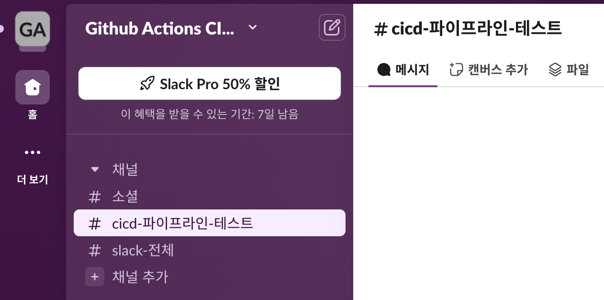_슬랙 채널 개설_

* `cicd 파이프라인 테스트`라는 채널을 추가했다

<br>

---

### 슬랙 앱 생성: Webhook URL 발급

GitHub Action을 이용한 파이프라인의 통과 여부에 대한 결과를 받기 위해서 **슬랙 앱**을 만들고 **Slack Webhook URL**을 통해 연동할 것이다.

<br>

> **슬랙 GitHub 앱으로 충분한거 아니야?**
>
> 뒤에서 GitHub 앱을 추가해서 레포지토리를 구독하는 방법에 대해서 알아볼 것이다.
>
> Slack의 GitHub 앱은 일반적인 이벤트에 대한 알림을 제공하지만, **Webhook을 사용하면 특정 조건이나 커스텀 이벤트(예: 특정 단계에서만 발생하는 오류)를 감지하고 알림을 보낼 수 있다**. 이는 복잡한 CI/CD 파이프라인에서 유용할 수 있다.
{: .prompt-info }

<br>

해당 링크에 들어가서 슬랙 앱을 만들어보자. [https://api.slack.com/apps](https://api.slack.com/apps)

**Create New App**을 누르고 **Create from Scratch**를 고르자.

<br>

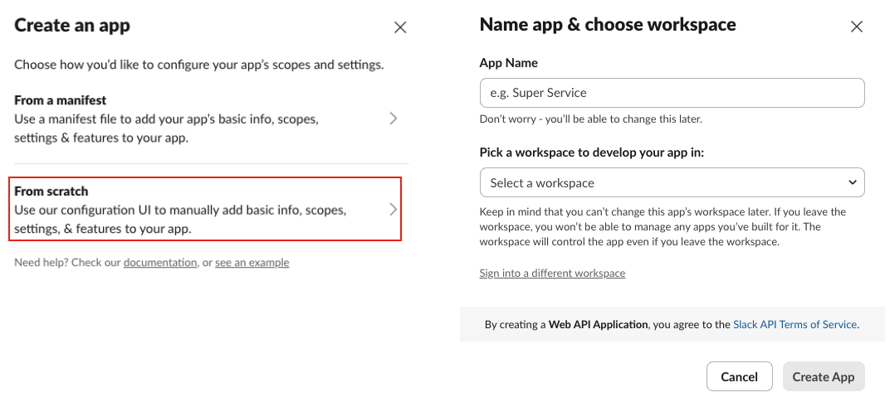_슬랙 앱 생성_

* 앱의 이름과 앱을 사용할 워크스페이스-채널을 선택한다

<br>

---

### Secrets 등록

생성을 완료하고, 해당 앱의 설정 페이지에서 **Incoming Webhooks**를 선택하고 활성화 시키자. 그리고 **Webhook URL**을 복사하자.

<br>

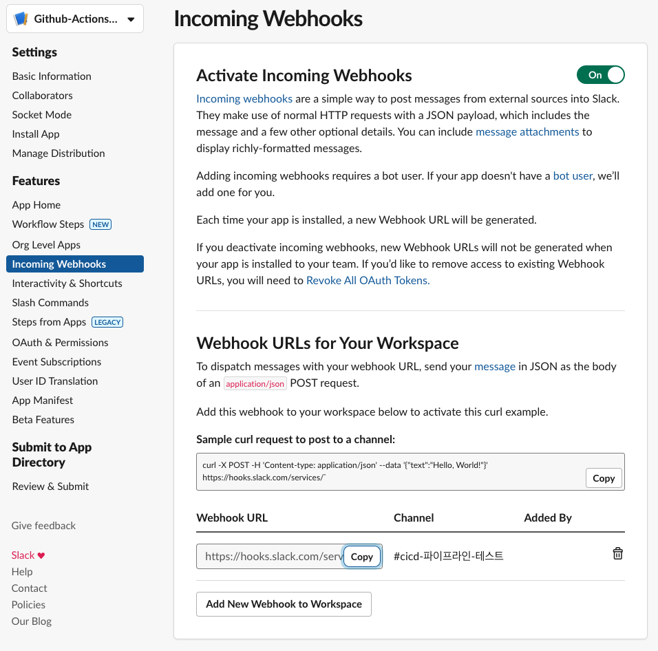_Webhook URL 복사_

<br>

복사한 **Webhook URL**은 깃헙 레포지토리의 **Settings > Secrets and variables > Actions**에 들어가서 **New repository secret**에 추가한다.

<br>

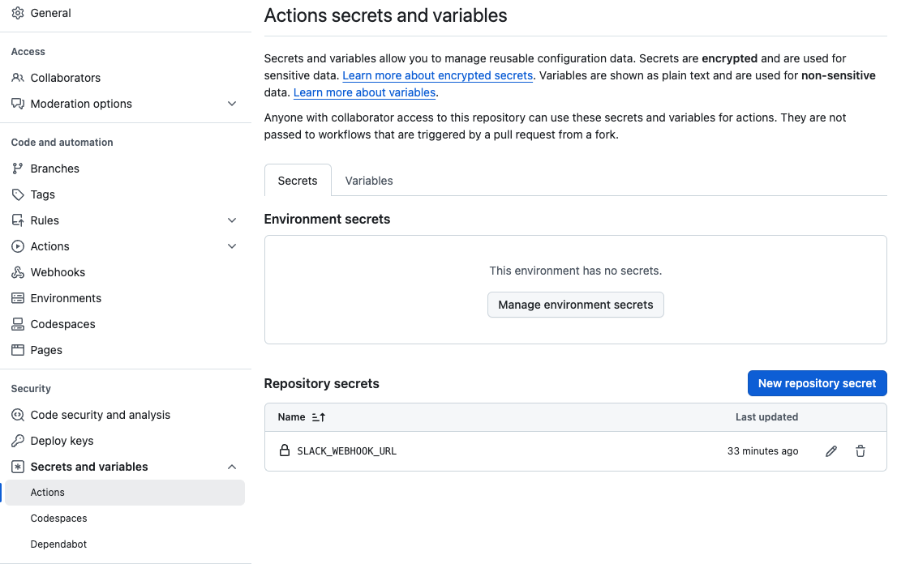_secret 추가_

* 해당 시크릿은 GitHub Actions 워크플로우에서 `${{ secrets.SLACK_WEBHOOK_URL }}` 형태로 사용할 수 있다

<br>

---

### 워크플로우 작성하기

이제 기존의 `ci.yml`에 슬랙 알림을 보내는 작업을 추가해보자.

<br>

#### slack-github-action: 버그 발생

> **버그**
>
> 현재 이 방법은 `payload-file-path`를 사용하는 경우 필드가 `???`로 표시되는 버그있다!
>
> [159#discussion](https://github.com/slackapi/slack-github-action/pull/159#discussion_r1120736821) 참고
{: .prompt-danger }

<br>

[slackapi/slack-github-action](https://github.com/slackapi/slack-github-action)을 사용해서 보내는 방법을 알아보자.

<br>



```yaml
# 6. 슬랙 채널로 빌드의 성공 또는 실패에 따라 알림 보내기
# 성공시 슬랙 알람 보내기
- name: Notify Slack on Success
  if: success() # 이전 스텝이 모두 성공하면 해당 스텝을 실행하는 조건문
  id: slack-success
  uses: slackapi/slack-github-action@v1.27.0
  with:
    payload-file-path: "./slack/success-payload-content.json" # 미리 정의된 json 파일에 payload를 정의해서 사용가능
    # payload를 json 형태로 직접 제공해서 사용할 수 있다
    # payload는 payload-file-path 보다 높은 우선순위를 가진다
    # payload: |
    #      {
    #        "key": "value",
    #        "foo": "bar"
    #      }
  env:
    SLACK_WEBHOOK_URL: ${{ secrets.SLACK_WEBHOOK_URL }}
    SLACK_WEBHOOK_TYPE: INCOMING_WEBHOOK
# 실패시 슬랙 알람 보내기
- name: Notify Slack on Failure
  if: failure() # 이전 스텝 중 하나라도 실패하면 해당 스텝을 실행하는 조건문
  id: slack-failure
  uses: slackapi/slack-github-action@v1.27.0
  with:
    payload-file-path: "./slack/failure-payload-content.json"
  env:
    SLACK_WEBHOOK_URL: ${{ secrets.SLACK_WEBHOOK_URL }}
    SLACK_WEBHOOK_TYPE: INCOMING_WEBHOOK
```

* `success-payload-content.json`와 `failure-payload-content.json`를 따로 정의해서 사용하고 있다
* `payload` 필드를 사용해서 바로 정의해서 사용하는 방법도 존재한다(이 방법은 버그가 없음)



<br>



`success-payload-content.json`

```json
{
  "channel": "C07L4BQTKGE",
  "attachments": [
    {
      "color": "#36a64f",
      "title": "${{ github.repository }}",
      "title_link": "https://github.com/${{github.repository}}",
      "text": "✅ CI/CD 파이프라인 성공",
      "fields": [
        {
          "title": "Repository",
          "value": "${{ github.repository }}",
          "short": true
        },
        {
          "title": "Tag",
          "value": "${{ github.ref_name }}",
          "short": true
        },
        {
          "title": "Commit",
          "value": "${{ github.sha }}",
          "short": true
        },
        {
          "title": "Commit Message",
          "value": "${{ github.event.head_commit.message }}",
          "short": true
        },
        {
          "title": "Author",
          "value": "${{ github.event.head_commit.author.name }}",
          "short": true
        }
      ]
    }
  ]
}
```

* 필요한 경우, 채널ID도 시크릿으로 설정해서 사용할 수 있다



<br>

이 방법의 경우 아래 처럼 필드가 `???`로 랜더링되는 버그가 있다.

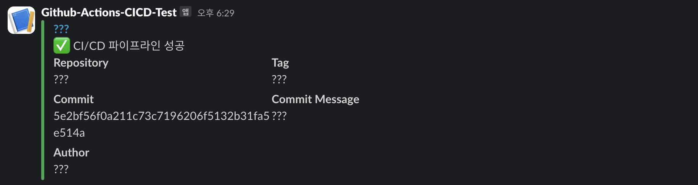_??? bug_

<br>

---

#### slack-github-action: 버그 Workaround

> **버그 우회**
>
> 이 방법은 버그 해결이 아닌 우회하는 방법이다.
>
> [Problems persist using payload file #203](https://github.com/slackapi/slack-github-action/issues/203) 참고
{: .prompt-warning }

<br>



```yaml
# 추가 1
env:
  PULL_REQUEST_TITLE: ${{ github.event.pull_request.title }}
  PULL_REQUEST_URL: ${{ github.event.pull_request.html_url }}
  PULL_REQUEST_AUTHOR: ${{ github.event.pull_request.user.login }}
  PULL_REQUEST_EVENT_NAME: ${{ github.event_name }}
  PULL_REQUEST_LOGS_URL: ${{ github.event.repository.html_url }}/actions/runs/${{ github.run_id }}
  PULL_REQUEST_COMMIT_URL: ${{ github.event.pull_request.head.repo.html_url }}/commit/${{ github.event.pull_request.head.sha }}
  
jobs:
  # Build Job
  build:
    runs-on: ubuntu-latest
			
    steps:
    # 기존 Step
    
      # 추가 2
      - name: Slack message with build result
        if: success() || failure()
        uses: slackapi/slack-github-action@v1.27.0
        env:
          SLACK_WEBHOOK_URL: ${{ secrets.SLACK_WEBHOOK_URL }}
          SLACK_WEBHOOK_TYPE: INCOMING_WEBHOOK
          PULL_REQUEST_JOB_STATUS: ${{ job.status }}
          PULL_REQUEST_JOB_STATUS_COLOR: ${{ job.status == 'success' && vars.COLOR_GREEN || job.status == 'failure' && vars.COLOR_RED || vars.COLOR_ORANGE }}
        with:
          channel-id: C07L4BQTKGE
          payload-file-path: ./slack/ci_slack_message.json
```



<br>



`ci_slack_message.json`

```json
{
  "attachments": [
    {
      "color": "${{ env.PULL_REQUEST_JOB_STATUS_COLOR }}",
      "fallback": "test",
      "blocks": [
        {
          "type": "section",
          "fields": [
            {
              "type": "mrkdwn",
              "text": "*Pull Request:*\n<${{ env.PULL_REQUEST_URL }}|${{ env.PULL_REQUEST_TITLE }}>"
            },
            {
              "type": "mrkdwn",
              "text": "*Status:*\n`${{ env.PULL_REQUEST_JOB_STATUS }}`"
            }
          ]
        },
        {
          "type": "section",
          "fields": [
            {
              "type": "mrkdwn",
              "text": "*Author:*\n`${{ env.PULL_REQUEST_AUTHOR }}`"
            },
            {
              "type": "mrkdwn",
              "text": "*Event:*\n`${{ env.PULL_REQUEST_EVENT_NAME }}`"
            }
          ]
        },
        {
          "type": "divider"
        },
        {
          "type": "actions",
          "elements": [
            {
              "type": "button",
              "text": {
                "type": "plain_text",
                "text": "Logs"
              },
              "url": "${{ env.PULL_REQUEST_LOGS_URL }}"
            },
            {
              "type": "button",
              "text": {
                "type": "plain_text",
                "text": "Commit"
              },
              "url": "${{ env.PULL_REQUEST_COMMIT_URL }}"
            }
          ]
        }
      ]
    }
  ]
}
```



<br>

이제 슬랙 알림을 보내서 확인해보면 다음과 같이 표시된다.

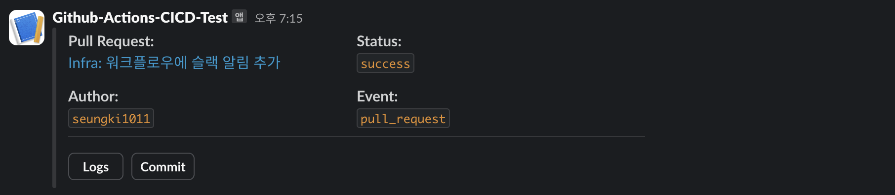_bug workaround_

<br>

---

#### action-slack

이번에는 더 간편한 방법인 [8398a7/action-slack](https://github.com/8398a7/action-slack)를 사용하는 방법에 대해 알아보자.

<br>

아래의 Step만 추가하면 된다.


```yaml
- name: Slack message with build result
  if: always() # 이전의 Step들의 성공과 실패 여부에 상관 없이 항상 실행
  uses: 8398a7/action-slack@v3
  with:
    status: ${{ job.status }}
    fields: repo,message,commit,author,action,eventName,ref,workflow,job,took
    if_mention: failure,cancelled
  env:
    SLACK_WEBHOOK_URL: ${{ secrets.SLACK_WEBHOOK_URL }}
```


<br>

다음과 같은 슬랙 알람을 받을 수 있다.

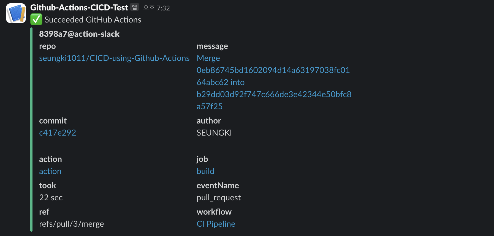_8398a7/action-slack 사용_

<br>

이 방법은 간편하지만 `slack-github-action`에 비해 필드를 원하는데로 커스터마이징 하기가 어렵다는 단점이 있다.


<br>

---

### 슬랙에 GitHub 앱 추가: 레포지토리 구독

슬랙 워크스페이스에 **GitHub 앱을 추가**해서 **레포지토리의 이벤트에 대한 알림**을 받아보자.

왼쪽 사이드바의 아래에 **"앱 추가"**라는 버튼을 눌러서 **GitHub이라는 앱을 찾자**. 만약 앱 추가가 없다면, 왼쪽의 **더 보기**를 눌러서 **자동화**라는 항목에 들어가서 확인해보자.

<br>

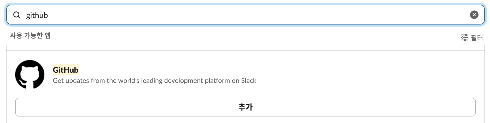_GitHub 앱 찾아서 추가 누르기_

<br>

찾았다면 **GitHub 앱을 추가**하자. 추가를 누르면 Web UI로 이동하고 다음과 같은 창이 보일 것이다.

<br>

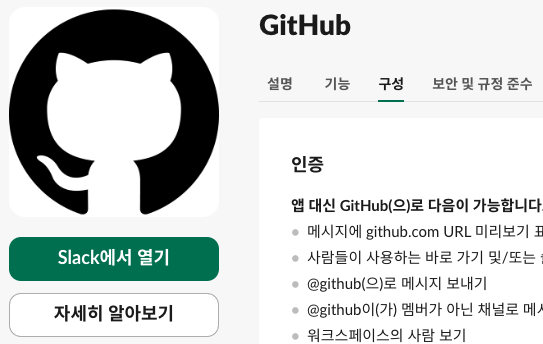_Web UI GitHub 앱_

<br>

위 이미지에서는 이미 추가를 진행해서 **Slack에서 열기**로 보이지만, 만약 추가를 안했다면 **Slack에 추가하기**를 누르자.

모든 과정이 성공했다면 다음과 같이 **앱 아래에 GitHub이 보일 것**이다. 이제 나머지 연동 작업까지 모두 완료하자.

<br>

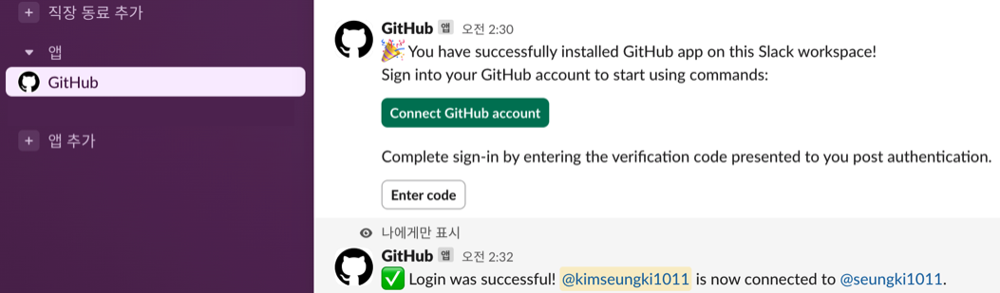_GitHub 연동_

<br>

다음으로 `/github subscribe {레포지토리 주인}/{레포지토리 이름}` 명령어를 통해서 레포지토리를 구독하자.

<br>

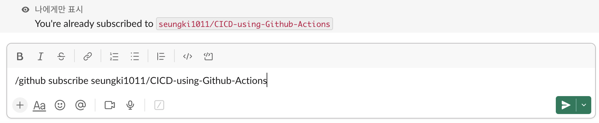_레포지토리 구독_

* 이 명령어를 사용하면 특정 **GitHub 레포지토리의 이벤트를 Slack 채널에서 실시간으로 받아볼 수 있다**
* 기본 설정은 모든 이벤트를 구독하는 것이지만, **필터링을 통해 특정 이벤트만 받도록 설정**할 수 있다

<br>

---

## 다음 포스트

지금까지 다룬 내용은 다음과 같다.

* CI/CD 소개
* GitHub Actions 사용법
* GitHub Actions를 사용해서 CI 파이프라인 구현
* GitHub Actions의 결과를 슬랙으로 보내기 

<br>

다음 포스트는 CD 파이프라인을 어떤식으로 설계할 수 있는지 알아볼 예정이다.

<br>

---

## Reference

1. [https://pozafly.github.io/dev-ops/cache-and-restore-keys-in-github-actions/](https://pozafly.github.io/dev-ops/cache-and-restore-keys-in-github-actions/)
2. [https://fe-developers.kakaoent.com/2022/220106-github-actions/](https://fe-developers.kakaoent.com/2022/220106-github-actions/)
3. [https://hyperconnect.github.io/2021/11/08/github-actions-for-everyone-1.html](https://hyperconnect.github.io/2021/11/08/github-actions-for-everyone-1.html)
4. [https://github.com/8398a7/action-slack](https://github.com/8398a7/action-slack)
5. [https://github.com/slackapi/slack-github-action](https://github.com/slackapi/slack-github-action)

