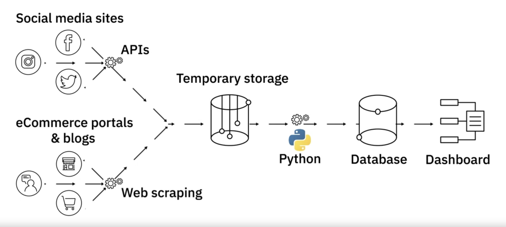

---

해당 포스트는 코세라의 IBM Data Engineering 코스를 한글로 다시 정리한 내용입니다.

---

## Responsibilties and Skillsets of a Data Engineer

### 데이터 엔지니어의 역할 및 스킬셋

이전 데이터 엔지니어가 하는 일에 대한 포스트의 연장선상의 설명이다.

1. 데이터 관리(Data Management)
   * 다양한 데이터 소스에서 데이터를 추출, 정리 및 통합
   * 분석 및 보고를 위한 데이터 전처리와 데이터 클리닝
   * End to end 데이터 파이프라인의 설계 및 관리
   * 데이터 수집, 처리, 보관을 위한 인프라 구성
2. 기술적 능력(Technical Skills)
   * OS(Unix, Linux, Windows)와 관리도구에 능숙해야 함
   * 인프라의 구성 요소, 가상화 및 클라우드 서비스(AWS, GCP, Azure..)에 대한 지식
   * 데이터베이스(RDBMS,NoSQL..) 및 데이터 웨어하우징 기술에 대한 경험
   * Apache Airflow, DataFlow 등과 같은 데이터 파이프라인 도구 사용에 대한 경험
   * ETL 도구(AWS Gluw, IBM Infoshpere..) 및 쿼리 언어에 대한 지식
   * 프로그래밍 언어에 대한 지식(Python, Java, R..)
   * 빅데이터 처리 도구(Hadoop, Hive, Spark..)에 대한 경험
3. 기능적 기술(Functional Skills)
   * 비즈니스 요구사항을 기술 요구사항이나 계획서로 변환 시킬 수 있는 능력
   * 소프트웨어 개발 라이프사이클에 대한 이해
   * 데이터의 비즈니스 애플리케이션에 대한 이해
   * 데이터 관리 리스크(data quality, privacy, security, compliance..)의 인지
4. 소프트 스킬
   * 팀워크
   * 기술과 비기술 관계자와의 커뮤니케이션

데이터 엔지니어 커리어를 시작하기 위해서는 넓은 스킬셋이 필요하고, 특정 영역의 전문화가 일반적이다. 모든 기술을 마스터하기는 어렵지만, 데이터 엔지니어로 일하기 위해서는 모든 측면에 대해서 잘 이해하고 있는 것이 필요하다. 결론적으로 데이터 기술에 대해 꾸준히 학습을 해야한다. 

---

## Example of a Data Engineer

### 데이터 엔지니어 예시

화장품 회사의 데이터 팀에서 근무하는 데이터 엔지니어 사라가 있다고 가정하자. 사라의 회사는 새로운 샴푸의 출시의 마지막 단계를 거치고 있다. 최근에는 소셜 미디어와 같은 온라인 플랫폼에서의 제품에 대한 의견이 판매량과 브랜드 인지도에 큰 영향을 끼치고 있다. 이런 이유로 BI 팀에서 트위터, 페이스북, 인스타그램과 같은 온라인 커뮤니티나 이커머스 플랫폼에서 자기들 제품에 대한 의견을 모으고 분석에 이용하고 싶어한다. 먼저 데이터 사이언티스트 팀에서 더미 데이터를 이용해서 감정분석 알고리즘을 이용한 데이터 분석 대시보드의 프로토타입을 개발했다. 대시보드는 여러 플랫폼에서 모은 소비자의 의견에 대한 감정 분석을 정량적으로 나타낸 그래프를 시각화해서 보여준다.

데이터 엔지니어 팀에 속한 사라의 역할은 여기서부터 시작한다. 먼저 여러 데이터 소스(트위터, 인스타그램, 페이스북, 등..)에서 api 또는 웹 스크래핑을 통해서 데이터를 수집하기 시작했다. 수집의 기준은 신제품을 해쉬태그에 포함시킨 경우 또는 일정 기준 이상의 언급이 있을 경우 데이터를 임시 스토리지에 저장하였다. 다양한 소스로 부터 수집한 데이터는 다양한 형태와 포맷을 가지고 있었다. 사라는 수집한 데이터를 데이터베이스에 로드하기 전에 데이터를 전처리하고 데이터베이스에 저장 할 수 있는 형태로 변환 시킬 수 있는 파이썬 프로그램을 작성했다. 사라는 대시보드가 데이터베이스에서 데이터 가져가서 이용하는 것에 성공한 것을 확인했다.

데이터 엔지니어의 일은 여기서 끝나지 않는다. BI 팀에서는 이번 한번만 제품에 대한 동향을 확인하는 것에 그치치 않고 주기적으로 데이터를 수집하고 통합해서 확인하고 싶어한다. 데이터 엔지니어 팀은 리얼타임으로 데이터를 수집, 전처리 그리고 데이터베이스로 로드하는 데이터 파이프라인을 제작 해야한다.

출처 - https://www.coursera.org/learn/introduction-to-data-engineering

## 참고

---

1. [Coursera - IBM Introduction to Data Engineering](https://www.coursera.org/learn/introduction-to-data-engineering/lecture/Kcbi0/modern-data-ecosystem)
