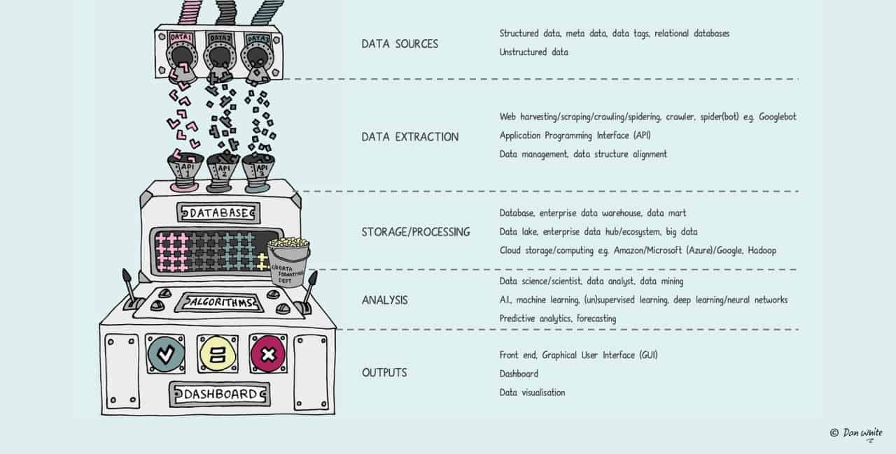
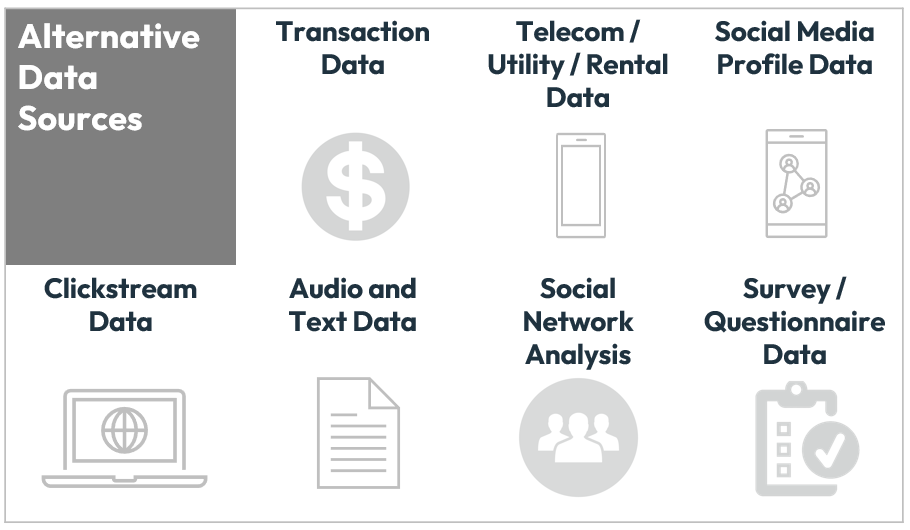

---

해당 포스트는 코세라의 IBM Data Engineering 코스를 한글로 다시 정리한 내용입니다.

---

## Modern Data Ecosystem

### 현대의 데이터 생태계

> Data begets more data

현재 데이터 처리 속도와 bandwidth의 증가, 데이터의 생성 소비 및 공유에 대한 끊임 없는 발전으로 인해 데이터의 중요성은 나날이 커지고 있다. 이런 데이터의 source 부터 시작해서 데이터를 수집, 처리, 분석하는 인프라 및 유저들을 아우르는 생태계를 data ecosystem 이라고 한다. 이런 데이터 생태계 내부의 요소들은 서로 상호적으로 연결되어 있으면서 독립적이기도 한다.

출처 - https://www.datameer.com/blog/the-how-to-guide-for-understanding-data-ecosystems/

이런 데이터 생태계는 다음을 포함한다고 볼 수 있다.

* 서로 다른 data source로 부터 통합된 데이터
* 데이터에 대한 분석을 통해 얻은 insight
* 해당 insight를 통한 여러 이해관계자들과의 협업
* 필요한 데이터를 전달하기 위한 도구, 애플리케이션 그리고 인프라

### Data Sources

정말 많은 Date Source에서 정형, 비정형, 반정형 데이터가 올 수 있다.

출처 - https://www.fico.com/blogs/using-alternative-data-credit-risk-modelling

* 텍스트
* 비디오
* clickstream
* 유저간 메세지
* IoT
* realtime data
* professional provider

위의 예시 말고도 다양한 data source들이 존재한다.

---

## Enterprise Data Enviroment

처음에 할것은 원천 데이터의 복사본을 data repository에 넣는 것이다. Raw data를 commonplace에 전부 모았다면 끝단의 유저들이 사용할 수 있도록 정리하고 최적화하는 것이 데이터 엔지니어의 역할이다. 이때 주요 과제는 유저 별로 요구하는 데이터들이 다를 수 있다는 것이다. 가령 데이터 분석가는 raw data, BI 팀에서는 리포트와 대시보드 형태, 다른 이해관계자들은 커스텀 API 형태로 데이터를 받아야 할 수 있다.

출처 - https://www.coursera.org/learn/introduction-to-data-engineering

---

## Emerging Technologies

현재는 새롭게 등장하는 기술들에 의해 데이터 생태계가 변화하고 있다.

* Cloud Computing
* Machine Learning
* Big Data

위에서 언급한 주제들은 누구나 한번씩 들어봤을 법한 주제들이고, 현대의 데이터 생태계를 포함한 IT 산업 전반에서 다루고 있을만큼 큰 영향을 끼치고 있다.

## 참고

---

1. [Coursera - IBM Introduction to Data Engineering](https://www.coursera.org/learn/introduction-to-data-engineering/)
2. [https://www.fico.com/blogs/using-alternative-data-credit-risk-modelling](https://www.fico.com/blogs/using-alternative-data-credit-risk-modelling)
3. [https://www.datameer.com/blog/the-how-to-guide-for-understanding-data-ecosystems](https://www.datameer.com/blog/the-how-to-guide-for-understanding-data-ecosystems)
