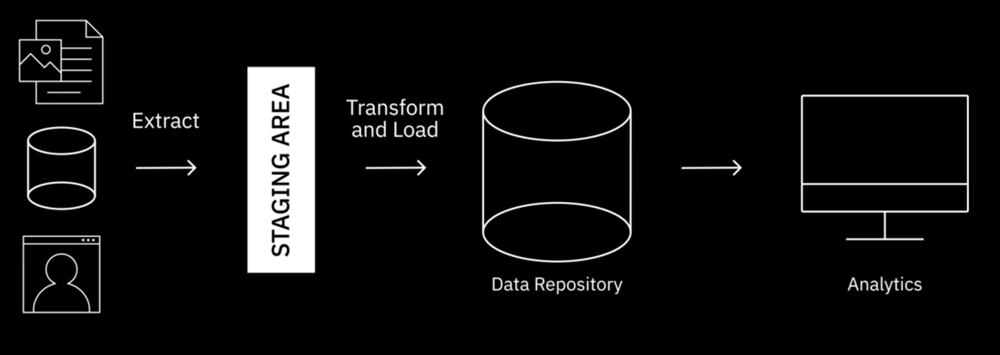

---

해당 포스트는 코세라의 IBM Data Engineering 코스를 한글로 다시 정리한 내용입니다.

---

> Data is the new oil

데이터는 현대 비즈니스의 의사 결정 및 혁신을 주도한다. 이런 데이터를 최대한 활용하려면 소스 시스템에서 부터 목적 시스템으로 데이터를 이동하는 일련의 프로세스를 거쳐야 한다. 다음은 데이터 이동을 위한 세가지 주요 요소인 ETL(추출, 변환, 로드), ELT(추출, 로드, 변환) 및 데이터 파이프라인을 살펴보겠다. 이러한 프로세스는 원시 데이터를 중요한 인사이트로 변환하는데 필수적이다.

---

## ETL & ELT

### ETL - Extract, Transform and Load

ETL은 raw 데이터를 가져와서 분석 가능한 정보로 변환하는 기본적인 데이터 이동 프로세스이다. 각 단계에 대한 설명은 다음과 같다.

* Extract
  * 데이터를 배치 프로세싱 또는 스트림 프로세싱을 통해 데이터 소스로 부터 수집된다
  * 배치 프로세싱은 예약된 간격으로 데이터를 이동하는 작업이 포함되며, 스트림 프로세싱은 실시간으로 데이터를 가져온다
* Transformation
  * 데이터를 정리, 표준화 및 보강(enrichment)하기 위해 규칙들이 적용된다
  * 데이터 일관성, 중복 항목 제거 그리고 데이블 간 관계의 설정을 보장한다
* Load
  * 처리된 데이터는 대상 시스템이나 저장소로 전송된다
  * 초기 로드(Initial load), [증분 로드(Incremental load)](https://hevodata.com/learn/incremental-data-load-vs-full-load/), 데이터의 전체 새로고침(Full refresh) 등이 포함된다
  * [Initial load, Incremental load, Full refresh에 대한 내용](https://www.geeksforgeeks.org/data-loading-in-data-warehouse/)
  * Load Verification
    * Null value 확인
    * 서버 성능 확인
    * 로드 실패 확인

ETL은 전통적으로 배치 워크로드에 사용되었지만 실시간 스트리밍 이벤트 데이터에 점점 더 적용되고 있다.

출처 - https://www.coursera.org/learn/introduction-to-data-engineering

### ELT - Extract, Load, Transform

ELT는 데이터가 먼저 대상 시스템에 로드되고 해당 시스템 내에서 변환이 발생하는 접근 방식이다. 각 단계에 대한 설명은 다음과 같다.

* Load
  * 데이터가 대상 시스템(보통 데이터 레이크 또는 데이터 웨어하우스)에 로드 된다
* Transformation
  * 데이터 변환은 대상 시스템 내에서 이루어지므로 정형이 아닌 비정형 데이터에 이상적이다

ELT 프로세스가 가지는 장점은 다음과 같다.

* 원시 데이터가 스테이징 환경이 아닌 대상 시스템으로 직접 전달되므로 추출에서 전달까지의 기간이 단축된다
* 데이터 레이크와 결합된 ELT를 사용하면 데이터 사용이 가능한 즉시 대량의 원시 데이터 수집(Data Ingestion)을 할수 있다
* ETL 프로세스에 비해 탐색적 데이터 분석에 대해 더 큰 유연성을 제공한다
* ELT는 특정 분석에 필요한 데이터만 변환하므로 다양한 사례에 활용할 수 있다
  * ETL의 경우 새로운 사용 사례(use case에 대해서 데이터 전체의 구조를 변환해야 할 수 있다
* ELT는 빅데이터 작업에 더 적합하다

출처 - https://www.coursera.org/learn/introduction-to-data-engineering

---

## Data Pipeline

### 데이터 파이프라인

데이터 엔지니어링에서 ETL과 ELT는 데이터 파이프라인이라는 용어와 서로 같은 의미로 사용하는 경우가 많다. 둘 다 소스에서 대상으로 데이터를 이동하지만 데이터 파이프라인은 한 시스템에서 다른 시스템으로 데이터를 이동하는 전체 플로우를 포괄하는 더 넓은 의미의 용어이며, ELT와 ETL은 데이터 파이프라인의 하위 집합(subset)에 해당한다고 표현하는 것이 더 정확하다.

* 데이터 파이프라인은 배치 처리, 스트리밍 처리 또는 배치와 스트리밍 처리가 조합된 형태로 설계할 수 있다
  * 스트리밍 데이터의 경우 데이터의 처리 또는 변환은 연속적인 흐름으로 발생한다
  * 이런 경우는 보통 지속적인 업데이트가 필요한 데이터에 적합하다 (예시로는 트래픽을 모니터링하는 센서로부터 오는 데이터)
* 데이터 파이프라인의 대상은 일반적으로 데이터 레이크지만, 데이터는 다른 시각화 도구나 애플리케이션에 로드될 수 있다
* 널리 사용되는 파이프라인 솔루션은 Apache Beam, Airflow, DataFlow 등이 있다

**IBM에서 정의 하는 데이터 파이프라인**

> 데이터 파이프라인은 다양한 데이터 소스에서 원시 데이터를 수집한 다음 분석을 위해 데이터 레이크 또는 데이터 웨어하우스와 같은 데이터 저장소로 이전하는 방법입니다. 일반적으로 데이터는 데이터 저장소로 이동하기 전에 데이터 처리 과정을 거칩니다. 여기에는 적절한 데이터 통합과 표준화를 보장하는 필터링, 마스킹, 집계와 같은 데이터 변환이 포함됩니다. 이 과정은 데이터 세트의 대상이 관계형 데이터베이스인 경우 특히 중요합니다. 이 유형의 데이터 저장소에는 기존 데이터를 새 데이터로 업데이트하기 위해 정렬(즉, 데이터 열 및 유형 매칭)이 필요한 정의된 스키마가 있습니다. 
>
> 이름에서 알 수 있듯이 데이터 파이프라인은 데이터 사이언스 프로젝트 또는 비즈니스 인텔리전스 대시보드에 대한 "파이프(배관)" 역할을 합니다. 데이터는 API, SQL 및 [NoSQL 데이터베이스](https://www.ibm.com/cloud/learn/nosql-databases), 파일 등 다양한 위치에서 가져올 수 있지만 안타깝게도 이러한 데이터는 즉시 사용할 수 없습니다. 일반적으로 데이터 준비 작업은 비즈니스 사용 사례의 요구사항에 따라 데이터를 구성하는 데이터 사이언티스트 또는 데이터 엔지니어가 책임집니다. 데이터 파이프라인에 필요한 데이터 처리 유형은 보통 탐색형 데이터 분석과 정의된 비즈니스 요구사항의 조합을 통해 결정됩니다. 데이터가 적절하게 필터링, 병합, 요약되면 저장하고 사용하도록 표시할 수 있습니다. 체계적으로 구성된 데이터 파이프라인은 다양한 데이터 프로젝트의 기반이 됩니다. 여기에는 탐색형 데이터 분석, 데이터 시각화, 머신 러닝 작업이 포함될 수 있습니다.

---

## Data Integration Platforms

### 데이터 통합 플랫폼

[가트너(Gartner)](https://www.gartner.com/en)에서는 데이터 통합을 조직이 다양한 데이터 유형에 걸쳐 데이터를 수집, 변환, 결합 및 제공할 수 있도록 하는 아키텍쳐 기술과 도구로 정의를 한다. 데이터 통합에는 애플리케이션 간 데이터 일관성, 마스터 데이터 관리, 기업 간 데이터 공유, 데이터 마이그레이션 및 통합(consolidation) 같은 여러 사용 시나리오가 존재한다. 데이터 분석과 과학에서의 데이터 통합은 데이터를 운영 시스템으로 부터 엑세스, 대기열 처리(queueing) 또는 추출하는 것이 포함된다. 

예를 들어, 분석에 고객 데이터를 사용하려면 영업, 마케팅, 재무 등의 운영 시스템에서 개별 고객의 정보를 추출해야 한다. 그 다음 사용자가 데이터에 액세스하고 쿼리 및 조작을 하여 통계, 분석 및 시각화를 도출할 수 있도록 결합된 데이터에 대한 단일 인터페이스를 제공해야한다.

데이터 통합은 그러면 데이터 파이프라인과 어떤 관계가 있을까? 데이터 통합은 서로 다른 데이터를 통합된 데이터 보기(data view)로 결합하는 반면, 데이터 파이프라인은 소스에서 대상 시스템 까지 전체 데이터 이동 과정을 다룬다. 어떻게 보면 ETL은 데이터 통합 내의 프로세스라고 볼 수 있다. 데이터 통합에는 한가지 접근 방식만 존재하는 것은 아니지만, 최신 데이터 통합 솔루션들은 보통 다음 기능을 지원한다.

*  데이터베이스, 플랫 파일, 소셜 미디어 데이터, API, CRM, ERP 애플리케이션과 같은 다양한 데이터 소스의 통합 workflow를 빌드할 수 있는 미리 구축된 커넥터 및 어댑터에 대한 광범위한 카탈로그(An extensive catalog of pre-built connectors and adopters)
* 큰 유연성을 제공하고 vendor lock-in을 방지할 수 있는 오픈 소스 아키텍쳐들
* 대용량 데이터에 대한 배치 처리 또는 스트림 처리에 대한 최적화
* 빅데이터 소스와의 통합
* 데이터 품잘, 보안, 거버넌스에 대한 기능
* 다양한 클라우드 환경이나 온프레미스 환경 사이의 이식성

출처 - https://www.coursera.org/learn/introduction-to-data-engineering

**Google에서 정의하는 Data Integration**

> 빅데이터, 사물 인터넷(IoT), Software as a service(SaaS), 클라우드 활동 등으로 인해 데이터 소스의 수가 폭발적으로 증가하고 전 세계에 존재하는 데이터의 양은 수직 증가하고 있습니다. 그러나 이러한 데이터의 대부분은 독립된 사일로나 별도의 데이터 저장소에 수집 및 저장되어왔습니다. 데이터 통합은 데이터에서 더 높은 가치를 창출하고 유용한 정보를 얻기 위해 이러한 개별 데이터의 수집을 통합하는 프로세스입니다. 

**Talend에서 정의하는 Data Integration**

> Data integration is the process of combining data from different sources into a single, unified view. Integration begins with the ingestion process, and includes steps such as cleansing, ETL mapping, and transformation. Data integration ultimately enables analytics tools to produce effective, actionable [business intelligence](https://www.talend.com/resources/what-is-business-intelligence/).
>
> There is no universal approach to data integration. However, data integration solutions typically involve a few common elements, including a network of data sources, a master server, and clients accessing data from the master server.
>
> In a typical [data integration](https://www.stitchdata.com/data-integration/) process, the client sends a request to the master server for data. The master server then intakes the needed data from internal and external sources. The data is extracted from the sources, then consolidated into a single, cohesive data set. This is served back to the client for use.

---

## Further Reading

* [https://www.ibm.com/kr-ko/topics/data-pipeline](https://www.ibm.com/kr-ko/topics/data-pipeline)
* [integration tools](https://hevodata.com/blog/data-integration-tools/)

## 참고

---

1. [Coursera - IBM Introduction to Data Engineering](https://www.coursera.org/learn/introduction-to-data-engineering)
2. [https://hevodata.com/learn/incremental-data-load-vs-full-load/](https://hevodata.com/learn/incremental-data-load-vs-full-load/)
3. [https://www.geeksforgeeks.org/data-loading-in-data-warehouse/](https://www.geeksforgeeks.org/data-loading-in-data-warehouse/)
4. https://www.ibm.com/kr-ko/topics/data-pipeline
5. [https://www.talend.com/resources/what-is-data-integration/](https://www.talend.com/resources/what-is-data-integration/)
