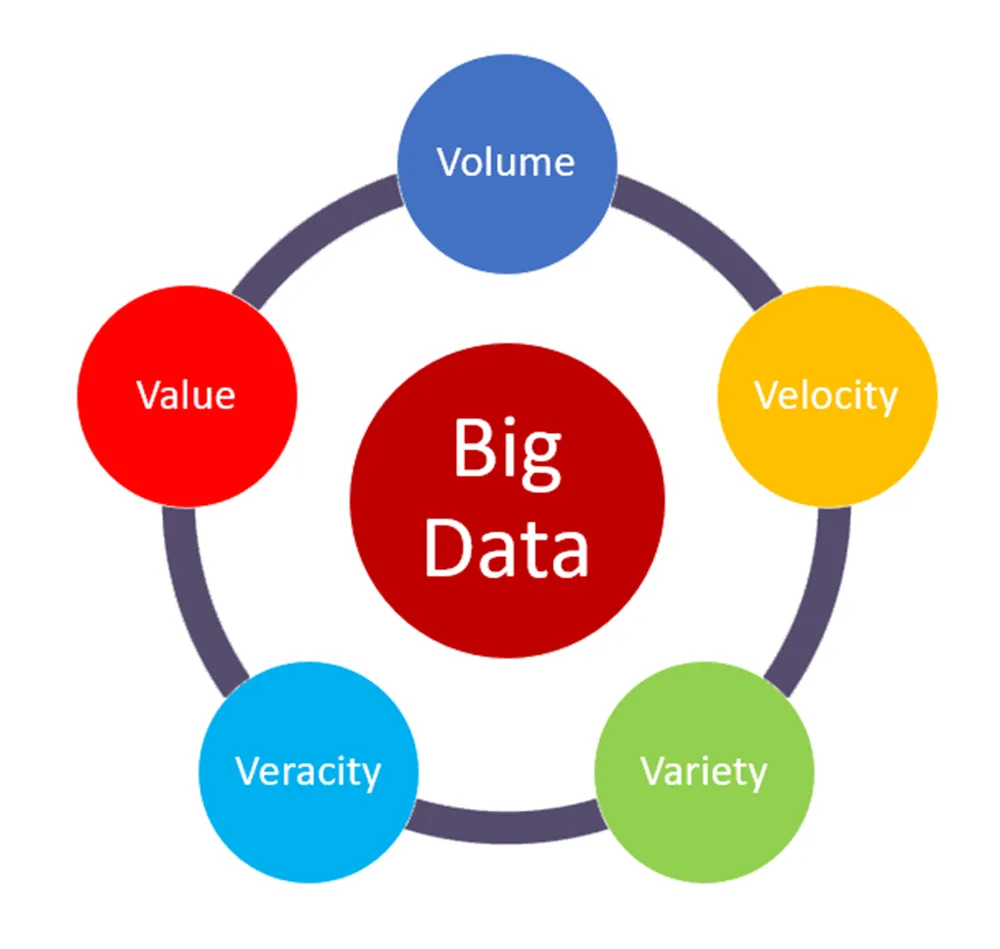

---

해당 포스트는 코세라의 IBM Data Engineering 코스를 한글로 다시 정리한 내용입니다.

---

## Foundations of BigData

### 빅데이터의 정의

빅데이터는 사람, 도구, 기계에 의해 생성되는 동적이고 대용량의 데이터 볼륨들을 의미한다. 소비자, 위험, 이익, 성과, 생산성 관리 및 주주 가치와 관련된 비즈니스 인사이트를 얻기 위해서는 방대한 양의 데이터를 실시간으로 수집 및 분석할 수 있는 기술이 필요하다. 

빅데이터에 대한 정의는 다양하지만, 이런 다양한 정의에 걸쳐 공통되는 특정 요소들이 존재한다. 이것들을 빅데이터의 "V"라고 표현한다. 빅데이터의 V들은 다음과 같다.

출처 - https://medium.com/analytics-vidhya/the-5-vs-of-big-data-2758bfcc51d

1. Velocity(속도)
   * Velocity는 데이터가 축적되는 속도다
   * 데이터는 굉장히 빠른 속도로 생성되고 있고 실시간 스트리밍, 로컬 및 클라우드 기반 기술들은 정보를 매우 빠르게 처리할 수 있다
2. Volume(부피)
   * Volume은 데이터의 규모 또는 저장된 데이터양의 증가이다
   * 데이터 소스의 증가, 고해상도 센서 및 확장 가능한 인프라의 증가 등이 볼륨이 중요한 원인이다
3. Variety(다양성)
   * Variety는 데이터의 다양성이다
   * 정형 데이터, 비정형 데이터, 반정형 데이터 처럼 다양한 형식을 가진 데이터가 존재한다
   * 데이터는 기계, 사람, 프로세스 등 처럼 다양한 소스로 부터 나온다
4. Veracity(정확성)
   * Veracity는 데이터의 품질과 출처, 그리고 데이터의 정확성 그리고 사실과의 일치성 등을 말한다
   * 속성에는 일관성, 완전성, 무결성 및 모호성이 포함된다
   * 많은 양의 데이터 속에 무엇이 진실인지 찾는 것이 중요하다
   * 비용과 추적 가능성도 중요 요소이다
5. Value(가치)
   * Value는 데이터를 가치로 바꾸는 것이다
   * 단순한 이익만을 의미하는 것이 아니라 사회적이나 의료적인 혜택 부터 시작해서 고객, 직원 또는 개인의 만족까지 포함할 수 있다

(빅데이터의 V에 대한 내용을 찾아보면 다양하게 정의되는 것 같다, 정답을 알아야겠다 보다는 느낌을 알아가려고 하자)

이런 빅데이터를 이용하기 위해서는 알맞는 도구를 사용해야한다. 오늘날 데이터 분석가나 과학자는 이러한 빅데이터에서 인사이트를 얻어내기 위해 노력한다. 그러나 수집되는 데이터의 규모로 인해 기존 데이터 분석 도구를 사용는 것은 불가능하다. 이런 문제를 해결하기 위해 분산 컴퓨팅 성능을 활용하는 Apache Spark나 Hadoop 같은 도구들을 사용한다. 

다음은 이런 빅데이터를 처리하기 위한 다양한 도구에 대한 소개다.

---

## Big Data Processing Tools

### 빅데이터 처리

## Further Reading

---

1. [https://cloud.google.com/learn/what-is-big-data](https://cloud.google.com/learn/what-is-big-data)

## 참고

---

1. [Coursera - IBM Introduction to Data Engineering](https://www.coursera.org/learn/introduction-to-data-engineering)
1. [https://medium.com/analytics-vidhya/the-5-vs-of-big-data-2758bfcc51d](https://medium.com/analytics-vidhya/the-5-vs-of-big-data-2758bfcc51d)