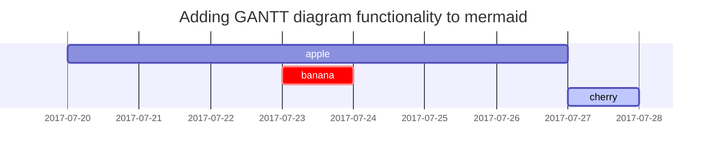

<!-- markdownlint-capture -->
<!-- markdownlint-disable -->

이 안의 제목들은 TOC에 포함되지 않음 (마크 다운 문법 적용 x)

<!-- markdownlint-restore -->

---

프롬프트 사용법 - block quote(> )에 색이 들어가고, 가장 왼쪽에 해당 종류에 맞는 이모지가 존재
- 예시) `tip`은 전구 이모지

<!-- markdownlint-capture -->
<!-- markdownlint-disable -->
> An example showing the `tip` type prompt.
{: .prompt-tip }

> An example showing the `info` type prompt.
{: .prompt-info }

> An example showing the `warning` type prompt.
{: .prompt-warning }

> An example showing the `danger` type prompt.
{: .prompt-danger }
<!-- markdownlint-restore -->

---

테이블 사용법

| Company                      | Contact          | Country |
| :--------------------------- | :--------------- | ------: |
| Alfreds Futterkiste          | Maria Anders     | Germany |
| Island Trading               | Helen Bennett    |      UK |
| Magazzini Alimentari Riuniti | Giovanni Rovelli |   Italy |

---

링크 사용법 1 

<http://127.0.0.1:4000>

링크 사용법 2

[표시될 문자](링크)

---

코드 블럭을 다음과 같이 사용하면 언어의 종류가 아니라 명시한 내용이 코드 블럭 제일 상단에 표시된다.

```sass
@import
  "colors/light-typography",
  "colors/dark-typography";
```
{: file='_sass/jekyll-theme-chirpy.scss'}

위의 경우 '_sass/jekyll-theme-chirpy.scss'가 코드 블럭 상단에 표시된다.

---

수식 표현하기

인라인 요소 : $ $

블럭 요소 : $$ $$

---

Mermaid SVG 사용법



- 해당 설정으로 그래프가 그려짐

---

이미지 사용법은 chirpy 도큐먼트 확인 

---

fragmentation 사용법

[^footnote]: The footnote source
[^fn-nth-2]: The 2nd footnote source

